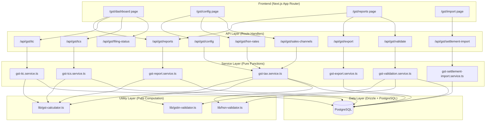
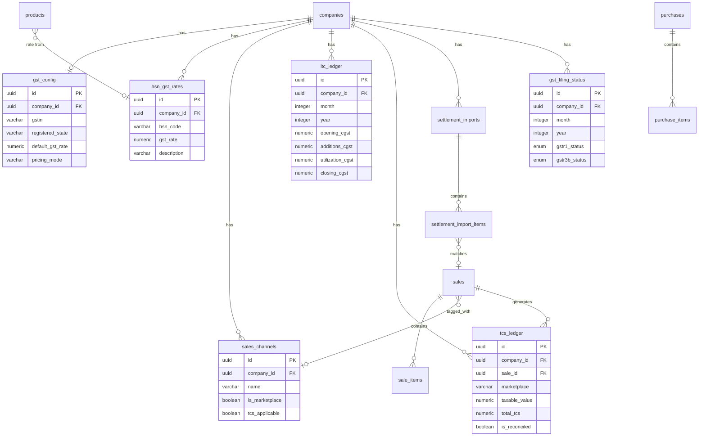

# Design Document: GST Filing Assistant

## Overview

The GST Filing Assistant integrates into the existing stock management system to automate GST return preparation. It transforms existing sales, purchases, and expense data into GSTR-1 and GSTR-3B compliant reports, handles tax calculations on transactions, tracks Input Tax Credit, and exports portal-ready files.

### Key Design Decisions

1. **Server-side computation** — All tax calculations and report generation run server-side as pure service functions. This ensures consistency, supports large datasets (10k+ transactions), and keeps tax logic auditable in one place.
2. **Company-scoped data** — Every new table includes `companyId` FK, following the existing multi-tenant pattern. All queries filter by company.
3. **Extend existing tables** — Sales, purchases, suppliers get new GST columns via migrations rather than creating parallel tables. This avoids data duplication and leverages existing transaction flows.
4. **Pure function services** — Tax calculation logic lives in pure utility functions (`lib/gst-calculator.ts`) separate from DB operations, enabling property-based testing.
5. **Incremental adoption** — GST fields are optional initially. Products without HSN codes are flagged but don't block normal operations. Only report generation requires complete data.
6. **xlsx library for Excel** — Uses `xlsx` (SheetJS) for reading settlement files and writing Excel exports, complementing existing `pdf-lib` and `jszip`.

---

## Architecture



---

## Components and Interfaces

### 1. Pure Utility Libraries

| File | Purpose |
|------|---------|
| `lib/gst-calculator.ts` | Pure tax computation: taxable value derivation, CGST/SGST/IGST split, ITC utilization waterfall |
| `lib/gstin-validator.ts` | GSTIN format validation (15-char pattern, state code check, checksum) |
| `lib/hsn-validator.ts` | HSN code validation (4/6/8 digit numeric) |

### 2. Service Layer

| File | Purpose |
|------|---------|
| `services/gst-tax.service.ts` | GST config CRUD, HSN-rate mapping, tax calculation on transactions |
| `services/gst-report.service.ts` | GSTR-1, GSTR-3B, HSN summary, party-wise report generation |
| `services/gst-itc.service.ts` | ITC ledger management, monthly balance tracking, utilization |
| `services/gst-tcs.service.ts` | TCS ledger, auto-calculation, marketplace reconciliation |
| `services/gst-settlement-import.service.ts` | File parsing (Meesho/Flipkart), order matching, TCS extraction |
| `services/gst-export.service.ts` | Excel/JSON export generation for GST portal upload |
| `services/gst-validation.service.ts` | Pre-report validation checks (ERROR/WARNING classification) |

### 3. API Routes

| Route | Methods | Purpose |
|-------|---------|---------|
| `/api/gst/config` | GET, PATCH | Company GST configuration |
| `/api/gst/hsn-rates` | GET, POST, PATCH, DELETE | HSN-to-rate master mapping CRUD |
| `/api/gst/hsn-rates/bulk` | POST | Bulk HSN-rate assignment |
| `/api/gst/reports/gstr1` | GET | GSTR-1 report generation |
| `/api/gst/reports/gstr3b` | GET | GSTR-3B summary generation |
| `/api/gst/reports/hsn-summary` | GET | HSN-wise summary |
| `/api/gst/reports/party-summary` | GET | Party-wise GST summary |
| `/api/gst/itc` | GET | ITC ledger for a month |
| `/api/gst/tcs` | GET, POST, PATCH | TCS ledger CRUD |
| `/api/gst/tcs/reconciliation` | GET | TCS reconciliation report |
| `/api/gst/sales-channels` | GET, POST, PATCH, DELETE | Custom sales channel management |
| `/api/gst/settlement-import` | POST | Upload and parse settlement file |
| `/api/gst/settlement-import/history` | GET | Import history log |
| `/api/gst/export/gstr1` | GET | Export GSTR-1 as Excel/JSON |
| `/api/gst/export/hsn` | GET | Export HSN summary |
| `/api/gst/validate` | GET | Run pre-report validation |
| `/api/gst/filing-status` | GET, PATCH | Monthly filing status management |
| `/api/gst/dashboard` | GET | Dashboard summary data |

### 4. Key Interfaces

```typescript
// lib/gst-calculator.ts

export type GstRate = 0 | 5 | 12 | 18 | 28;
export type PricingMode = 'inclusive' | 'exclusive';
export type SupplyType = 'intra-state' | 'inter-state';

export interface TaxBreakdown {
  taxableValue: number;    // rounded 2dp
  cgstAmount: number;      // rounded 2dp
  sgstAmount: number;      // rounded 2dp
  igstAmount: number;      // rounded 2dp
  totalTax: number;        // rounded 2dp
  gstRate: GstRate;
}

export interface TaxCalculationInput {
  amount: number;           // line item total (unit price × quantity)
  gstRate: GstRate;
  pricingMode: PricingMode;
  supplyType: SupplyType;
}

/**
 * Compute tax breakdown for a single line item.
 * Pure function — no side effects.
 */
export function calculateTax(input: TaxCalculationInput): TaxBreakdown;

/**
 * Determine supply type from place of supply vs registered state.
 */
export function determineSupplyType(
  placeOfSupply: string,
  registeredState: string
): SupplyType;

/**
 * Derive taxable value from total amount based on pricing mode.
 * Inclusive: taxableValue = amount / (1 + rate/100)
 * Exclusive: taxableValue = amount
 */
export function deriveTaxableValue(
  amount: number,
  gstRate: GstRate,
  pricingMode: PricingMode
): number;

/**
 * Split GST into CGST+SGST or IGST based on supply type.
 * Intra-state: CGST = SGST = totalTax / 2, IGST = 0
 * Inter-state: IGST = totalTax, CGST = SGST = 0
 */
export function splitTax(
  totalTax: number,
  supplyType: SupplyType
): { cgst: number; sgst: number; igst: number };

/**
 * ITC utilization waterfall per GST rules.
 * Returns net payable for each head after ITC offset.
 */
export interface ItcUtilizationInput {
  outputCgst: number;
  outputSgst: number;
  outputIgst: number;
  itcCgst: number;
  itcSgst: number;
  itcIgst: number;
  tcsCgst: number;
  tcsSgst: number;
  tcsIgst: number;
}

export interface ItcUtilizationResult {
  netCgstPayable: number;
  netSgstPayable: number;
  netIgstPayable: number;
  igstCreditUsed: number;
  cgstCreditUsed: number;
  sgstCreditUsed: number;
  tcsCreditUsed: number;
  excessCgst: number;   // carry forward
  excessSgst: number;
  excessIgst: number;
}

export function calculateItcUtilization(
  input: ItcUtilizationInput
): ItcUtilizationResult;

/**
 * Calculate TCS amount for marketplace sale.
 * TCS = 1% of taxable value.
 * Intra-state: 0.5% CGST + 0.5% SGST
 * Inter-state: 1% IGST
 */
export function calculateTcs(
  taxableValue: number,
  supplyType: SupplyType
): { tcsCgst: number; tcsSgst: number; tcsIgst: number; totalTcs: number };
```

```typescript
// lib/gstin-validator.ts

export interface GstinValidationResult {
  valid: boolean;
  stateCode: string | null;
  error: string | null;
}

/**
 * Validate GSTIN format:
 * - 15 characters alphanumeric
 * - First 2 digits: state code (01-37)
 * - Next 10: PAN
 * - 13th: entity number (1-9 or A-Z)
 * - 14th: 'Z' (default)
 * - 15th: checksum digit
 */
export function validateGstin(gstin: string): GstinValidationResult;

/**
 * Check if GSTIN state code matches expected state.
 */
export function gstinMatchesState(
  gstin: string,
  stateCode: string
): boolean;
```

```typescript
// lib/hsn-validator.ts

export function validateHsnCode(hsn: string): {
  valid: boolean;
  error: string | null;
};
```

### 5. Validator Schemas

```typescript
// validators/gst.validator.ts

import { z } from "zod";

export const gstConfigSchema = z.object({
  gstin: z.string().length(15).regex(/^\d{2}[A-Z]{5}\d{4}[A-Z]\d[Z][A-Z\d]$/),
  registeredState: z.string().length(2).regex(/^(0[1-9]|[1-2]\d|3[0-7])$/),
  defaultGstRate: z.enum(["0", "5", "12", "18", "28"]),
  pricingMode: z.enum(["inclusive", "exclusive"]),
});

export const hsnRateMappingSchema = z.object({
  hsnCode: z.string().regex(/^\d{4}(\d{2})?(\d{2})?$/, "HSN must be 4, 6, or 8 digits"),
  gstRate: z.enum(["0", "5", "12", "18", "28"]),
  description: z.string().max(255).optional(),
});

export const salesChannelSchema = z.object({
  name: z.string().min(1).max(100),
  isMarketplace: z.boolean().default(false),
  tcsApplicable: z.boolean().default(false),
});

export const filingStatusSchema = z.object({
  month: z.number().int().min(1).max(12),
  year: z.number().int().min(2017).max(2100),
  status: z.enum(["filed", "pending"]),
});

export const tcsEntrySchema = z.object({
  marketplace: z.string().min(1),
  orderReference: z.string().min(1),
  transactionDate: z.coerce.date(),
  taxableValue: z.coerce.number().nonnegative(),
  tcsRate: z.coerce.number().default(1),
  tcsCgst: z.coerce.number().nonnegative(),
  tcsSgst: z.coerce.number().nonnegative(),
  tcsIgst: z.coerce.number().nonnegative(),
});
```

---

## Data Models

### Schema Extensions (Existing Tables)

#### companies table — new columns

```typescript
// Add to db/schema/company.ts
gstin: varchar("gstin", { length: 15 }),
registeredState: varchar("registered_state", { length: 2 }),
defaultGstRate: numeric("default_gst_rate", { precision: 4, scale: 2 }),
pricingMode: varchar("pricing_mode", { length: 10 }).default("exclusive"), // 'inclusive' | 'exclusive'
```

#### suppliers table — new columns

```typescript
// Add to db/schema/supplier.ts
gstin: varchar("gstin", { length: 15 }),
state: varchar("state", { length: 2 }),
```

#### sales table — new columns

```typescript
// Add to db/schema/sale.ts
buyerGstin: varchar("buyer_gstin", { length: 15 }),
placeOfSupply: varchar("place_of_supply", { length: 2 }),
salesChannelId: uuid("sales_channel_id").references(() => salesChannels.id, { onDelete: "set null" }),
marketplaceOrderId: varchar("marketplace_order_id", { length: 100 }),
```

#### sale_items table — new columns

```typescript
// Add to db/schema/sale.ts (saleItems)
taxableValue: numeric("taxable_value", { precision: 14, scale: 2 }),
cgstAmount: numeric("cgst_amount", { precision: 14, scale: 2 }).default("0"),
sgstAmount: numeric("sgst_amount", { precision: 14, scale: 2 }).default("0"),
igstAmount: numeric("igst_amount", { precision: 14, scale: 2 }).default("0"),
totalTax: numeric("total_tax", { precision: 14, scale: 2 }).default("0"),
gstRate: numeric("gst_rate", { precision: 4, scale: 2 }),
```

#### purchase_items table — new columns

```typescript
// Add to db/schema/purchase.ts (purchaseItems)
taxableValue: numeric("taxable_value", { precision: 14, scale: 2 }),
cgstAmount: numeric("cgst_amount", { precision: 14, scale: 2 }).default("0"),
sgstAmount: numeric("sgst_amount", { precision: 14, scale: 2 }).default("0"),
igstAmount: numeric("igst_amount", { precision: 14, scale: 2 }).default("0"),
totalTax: numeric("total_tax", { precision: 14, scale: 2 }).default("0"),
gstRate: numeric("gst_rate", { precision: 4, scale: 2 }),
```

### New Tables

#### gst_config

Per-company GST settings (separate from companies table for cleaner domain separation).

```typescript
// db/schema/gst-config.ts
export const gstConfig = pgTable("gst_config", {
  id: uuid("id").defaultRandom().primaryKey(),
  companyId: uuid("company_id")
    .references(() => companies.id, { onDelete: "cascade" })
    .notNull()
    .unique(),
  gstin: varchar("gstin", { length: 15 }).notNull(),
  registeredState: varchar("registered_state", { length: 2 }).notNull(),
  defaultGstRate: numeric("default_gst_rate", { precision: 4, scale: 2 }).notNull(),
  pricingMode: varchar("pricing_mode", { length: 10 }).default("exclusive").notNull(),
  createdAt: timestamp("created_at").defaultNow().notNull(),
  updatedAt: timestamp("updated_at").defaultNow().notNull(),
});
```

#### hsn_gst_rates

Master mapping of HSN codes to GST rates.

```typescript
// db/schema/hsn-gst-rates.ts
export const hsnGstRates = pgTable("hsn_gst_rates", {
  id: uuid("id").defaultRandom().primaryKey(),
  companyId: uuid("company_id")
    .references(() => companies.id, { onDelete: "cascade" })
    .notNull(),
  hsnCode: varchar("hsn_code", { length: 8 }).notNull(),
  gstRate: numeric("gst_rate", { precision: 4, scale: 2 }).notNull(),
  description: varchar("description", { length: 255 }),
  createdAt: timestamp("created_at").defaultNow().notNull(),
  updatedAt: timestamp("updated_at").defaultNow().notNull(),
});
// Unique constraint: (companyId, hsnCode)
```

#### sales_channels

User-configurable sales channels.

```typescript
// db/schema/sales-channels.ts
export const salesChannels = pgTable("sales_channels", {
  id: uuid("id").defaultRandom().primaryKey(),
  companyId: uuid("company_id")
    .references(() => companies.id, { onDelete: "cascade" })
    .notNull(),
  name: varchar("name", { length: 100 }).notNull(),
  isMarketplace: boolean("is_marketplace").default(false).notNull(),
  tcsApplicable: boolean("tcs_applicable").default(false).notNull(),
  isActive: boolean("is_active").default(true).notNull(),
  createdAt: timestamp("created_at").defaultNow().notNull(),
  updatedAt: timestamp("updated_at").defaultNow().notNull(),
});
// Unique constraint: (companyId, name)
```

#### itc_ledger

Monthly ITC tracking per tax component.

```typescript
// db/schema/itc-ledger.ts
export const itcLedger = pgTable("itc_ledger", {
  id: uuid("id").defaultRandom().primaryKey(),
  companyId: uuid("company_id")
    .references(() => companies.id, { onDelete: "cascade" })
    .notNull(),
  month: integer("month").notNull(),         // 1-12
  year: integer("year").notNull(),           // e.g. 2024
  openingCgst: numeric("opening_cgst", { precision: 14, scale: 2 }).default("0").notNull(),
  openingSgst: numeric("opening_sgst", { precision: 14, scale: 2 }).default("0").notNull(),
  openingIgst: numeric("opening_igst", { precision: 14, scale: 2 }).default("0").notNull(),
  additionsCgst: numeric("additions_cgst", { precision: 14, scale: 2 }).default("0").notNull(),
  additionsSgst: numeric("additions_sgst", { precision: 14, scale: 2 }).default("0").notNull(),
  additionsIgst: numeric("additions_igst", { precision: 14, scale: 2 }).default("0").notNull(),
  utilizationCgst: numeric("utilization_cgst", { precision: 14, scale: 2 }).default("0").notNull(),
  utilizationSgst: numeric("utilization_sgst", { precision: 14, scale: 2 }).default("0").notNull(),
  utilizationIgst: numeric("utilization_igst", { precision: 14, scale: 2 }).default("0").notNull(),
  closingCgst: numeric("closing_cgst", { precision: 14, scale: 2 }).default("0").notNull(),
  closingSgst: numeric("closing_sgst", { precision: 14, scale: 2 }).default("0").notNull(),
  closingIgst: numeric("closing_igst", { precision: 14, scale: 2 }).default("0").notNull(),
  createdAt: timestamp("created_at").defaultNow().notNull(),
  updatedAt: timestamp("updated_at").defaultNow().notNull(),
});
// Unique constraint: (companyId, month, year)
```

#### tcs_ledger

Marketplace TCS tracking.

```typescript
// db/schema/tcs-ledger.ts
export const tcsLedger = pgTable("tcs_ledger", {
  id: uuid("id").defaultRandom().primaryKey(),
  companyId: uuid("company_id")
    .references(() => companies.id, { onDelete: "cascade" })
    .notNull(),
  saleId: uuid("sale_id").references(() => sales.id, { onDelete: "set null" }),
  marketplace: varchar("marketplace", { length: 50 }).notNull(),
  orderReference: varchar("order_reference", { length: 100 }),
  transactionDate: timestamp("transaction_date").notNull(),
  taxableValue: numeric("taxable_value", { precision: 14, scale: 2 }).notNull(),
  tcsRate: numeric("tcs_rate", { precision: 4, scale: 2 }).default("1").notNull(),
  tcsCgst: numeric("tcs_cgst", { precision: 14, scale: 2 }).default("0").notNull(),
  tcsSgst: numeric("tcs_sgst", { precision: 14, scale: 2 }).default("0").notNull(),
  tcsIgst: numeric("tcs_igst", { precision: 14, scale: 2 }).default("0").notNull(),
  totalTcs: numeric("total_tcs", { precision: 14, scale: 2 }).notNull(),
  source: varchar("source", { length: 20 }).default("auto").notNull(), // 'auto' | 'manual' | 'import'
  isReconciled: boolean("is_reconciled").default(false).notNull(),
  createdAt: timestamp("created_at").defaultNow().notNull(),
  updatedAt: timestamp("updated_at").defaultNow().notNull(),
});
```

#### settlement_imports

Import history tracking.

```typescript
// db/schema/settlement-imports.ts
export const settlementImportStatusEnum = pgEnum("settlement_import_status", [
  "SUCCESS",
  "PARTIAL",
  "FAILED",
]);

export const settlementImports = pgTable("settlement_imports", {
  id: uuid("id").defaultRandom().primaryKey(),
  companyId: uuid("company_id")
    .references(() => companies.id, { onDelete: "cascade" })
    .notNull(),
  fileName: varchar("file_name", { length: 255 }).notNull(),
  marketplace: varchar("marketplace", { length: 50 }).notNull(),
  periodStart: timestamp("period_start"),
  periodEnd: timestamp("period_end"),
  totalOrders: integer("total_orders").default(0).notNull(),
  matchedOrders: integer("matched_orders").default(0).notNull(),
  unmatchedOrders: integer("unmatched_orders").default(0).notNull(),
  duplicateOrders: integer("duplicate_orders").default(0).notNull(),
  totalTcsFromFile: numeric("total_tcs_from_file", { precision: 14, scale: 2 }),
  totalTcsCalculated: numeric("total_tcs_calculated", { precision: 14, scale: 2 }),
  status: settlementImportStatusEnum("status").default("SUCCESS").notNull(),
  importedBy: uuid("imported_by").references(() => users.id, { onDelete: "set null" }),
  createdAt: timestamp("created_at").defaultNow().notNull(),
});
```

#### settlement_import_items

Individual records from imported files.

```typescript
// db/schema/settlement-imports.ts (continued)
export const settlementImportItems = pgTable("settlement_import_items", {
  id: uuid("id").defaultRandom().primaryKey(),
  importId: uuid("import_id")
    .references(() => settlementImports.id, { onDelete: "cascade" })
    .notNull(),
  orderId: varchar("order_id", { length: 100 }).notNull(),
  orderDate: timestamp("order_date"),
  productPrice: numeric("product_price", { precision: 14, scale: 2 }),
  commission: numeric("commission", { precision: 14, scale: 2 }),
  tcsAmount: numeric("tcs_amount", { precision: 14, scale: 2 }),
  shippingFee: numeric("shipping_fee", { precision: 14, scale: 2 }),
  netPayout: numeric("net_payout", { precision: 14, scale: 2 }),
  matchedSaleId: uuid("matched_sale_id").references(() => sales.id, { onDelete: "set null" }),
  matchStatus: varchar("match_status", { length: 20 }).default("unmatched").notNull(), // 'matched' | 'unmatched' | 'duplicate'
  createdAt: timestamp("created_at").defaultNow().notNull(),
});
```

#### gst_filing_status

Monthly filing status per company.

```typescript
// db/schema/gst-filing-status.ts
export const gstFilingStatusEnum = pgEnum("gst_filing_status_value", [
  "FILED",
  "PENDING",
  "OVERDUE",
]);

export const gstFilingStatus = pgTable("gst_filing_status", {
  id: uuid("id").defaultRandom().primaryKey(),
  companyId: uuid("company_id")
    .references(() => companies.id, { onDelete: "cascade" })
    .notNull(),
  month: integer("month").notNull(),
  year: integer("year").notNull(),
  gstr1Status: gstFilingStatusEnum("gstr1_status").default("PENDING").notNull(),
  gstr3bStatus: gstFilingStatusEnum("gstr3b_status").default("PENDING").notNull(),
  gstr1FiledAt: timestamp("gstr1_filed_at"),
  gstr3bFiledAt: timestamp("gstr3b_filed_at"),
  createdAt: timestamp("created_at").defaultNow().notNull(),
  updatedAt: timestamp("updated_at").defaultNow().notNull(),
});
// Unique constraint: (companyId, month, year)
```

### Entity Relationship Diagram



---

## Correctness Properties

*A property is a characteristic or behavior that should hold true across all valid executions of a system — essentially, a formal statement about what the system should do. Properties serve as the bridge between human-readable specifications and machine-verifiable correctness guarantees.*

### Property 1: GSTIN Format Validation

*For any* 15-character string, the GSTIN validator SHALL return valid=true if and only if: the first 2 characters are a numeric state code between 01-37, characters 3-12 form a valid PAN pattern (5 uppercase letters + 4 digits + 1 uppercase letter), character 13 is a digit or uppercase letter, character 14 is 'Z', and character 15 is a valid checksum. All other strings SHALL return valid=false with a descriptive error.

**Validates: Requirements 1.2, 1.5, 2.7**

### Property 2: GSTIN State Code Extraction

*For any* valid GSTIN and *for any* state code, `gstinMatchesState(gstin, stateCode)` SHALL return true if and only if the first 2 digits of the GSTIN equal the provided state code.

**Validates: Requirements 1.2**

### Property 3: HSN Code Format Validation

*For any* string, the HSN validator SHALL return valid=true if and only if the string is composed entirely of digits and has a length of exactly 4, 6, or 8. All other strings SHALL return valid=false.

**Validates: Requirements 1.6, 11.1**

### Property 4: B2B/B2C Classification

*For any* sale record, the classification function SHALL return "B2B" if buyerGstin is a non-empty string (present), and "B2C" if buyerGstin is null or empty. The classification is fully determined by the presence of buyerGstin.

**Validates: Requirements 2.3, 2.4**

### Property 5: Tax Split Mutual Exclusivity

*For any* tax calculation result, the tax split SHALL be mutually exclusive: either (cgstAmount > 0 AND sgstAmount > 0 AND igstAmount === 0) for intra-state, or (igstAmount > 0 AND cgstAmount === 0 AND sgstAmount === 0) for inter-state, or all three are zero when the rate is 0%. Additionally, for intra-state splits, cgstAmount SHALL equal sgstAmount.

**Validates: Requirements 2.5, 2.6, 3.4**

### Property 6: Taxable Value Derivation

*For any* positive amount and *for any* GST rate in {0, 5, 12, 18, 28}: in inclusive mode, `deriveTaxableValue(amount, rate, 'inclusive')` SHALL equal `amount / (1 + rate/100)` rounded to 2 decimal places; in exclusive mode, `deriveTaxableValue(amount, rate, 'exclusive')` SHALL equal the original amount. Furthermore, in exclusive mode: `taxableValue + totalTax` SHALL equal the total invoice amount.

**Validates: Requirements 3.5, 3.6**

### Property 7: Tax Calculation Formula Correctness

*For any* valid TaxCalculationInput (positive amount, rate in {0,5,12,18,28}, any pricing mode, any supply type), the `calculateTax` function SHALL produce a TaxBreakdown where: totalTax equals `taxableValue * rate / 100` (rounded to 2dp), and `taxableValue + totalTax` reconstructs the original amount (for inclusive) or equals `amount + totalTax` (for exclusive), within ±0.01 tolerance.

**Validates: Requirements 3.1, 3.2**

### Property 8: Monetary Values Rounded to 2 Decimal Places

*For any* valid tax calculation input, every monetary field in the output TaxBreakdown (taxableValue, cgstAmount, sgstAmount, igstAmount, totalTax) SHALL have at most 2 decimal places (i.e., `value * 100` is an integer within floating-point tolerance).

**Validates: Requirements 3.3, 7.2, 8.2**

### Property 9: ITC Ledger Balance Invariant

*For any* ITC ledger entry, the closing balance for each tax head SHALL equal `opening + additions - utilization`. Furthermore, *for any* consecutive months M and M+1, the opening balance of M+1 SHALL equal the closing balance of M.

**Validates: Requirements 6.2, 6.7**

### Property 10: ITC Utilization Waterfall Order

*For any* valid ItcUtilizationInput (non-negative output and ITC amounts for each head), the `calculateItcUtilization` function SHALL: (1) apply IGST credit first against IGST liability, then against CGST liability, then against SGST liability; (2) apply CGST credit against CGST liability only; (3) apply SGST credit against SGST liability only; (4) apply TCS credit against any remaining liability after regular ITC. The total credit used SHALL never exceed the total credit available, and the net payable for each head SHALL be non-negative.

**Validates: Requirements 6.6, 13.5**

### Property 11: TCS Calculation

*For any* positive taxable value and *for any* supply type, `calculateTcs(taxableValue, supplyType)` SHALL produce: totalTcs = taxableValue × 0.01 (1% TCS rate) rounded to 2dp. For intra-state: tcsCgst = tcsSgst = totalTcs / 2 (rounded to 2dp) and tcsIgst = 0. For inter-state: tcsIgst = totalTcs and tcsCgst = tcsSgst = 0. The mutual exclusivity of TCS split SHALL mirror the tax split rules.

**Validates: Requirements 13.1, 13.2**

### Property 12: GSTR-1 Sales Filter (Status + Date Range)

*For any* set of sales with various statuses and dates, and *for any* period (month start/end dates), the GSTR-1 report SHALL include only sales where status === 'COMPLETED' AND saleDate falls within [periodStart, periodEnd] inclusive. No CANCELLED or PENDING sales SHALL appear in any section.

**Validates: Requirements 4.1, 4.7**

### Property 13: B2C Aggregation by Rate Slab

*For any* set of B2C sales within a period, the B2C summary SHALL group transactions by their GST rate slab (0%, 5%, 12%, 18%, 28%), and for each slab: the total taxable value SHALL equal the sum of individual taxable values, and the total CGST/SGST/IGST SHALL equal the sum of individual CGST/SGST/IGST amounts for sales in that slab.

**Validates: Requirements 4.3**

### Property 14: HSN Summary Aggregation and Sort Order

*For any* set of non-cancelled transactions in a period, the HSN summary SHALL group by HSN code and for each group: total quantity, taxable value, and tax amounts SHALL equal the sum of individual line items with that HSN. The result SHALL be sorted by taxable value in descending order. Products without HSN SHALL appear under "NO-HSN".

**Validates: Requirements 7.1, 7.3, 7.4**

### Property 15: Party-wise Summary Grouping and Sort

*For any* set of transactions in a period, the party-wise summary SHALL group by GSTIN (with null/empty GSTINs grouped as "Unregistered Parties" in customer view only). For each party: transaction count, total taxable value, and tax totals SHALL equal the sum of that party's individual transactions. Results SHALL be sorted by total taxable value descending.

**Validates: Requirements 8.1, 8.3, 8.4**

### Property 16: Sales Channel Report Filter

*For any* set of sales with assigned channels, and *for any* channel filter selection, the filtered report SHALL include only sales whose salesChannelId matches the filter. The total tax per channel SHALL equal the sum of individual sale taxes in that channel.

**Validates: Requirements 12.2, 12.3**

### Property 17: Channel Percentage Contribution

*For any* set of channel-wise tax totals where total tax > 0, the percentage contribution for each channel SHALL equal `(channelTax / totalTax) * 100` rounded to 2dp, and the sum of all channel percentages SHALL equal 100% (within ±0.1% rounding tolerance).

**Validates: Requirements 12.5**

### Property 18: Filing Status Derivation

*For any* month/year combination and *for any* current date, the filing status SHALL be: "Filed" if user has marked it filed, "Overdue" if not filed AND current date is past the 20th of the month following the filing month, "Pending" otherwise. When no previous month data exists, the 20% variance alert SHALL be suppressed.

**Validates: Requirements 10.4, 10.8**

### Property 19: Variance Alert Threshold

*For any* two consecutive months with net tax payable values, the variance alert SHALL trigger if and only if `|currentMonth - previousMonth| / previousMonth > 0.20` (20% change). When previousMonth is zero or unavailable, no alert SHALL be generated.

**Validates: Requirements 10.6, 10.8**

### Property 20: Export Filename Pattern

*For any* report type (GSTR1, GSTR3B, HSN), *for any* valid GSTIN, and *for any* period (month 1-12, year), the generated filename SHALL match the pattern `{REPORT_TYPE}_{GSTIN}_{MMYYYY}.{ext}` where MM is zero-padded month and ext is 'xlsx' or 'json'.

**Validates: Requirements 9.7**

### Property 21: Validation Severity Classification

*For any* set of transaction data issues, the validator SHALL classify: missing GSTIN on B2B invoices as ERROR, duplicate invoice numbers in same financial year as ERROR, missing HSN codes as WARNING, invoice number gaps as WARNING. The report status SHALL be "Draft — Contains Errors" if any ERROR exists, and "Ready for Filing" otherwise.

**Validates: Requirements 15.2, 15.3, 15.4, 15.5**

### Property 22: Settlement Import Count Invariant

*For any* imported settlement file with N order records, after processing: `matchedOrders + unmatchedOrders + duplicateOrders` SHALL equal `totalOrders` (N). No order record SHALL be counted in more than one category.

**Validates: Requirements 14.5**

### Property 23: TCS Reconciliation Threshold

*For any* set of TCS ledger entries with both system-calculated and actual (imported) values, the reconciliation report SHALL flag entries where `|actual - calculated| > 100` (INR 100 threshold). Entries at or below the threshold SHALL NOT be flagged.

**Validates: Requirements 13.8**

### Property 24: HSN Rate Auto-Assignment vs Manual Override

*For any* product with an HSN code that has a mapping in `hsn_gst_rates`, and no manual rate override: the product's effective GST rate SHALL equal the mapping's rate. *For any* product with a manual rate override: updating the HSN mapping SHALL NOT change the product's effective rate — the override is preserved.

**Validates: Requirements 11.3, 11.4, 11.7**

### Property 25: GSTR-3B Net Tax Computation

*For any* non-negative output tax values (CGST, SGST, IGST) and *for any* non-negative ITC values, the net tax payable per head SHALL equal `max(0, output - itc)` for each head independently. When ITC exceeds output for a head, the excess SHALL be reported as carry-forward (not negative payable).

**Validates: Requirements 5.3, 5.6**

### Property 26: Pre-Export Validation Count

*For any* set of export records with some missing required fields (GSTIN, HSN, invoice numbers), the validation function SHALL report a count equal to the actual number of records with missing fields. The count SHALL be deterministic — running validation twice on the same data produces the same count.

**Validates: Requirements 9.4**

---

## Error Handling

| Scenario | Behavior | HTTP Status |
|----------|----------|-------------|
| Invalid GSTIN format on config save | Zod validation error with specific format message | 400 |
| GSTIN state code mismatch | ServiceError: "GSTIN state code does not match selected state" | 400 |
| Invalid HSN code (not 4/6/8 digits) | Zod validation error with format message | 400 |
| Missing Place of Supply on sale | ServiceError: "Place of Supply required for tax calculation" | 400 |
| No GST rate available (no HSN mapping, no default) | ServiceError: "GST rate must be configured before recording transaction" | 400 |
| Report period has no data | Return empty report with zero values (not an error) | 200 |
| Duplicate HSN-rate mapping | ServiceError: "HSN mapping already exists" with existing data | 409 |
| Settlement file too large (>10MB) | ServiceError: "File size exceeds 10MB limit" | 400 |
| Settlement file unsupported format | ServiceError: "Unsupported file format. Use .xlsx, .xls, or .csv" | 400 |
| Settlement marketplace detection failed | Return `{ detected: false }` — prompt user selection | 200 |
| Duplicate settlement import detected | Return warning with previous import details | 200 |
| Export data has validation errors | Generate file with errors marked; include error sheet/array | 200 |
| Export system failure | ServiceError: "Export failed: {reason}"; no partial file produced | 500 |
| Bulk operation partial failure | Complete successful items; return summary with failure details | 200 |
| Unauthorized access | authMiddleware throws 401 | 401 |
| Insufficient role (not MANAGER/OWNER) | requireRole throws 403 | 403 |

### Error Handling Strategy

1. **Validation errors** use Zod schemas at the API route level. The existing `formatZodError` utility formats field-level messages.
2. **Business logic errors** use the existing `ServiceError` class with appropriate HTTP status codes.
3. **Graceful degradation** — empty data produces zero-value reports rather than errors. This follows GST portal behavior where nil returns are valid.
4. **Partial success** — bulk operations (HSN assignment, channel assignment) complete what they can and report failures, rather than rolling back entirely.
5. **File handling** — settlement imports validate file size and format before parsing. Parse errors are caught per-row and accumulated rather than failing the entire import.

---

## Testing Strategy

### Property-Based Testing (fast-check + vitest)

The project has `fast-check` v4.9.0 and `vitest` already configured. Property-based tests validate the 26 correctness properties above against the pure utility functions.

**Configuration:**
- Minimum 100 iterations per property test (`fc.assert(property, { numRuns: 100 })`)
- Each test tagged with: `// Feature: gst-filing-assistant, Property N: <title>`
- Tests target pure functions in `lib/gst-calculator.ts`, `lib/gstin-validator.ts`, `lib/hsn-validator.ts`

**Test Files:**
- `__tests__/properties/gst-calculator.property.test.ts` — Properties 5, 6, 7, 8, 9, 10, 11, 25
- `__tests__/properties/gstin-validator.property.test.ts` — Properties 1, 2
- `__tests__/properties/hsn-validator.property.test.ts` — Property 3
- `__tests__/properties/gst-classification.property.test.ts` — Property 4
- `__tests__/properties/gst-reports.property.test.ts` — Properties 12, 13, 14, 15, 16, 17
- `__tests__/properties/gst-filing-status.property.test.ts` — Properties 18, 19
- `__tests__/properties/gst-export.property.test.ts` — Properties 20, 26
- `__tests__/properties/gst-validation.property.test.ts` — Property 21
- `__tests__/properties/gst-settlement.property.test.ts` — Property 22
- `__tests__/properties/gst-tcs.property.test.ts` — Property 23
- `__tests__/properties/gst-hsn-rates.property.test.ts` — Property 24

**Generator Strategy:**
- GST rates: `fc.constantFrom(0, 5, 12, 18, 28)`
- Amounts: `fc.double({ min: 0.01, max: 99999999.99, noNaN: true })` rounded to 2dp
- Supply type: `fc.constantFrom('intra-state', 'inter-state')`
- Pricing mode: `fc.constantFrom('inclusive', 'exclusive')`
- GSTIN: custom arbitrary generating valid 15-char patterns with state codes 01-37
- HSN codes: `fc.stringMatching(/^\d{4}(\d{2})?(\d{2})?$/)`
- State codes: `fc.integer({ min: 1, max: 37 }).map(n => n.toString().padStart(2, '0'))`
- Month/year: `fc.integer({ min: 1, max: 12 })` / `fc.integer({ min: 2020, max: 2030 })`
- Sale records: custom composite arbitrary with status, date, GSTIN, amounts

### Unit Tests (vitest)

Unit tests cover specific examples, edge cases, and integration points:

**Test Files:**
- `__tests__/unit/gst-calculator.test.ts` — Known-answer tests for each formula, edge cases (0% rate, very large amounts)
- `__tests__/unit/gstin-validator.test.ts` — Specific valid/invalid GSTINs, boundary cases
- `__tests__/unit/gst-report.test.ts` — GSTR-1/3B generation with known datasets
- `__tests__/unit/gst-itc.test.ts` — ITC ledger operations, reversal scenarios
- `__tests__/unit/gst-settlement-parser.test.ts` — Known Meesho/Flipkart file structures
- `__tests__/unit/gst-export.test.ts` — File naming, JSON structure, Excel structure

### Integration Tests

- API route tests with auth middleware
- Database operations: config CRUD, HSN mapping with unique constraints
- Settlement file upload end-to-end (mock file → parse → match → update TCS)
- Report generation with realistic data volumes

### Accessibility

- All form inputs have associated labels
- Validation errors announced via aria-live regions
- Dashboard charts have text alternatives
- Report tables are keyboard navigable with proper ARIA roles
