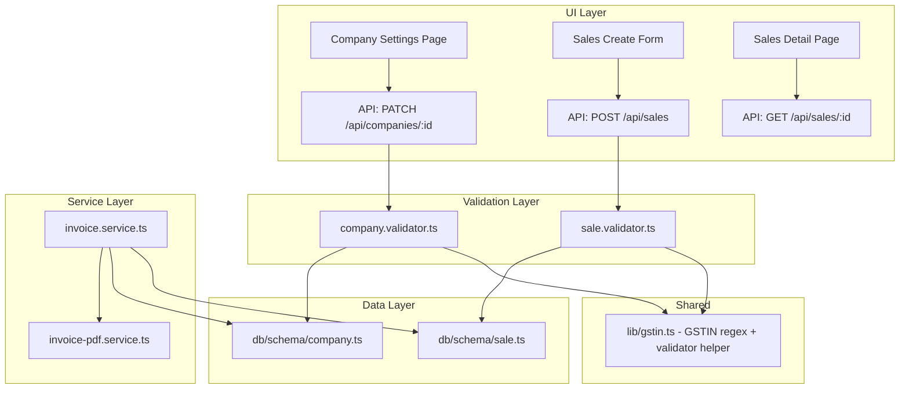

# Design Document: GST Invoice Details

## Overview

This feature adds GST-related fields to the company and sales schemas, updates the invoice PDF service to use real GST data, and extends the UI to capture and display this information. The implementation touches four layers: database schema (Drizzle ORM), validators (Zod), services (invoice generation), and UI (Next.js pages).

The key changes are:
1. Add `gstin` to the companies table for seller identification
2. Add `buyerGstin`, `shippingAddress`, and `placeOfSupply` to the sales table
3. Update the invoice PDF service to render separate billing/shipping sections
4. Extend the company settings page, sales create form, and sales detail page

## Architecture



The architecture follows the existing pattern: UI → API route → Validator → Service → Schema. A shared GSTIN validation utility (`lib/gstin.ts`) ensures the regex pattern is defined once and reused across company and sale validators.

## Components and Interfaces

### 1. Shared GSTIN Utility (`lib/gstin.ts`)

A small utility module exporting the GSTIN regex pattern and a reusable Zod schema refinement.

```typescript
// lib/gstin.ts
export const GSTIN_REGEX = /^[0-9]{2}[A-Z]{5}[0-9]{4}[A-Z]{1}[1-9A-Z]{1}Z[0-9A-Z]{1}$/;

export const GSTIN_ERROR_MESSAGE =
  "GSTIN must be exactly 15 characters in format: 22AAAAA0000A1Z5 (2 digits, 5 letters, 4 digits, 1 letter, 1 alphanumeric, Z, 1 alphanumeric)";

export function isValidGstin(value: string): boolean {
  return GSTIN_REGEX.test(value);
}
```

**Rationale**: Extracting the regex to a shared module avoids duplication between company and sale validators and makes the pattern testable in isolation.

### 2. Updated Company Validator (`validators/company.validator.ts`)

Adds an optional `gstin` field with format validation:

```typescript
gstin: z
  .string()
  .length(15, "GSTIN must be exactly 15 characters")
  .regex(GSTIN_REGEX, GSTIN_ERROR_MESSAGE)
  .nullable()
  .optional(),
```

### 3. Updated Sale Validator (`validators/sale.validator.ts`)

Adds three optional GST fields to `createSaleSchema`:

```typescript
buyerGstin: z
  .string()
  .length(15, "Buyer GSTIN must be exactly 15 characters")
  .regex(GSTIN_REGEX, GSTIN_ERROR_MESSAGE)
  .nullable()
  .optional(),

shippingAddress: z.string().nullable().optional(),

placeOfSupply: z
  .string()
  .max(50, "Place of supply must be at most 50 characters")
  .nullable()
  .optional(),
```

### 4. Updated Company Schema (`db/schema/company.ts`)

```typescript
gstin: varchar("gstin", { length: 15 }),
```

Added after the `registeredAddress` field. Nullable by default in Drizzle (no `.notNull()` chain).

### 5. Updated Sale Schema (`db/schema/sale.ts`)

```typescript
buyerGstin: varchar("buyer_gstin", { length: 15 }),
shippingAddress: text("shipping_address"),
placeOfSupply: varchar("place_of_supply", { length: 50 }),
```

Added after the existing `buyerAddress` field. All nullable by default.

### 6. Updated Invoice Service (`services/invoice.service.ts`)

The `generateInvoice` function changes:
- Read `company.gstin` and pass it as `sellerGstin` in `InvoiceData`
- Read `sale.buyerGstin`, `sale.shippingAddress`, `sale.placeOfSupply` and pass them through
- Remove the hardcoded "Seller GSTIN not configured" warning; only warn if `company.gstin` is null
- Determine `supplyType` based on comparing seller state (first 2 digits of seller GSTIN) with place of supply

### 7. Updated Invoice PDF Service (`services/invoice-pdf.service.ts`)

The `InvoiceData` interface already has `buyerGstin`, `buyerAddress`, `placeOfSupply`, and `sellerGstin` fields. The PDF rendering already handles:
- Displaying `sellerGstin` with fallback to "Not Registered"
- Displaying `buyerGstin` conditionally in the BILL TO section
- Displaying `placeOfSupply`

New addition: a **SHIP TO** section in the PDF layout that renders:
- The shipping address when `shippingAddress` is provided in `InvoiceData`
- Falls back to `buyerAddress` when `shippingAddress` is null

The `InvoiceData` interface gains a new field:
```typescript
shippingAddress: string | null;
```

### 8. Indian States List (`lib/indian-states.ts`)

A constant array of Indian states and Union Territories for the Place of Supply dropdown:

```typescript
export const INDIAN_STATES = [
  "Andhra Pradesh", "Arunachal Pradesh", "Assam", "Bihar",
  "Chhattisgarh", "Goa", "Gujarat", "Haryana", "Himachal Pradesh",
  "Jharkhand", "Karnataka", "Kerala", "Madhya Pradesh", "Maharashtra",
  "Manipur", "Meghalaya", "Mizoram", "Nagaland", "Odisha", "Punjab",
  "Rajasthan", "Sikkim", "Tamil Nadu", "Telangana", "Tripura",
  "Uttar Pradesh", "Uttarakhand", "West Bengal",
  "Andaman and Nicobar Islands", "Chandigarh",
  "Dadra and Nagar Haveli and Daman and Diu", "Delhi",
  "Jammu and Kashmir", "Ladakh", "Lakshadweep", "Puducherry",
] as const;
```

### 9. UI Components

**Company Settings Page** (`app/(dashboard)/company/page.tsx`):
- Add `gstin` to `CompanyFormData` interface
- Add GSTIN input field after the Phone field
- Client-side GSTIN format validation before submission

**Sales Create Form** (within `app/(dashboard)/sales/page.tsx`):
- Add `buyerGstin`, `shippingAddress`, `placeOfSupply` to the create sale form
- Place of Supply uses a `<select>` populated from `INDIAN_STATES`
- Client-side GSTIN validation on the buyer GSTIN field

**Sales Detail Page** (sale detail view):
- Display Buyer GSTIN when present
- Display Shipping Address separately from Billing Address
- When no shipping address, show billing address for both
- Display Place of Supply when present

## Data Models

### Companies Table (updated)

| Column | Type | Nullable | Description |
|--------|------|----------|-------------|
| ... (existing columns) | | | |
| gstin | varchar(15) | Yes | Company's GST Identification Number |

### Sales Table (updated)

| Column | Type | Nullable | Description |
|--------|------|----------|-------------|
| ... (existing columns) | | | |
| buyer_gstin | varchar(15) | Yes | Buyer's GSTIN for B2B invoicing |
| shipping_address | text | Yes | Shipping address, separate from billing |
| place_of_supply | varchar(50) | Yes | Indian state/UT for GST type determination |

### Migration SQL

```sql
-- 0012_gst_invoice_details.sql
ALTER TABLE companies ADD COLUMN gstin varchar(15) DEFAULT NULL;
ALTER TABLE sales ADD COLUMN buyer_gstin varchar(15) DEFAULT NULL;
ALTER TABLE sales ADD COLUMN shipping_address text DEFAULT NULL;
ALTER TABLE sales ADD COLUMN place_of_supply varchar(50) DEFAULT NULL;
```

All statements are `ADD COLUMN` with `DEFAULT NULL`, making them non-destructive and safe for existing data.

## Correctness Properties

*A property is a characteristic or behavior that should hold true across all valid executions of a system — essentially, a formal statement about what the system should do. Properties serve as the bridge between human-readable specifications and machine-verifiable correctness guarantees.*

### Property 1: GSTIN validation accepts only correctly formatted values

*For any* string of any length and character composition, the GSTIN validator SHALL accept it if and only if it is exactly 15 characters long and matches the pattern `^[0-9]{2}[A-Z]{5}[0-9]{4}[A-Z]{1}[1-9A-Z]{1}Z[0-9A-Z]{1}$`.

**Validates: Requirements 1.3, 1.4, 3.4, 3.5**

### Property 2: Valid GSTINs round-trip through Zod schema

*For any* string that matches the valid GSTIN pattern, passing it through the Zod company update schema (with gstin field) and the sale create schema (with buyerGstin field) SHALL produce the same string unchanged — no transformation, truncation, or rejection occurs.

**Validates: Requirements 1.3, 3.4**

### Property 3: Shipping address fallback to billing address

*For any* InvoiceData object where `shippingAddress` is null and `buyerAddress` is non-null, the rendered Ship To section of the invoice SHALL use the `buyerAddress` value. Conversely, for any InvoiceData where `shippingAddress` is non-null, the Ship To section SHALL use the `shippingAddress` value, not the `buyerAddress`.

**Validates: Requirements 7.4, 7.5**

## Error Handling

| Scenario | Handler | Response |
|----------|---------|----------|
| Invalid GSTIN format in company update | Validator (Zod) | 400 with descriptive message about expected format |
| Invalid GSTIN format in sale creation | Validator (Zod) | 400 with descriptive message about expected format |
| Company not found during invoice generation | Invoice Service | 404 ServiceError |
| Missing seller GSTIN during invoice generation | Invoice Service | Warning added to response (non-blocking) |
| Missing buyer address during invoice generation | Invoice Service | Warning added to response (non-blocking) |
| Place of supply exceeds 50 characters | Validator (Zod) | 400 with max length error |

Design decision: Missing GST fields are treated as **warnings** during invoice generation, not errors. This allows businesses to generate invoices even while gradually adding GST details, which matches the real-world workflow of businesses transitioning to GST compliance.

## Testing Strategy

### Unit Tests

- **GSTIN validator**: Test specific valid GSTINs (e.g., `22AAAAA0000A1Z5`) and invalid strings
- **Invoice data assembly**: Verify the invoice service correctly maps company.gstin → sellerGstin and sale fields → InvoiceData
- **Shipping address fallback logic**: Verify the PDF service uses correct address based on shippingAddress presence
- **Indian states list**: Verify the list contains all 28 states and 8 UTs

### Property-Based Tests (fast-check)

Property-based tests validate the GSTIN validation logic exhaustively:

- **Library**: fast-check (already installed)
- **Configuration**: Minimum 100 iterations per property
- **Location**: `__tests__/properties/gstin-validation.property.test.ts`

Each property test is tagged with:
```
Feature: gst-invoice-details, Property {N}: {property text}
```

The property tests focus on the GSTIN validation logic because:
1. The input space is large (all possible strings up to arbitrary length)
2. The validation is a pure function with clear accept/reject behavior
3. Edge cases (strings close to valid format) are best caught through randomized generation
4. The same validation is shared between company and sale validators

### Integration Tests

- **Migration**: Verify columns are added without data loss
- **API round-trip**: Create sale with GST fields → fetch sale → verify fields returned
- **Invoice generation**: Generate invoice with GST fields → verify InvoiceData contains them

### What Is NOT Property-Tested

- UI rendering (React components) — use example-based tests with React Testing Library
- PDF output (visual layout) — manual verification + example-based tests checking data flow
- Database migrations — integration tests against real PostgreSQL
