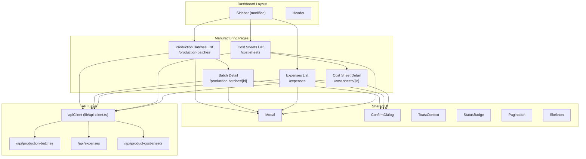

# Design Document: Manufacturing Cost Frontend

## Overview

This design covers the frontend implementation of the Manufacturing Cost Management module — three new dashboard pages (Production Batches, Expenses, Product Cost Sheets) plus their detail views, integrated into the existing Next.js 16 App Router application. The pages follow all established UI patterns: paginated tables, modal-based CRUD forms, toast notifications, confirmation dialogs, skeleton loading, and role-based write guards.

The implementation leverages the existing `apiClient` for all HTTP communication, the shared UI component library (`Modal`, `ConfirmDialog`, `Toast`, `StatusBadge`, `Pagination`, `Skeleton`), and the dashboard layout shell (`Sidebar`, `Header`). No new external dependencies are introduced.

### Key Design Decisions

1. **Client components throughout** — All page components are `'use client'` with `useState`/`useEffect` for data fetching and local state, consistent with the existing categories/purchases/sales pages.
2. **No global state management** — Each page manages its own data lifecycle (fetch on mount, refetch after mutations). This matches the established pattern and avoids adding Redux/Zustand complexity.
3. **Sidebar modification** — The existing `Sidebar.tsx` component is extended with a section grouping mechanism to add a "Manufacturing" header and its three links, positioned between Stock Ledger and the owner-only links.
4. **Form validation** — Client-side validation runs before API submission; API errors are surfaced via toast notifications. Inline validation messages are rendered below invalid fields.

---

## Architecture



### Routing Structure

| Route | File Path | Description |
|-------|-----------|-------------|
| `/production-batches` | `app/(dashboard)/production-batches/page.tsx` | Paginated batch list with create modal |
| `/production-batches/[id]` | `app/(dashboard)/production-batches/[id]/page.tsx` | Batch detail with status transitions, edit, delete, expenses |
| `/expenses` | `app/(dashboard)/expenses/page.tsx` | Paginated expense list with filters, CRUD modals |
| `/cost-sheets` | `app/(dashboard)/cost-sheets/page.tsx` | Paginated cost sheet list with filter |
| `/cost-sheets/[id]` | `app/(dashboard)/cost-sheets/[id]/page.tsx` | Cost sheet detail with status management |

---

## Components and Interfaces

### Sidebar Modification

The `Sidebar.tsx` component is refactored to support section groupings. A new `Manufacturing` section header (non-clickable label) is inserted after "Stock Ledger", followed by three nav links. The existing owner-only items (Users, Company) remain at the bottom.

```typescript
// Updated NAV structure
interface NavSection {
  label?: string; // Section header (rendered as non-clickable text)
  items: NavItem[];
}

const NAV_SECTIONS: NavSection[] = [
  {
    items: [
      { label: 'Home', href: '/' },
      { label: 'Categories', href: '/categories' },
      { label: 'Products', href: '/products' },
      { label: 'SKUs', href: '/skus' },
      { label: 'Purchases', href: '/purchases' },
      { label: 'Sales', href: '/sales' },
      { label: 'Stock Ledger', href: '/stock-ledger' },
    ]
  },
  {
    label: 'Manufacturing',
    items: [
      { label: 'Production Batches', href: '/production-batches' },
      { label: 'Expenses', href: '/expenses' },
      { label: 'Cost Sheets', href: '/cost-sheets' },
    ]
  },
  {
    items: [
      { label: 'Users', href: '/users', ownerOnly: true },
      { label: 'Company', href: '/company', ownerOnly: true },
    ]
  },
];
```

### Page Component Pattern

Each page follows this established pattern from `categories/page.tsx` and `purchases/page.tsx`:

```typescript
'use client';

export default function PageName() {
  // 1. Auth & role
  const [role, setRole] = useState<'OWNER' | 'MANAGER' | 'STAFF'>('STAFF');
  const canManage = role === 'OWNER' || role === 'MANAGER';

  // 2. Data state
  const [items, setItems] = useState<Item[]>([]);
  const [pagination, setPagination] = useState<PaginationMeta>({...});

  // 3. UI state
  const [loading, setLoading] = useState(true);
  const [error, setError] = useState<string | null>(null);
  const [submitting, setSubmitting] = useState(false);

  // 4. Modal state
  const [isCreateModalOpen, setIsCreateModalOpen] = useState(false);

  // 5. Fetch function
  async function fetchItems(page: number) { ... }

  // 6. useEffect for initial load
  useEffect(() => { fetchItems(1); }, []);

  // 7. CRUD handlers
  async function handleCreate(e: FormEvent) { ... }

  // 8. Render: header → loading/error/empty/table → pagination → modals
}
```

### Component Hierarchy

```
ProductionBatchesPage
├── PageHeader (title + "Create Batch" button)
├── Table (batch rows, clickable → detail page)
│   └── StatusBadge (per row)
├── Skeleton (loading state)
├── Pagination
├── Modal (Create Batch form)
│   ├── Product selector (fetches /api/products)
│   ├── SKU selector (fetches product items after product selection)
│   ├── Planned quantity input
│   └── Start date picker
└── ErrorState (inline error + retry)

BatchDetailPage
├── Breadcrumb / Back link
├── BatchInfoCard (status badge, dates, quantities)
├── CostBreakdown (only for COMPLETED batches)
├── ActionButtons (Start/Complete/Cancel/Edit/Delete, role-gated)
├── BatchExpensesSection
│   ├── Table (expense rows)
│   ├── Skeleton (loading)
│   └── Pagination
├── Modal (Edit Batch form)
└── ConfirmDialog (Cancel batch / Delete batch)

ExpensesPage
├── PageHeader (title + "Create Expense" button)
├── FilterBar (batch dropdown + category dropdown)
├── Table (expense rows with inline Edit/Delete actions)
│   └── StatusBadge-like category labels
├── Skeleton (loading state)
├── Pagination
├── Modal (Create/Edit Expense form)
├── ConfirmDialog (Delete expense)
└── ErrorState (inline error + retry)

CostSheetsPage
├── PageHeader (title + "Create Cost Sheet" button)
├── FilterBar (product filter)
├── Table (cost sheet rows, clickable → detail)
│   └── StatusBadge (DRAFT/ACTIVE/ARCHIVED)
├── Skeleton (loading state)
├── Pagination
├── Modal (Create Cost Sheet form)
└── ErrorState (inline error + retry)

CostSheetDetailPage
├── Breadcrumb / Back link
├── CostSheetInfoCard (product, SKU, status, effective date)
├── CostBreakdownTable (per-unit costs to 4 decimal places)
├── LinkedBatchLink (hyperlink to batch detail)
├── ActionButtons (Activate/Archive, role-gated)
└── ConfirmDialog (Archive confirmation)
```

### Shared Helper: Form Validation

A lightweight validation utility is used across all forms to maintain consistency:

```typescript
// lib/form-validation.ts
export interface ValidationError {
  field: string;
  message: string;
}

export function validateRequired(value: string | undefined, field: string, label: string): ValidationError | null {
  if (!value || !value.trim()) return { field, message: `${label} is required` };
  return null;
}

export function validateNumericRange(
  value: string | number | undefined,
  field: string,
  label: string,
  min: number,
  max: number
): ValidationError | null {
  const num = typeof value === 'string' ? parseFloat(value) : value;
  if (num === undefined || isNaN(num as number)) return { field, message: `${label} must be a valid number` };
  if ((num as number) < min || (num as number) > max) return { field, message: `${label} must be between ${min} and ${max}` };
  return null;
}
```

---

## Data Models

### TypeScript Interfaces

```typescript
// types/production-batch.ts
interface ProductionBatch {
  id: string;
  companyId: string;
  batchNumber: string;
  productId: string;
  productItemId: string | null;
  status: 'DRAFT' | 'IN_PROGRESS' | 'COMPLETED' | 'CANCELLED';
  plannedQuantity: number;
  producedQuantity: number;
  goodQuantity: number;
  rejectedQuantity: number;
  startDate: string;
  completionDate: string | null;
  // Cost fields (populated only when status = COMPLETED)
  materialCost: string | null;
  labourCost: string | null;
  packagingCost: string | null;
  overheadCost: string | null;
  transportCost: string | null;
  otherCost: string | null;
  totalManufacturingCost: string | null;
  costPerUnit: string | null;
  materialCostPerUnit: string | null;
  labourCostPerUnit: string | null;
  packagingCostPerUnit: string | null;
  overheadCostPerUnit: string | null;
  transportCostPerUnit: string | null;
  otherCostPerUnit: string | null;
  createdAt: string;
  updatedAt: string;
}

// types/expense.ts
type ExpenseCategory = 'MATERIAL' | 'LABOUR' | 'PACKAGING' | 'OVERHEAD' | 'TRANSPORT' | 'OTHER';

interface Expense {
  id: string;
  companyId: string;
  productionBatchId: string | null;
  name: string;
  amount: string;
  category: ExpenseCategory;
  expenseDate: string;
  notes: string | null;
  includeInManufacturingCost: boolean;
  createdAt: string;
  updatedAt: string;
}

// types/product-cost-sheet.ts
type CostSheetStatus = 'DRAFT' | 'ACTIVE' | 'ARCHIVED';

interface ProductCostSheet {
  id: string;
  productId: string;
  productItemId: string | null;
  productionBatchId: string;
  effectiveDate: string;
  materialCostPerUnit: string;
  labourCostPerUnit: string;
  packagingCostPerUnit: string;
  overheadCostPerUnit: string;
  transportCostPerUnit: string;
  otherCostPerUnit: string;
  totalManufacturingCostPerUnit: string;
  status: CostSheetStatus;
  createdAt: string;
  updatedAt: string;
}

// Shared pagination metadata (consistent with apiClient response)
interface PaginationMeta {
  page: number;
  limit: number;
  total: number;
  totalPages: number;
}
```

### API Endpoints Consumed

| Method | Endpoint | Used By |
|--------|----------|---------|
| GET | `/api/production-batches?page=N&limit=20` | Production Batches List |
| POST | `/api/production-batches` | Create Batch Modal |
| GET | `/api/production-batches/[id]` | Batch Detail Page |
| PATCH | `/api/production-batches/[id]` | Status transitions, Edit Batch |
| DELETE | `/api/production-batches/[id]` | Delete Batch |
| GET | `/api/production-batches/[id]/expenses?page=N&limit=20` | Batch Expenses Section |
| GET | `/api/expenses?page=N&limit=20&productionBatchId=X&category=Y` | Expenses List |
| POST | `/api/expenses` | Create Expense Modal |
| PATCH | `/api/expenses/[id]` | Edit Expense Modal |
| DELETE | `/api/expenses/[id]` | Delete Expense |
| GET | `/api/product-cost-sheets?page=N&limit=20&productId=X` | Cost Sheets List |
| POST | `/api/product-cost-sheets` | Create Cost Sheet Modal |
| GET | `/api/product-cost-sheets/[id]` | Cost Sheet Detail Page |
| PATCH | `/api/product-cost-sheets/[id]` | Activate/Archive Cost Sheet |
| GET | `/api/products` | Product dropdowns |
| GET | `/api/products/[id]/items` | SKU selection in batch creation |

---


## Correctness Properties

*A property is a characteristic or behavior that should hold true across all valid executions of a system — essentially, a formal statement about what the system should do. Properties serve as the bridge between human-readable specifications and machine-verifiable correctness guarantees.*

### Property 1: Active Link Path Matching

*For any* URL path and any manufacturing navigation link, the link is marked as active (receives `bg-indigo-700` class and `aria-current="page"`) if and only if the path matches the link's href exactly or starts with the link's href followed by `/`. No other manufacturing link shall be active simultaneously.

**Validates: Requirements 1.3, 1.5**

### Property 2: Required Field Validation Prevents Submission

*For any* form (batch creation, expense creation/edit, cost sheet creation) and *for any* form state where at least one required field is empty or whitespace-only, the validation function SHALL return an error object containing a message for each empty required field, and the form SHALL NOT submit a request to the API.

**Validates: Requirements 3.9, 8.13, 10.4, 12.1**

### Property 3: Quantity Cross-Field Constraint

*For any* triple of integers (producedQuantity, goodQuantity, rejectedQuantity) where all three are provided and producedQuantity ≠ goodQuantity + rejectedQuantity, the batch edit validation SHALL return an error indicating the quantity mismatch. Conversely, for any triple where producedQuantity = goodQuantity + rejectedQuantity, no quantity mismatch error SHALL be produced.

**Validates: Requirements 5.3**

### Property 4: Numeric Formatting Precision

*For any* valid numeric string (representing a monetary amount) and *for any* specified decimal precision (2 or 4), the formatting function SHALL produce a string containing exactly the specified number of digits after the decimal point, and parsing that formatted string back to a number SHALL yield a value within ±0.00005 (for 4dp) or ±0.005 (for 2dp) of the original.

**Validates: Requirements 6.2, 11.1**

### Property 5: Numeric Range Validation

*For any* value provided as input to a numeric field (amount, quantity, price), if the value is non-numeric (NaN after parsing), or is less than the field's specified minimum, or is greater than the field's specified maximum, the validation function SHALL return an error message indicating the valid range. If the value is numeric and within the valid range, no error SHALL be produced for that field.

**Validates: Requirements 12.2**

### Property 6: Validation Error Clearing on Correction

*For any* form state that has triggered validation errors on N fields, when one specific field is corrected to a valid value and validation is re-run, the error for that corrected field SHALL be absent from the new error set, while errors for all other still-invalid fields SHALL remain present.

**Validates: Requirements 12.6**

### Property 7: Form Label-Input Association

*For any* rendered form in the manufacturing pages, every `<input>`, `<select>`, or `<textarea>` element with an `id` attribute SHALL have a corresponding `<label>` element whose `htmlFor` attribute matches that `id`.

**Validates: Requirements 13.5**

---

## Error Handling

### Client-Side Errors

| Error Type | Handling Strategy |
|------------|-------------------|
| Required field empty | Inline validation message below field; form submission blocked |
| Numeric out of range | Inline validation message with valid range; form submission blocked |
| Quantity mismatch (produced ≠ good + rejected) | Inline validation message on produced quantity field |
| Network failure | `apiClient` returns `{ success: false, message: 'Network error...' }` → error toast |

### API Error Responses

| HTTP Status | Context | UI Response |
|-------------|---------|-------------|
| 400 | Validation error | Error toast with API message; modal stays open, form data preserved |
| 401 | Token expired | `apiClient` clears token, redirects to `/login` (existing behavior) |
| 404 | Resource not found | Inline error message on detail page with retry option |
| 409 | Conflict (duplicate, invalid state) | Error toast with conflict message; modal stays open |
| 422 | Business rule violation | Error toast with violation message; modal stays open |
| 500 | Server error | Error toast with generic message |

### Error State Rendering Pattern

```typescript
// Consistent error state pattern across all pages
{!loading && error && (
  <div className="flex flex-col items-center justify-center py-16 gap-4" role="alert">
    <p className="text-sm text-red-600">{error}</p>
    <button type="button" onClick={handleRetry} className="...">
      Retry
    </button>
  </div>
)}
```

### Loading State Pattern

```typescript
// Submit button pattern
<button type="submit" disabled={submitting} aria-busy={submitting}>
  {submitting ? 'Creating...' : 'Create'}
</button>

// Page loading pattern — aria-busy on table container
<div aria-busy={loading} aria-live="polite">
  {loading ? <SkeletonRows count={5} /> : <DataTable ... />}
</div>
```

---

## Testing Strategy

### Unit Tests (Example-Based)

Unit tests cover specific interactions, rendering conditions, and edge cases:

- **Sidebar rendering**: Manufacturing section visible for all roles, correct link order, active state
- **Role guard logic**: Write buttons hidden for STAFF, visible for MANAGER/OWNER
- **Status badge mapping**: Correct color classes per status value
- **Conditional rendering**: Cost breakdown visible only for COMPLETED batches; action buttons per status × role
- **Modal open/close**: Form data reset on close, preserved on API error
- **Filter interactions**: Dropdown selection triggers re-fetch with correct params
- **Empty states**: Correct messages when no data
- **Error states**: Error message + retry button rendered on fetch failure
- **Loading states**: Skeleton visible during fetch, button text changes during submission

### Property-Based Tests

Property-based tests verify universal behaviors across generated inputs using `fast-check`:

- **Minimum 100 iterations per property**
- **Library**: `fast-check` (already available in the Node.js/TypeScript ecosystem)
- **Tag format**: `Feature: manufacturing-cost-frontend, Property N: <property text>`

| Property | What's Generated | What's Verified |
|----------|------------------|-----------------|
| Property 1: Active link matching | Random URL paths (valid routes, sub-routes, unrelated paths) | Correct link receives active class; only one link active |
| Property 2: Required field validation | Random form states with 0+ empty required fields | Each empty field gets an error; non-empty fields don't; submission blocked |
| Property 3: Quantity cross-field | Random integer triples (produced, good, rejected) | Error iff produced ≠ good + rejected |
| Property 4: Numeric formatting | Random floats, precision 2 or 4 | Output has exact decimal count; round-trip within epsilon |
| Property 5: Numeric range validation | Random values (strings, negatives, very large numbers, valid numbers) | Error iff value outside min/max or non-numeric |
| Property 6: Validation clearing | Random multi-field error states + one correction | Only corrected field's error removed |
| Property 7: Label-input association | Rendered forms (all manufacturing forms) | Every input with id has a matching label |

### Integration Tests

Integration tests verify the full page → API → state update cycle using mocked API responses:

- Fetch and render batch list, expense list, cost sheet list
- Create/edit/delete flows with success and error responses
- Filter application + pagination
- Status transitions with various API responses (success, 422, 409, 500)
- Cascading dropdowns (product → SKU selection)

### Test Configuration

```typescript
// vitest.config.ts extension for property tests
// fast-check is configured with:
//   numRuns: 100 (minimum iterations per property)
//   seed: deterministic for CI reproducibility
```
