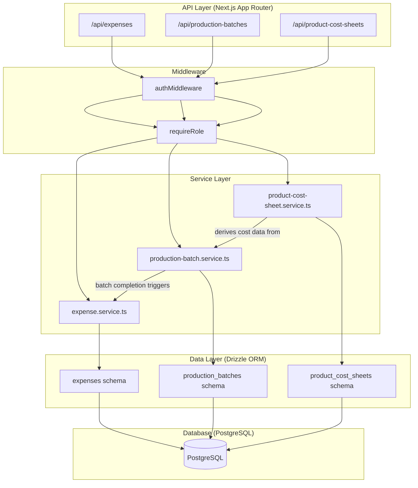
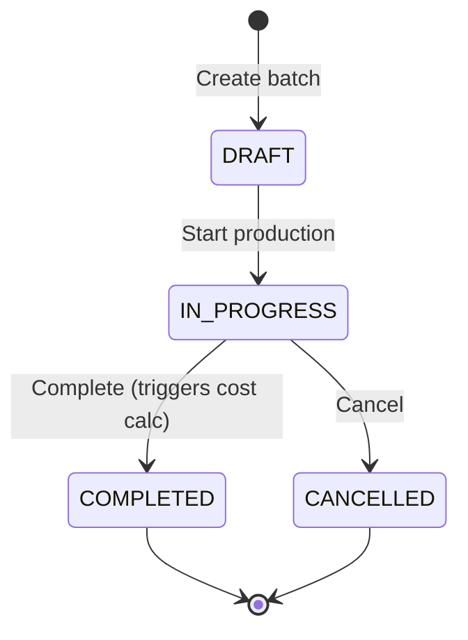

# Design Document: Manufacturing Cost Management

## Overview

This design adds manufacturing cost management to the existing multi-tenant stock management SaaS. It introduces three new domain entities — **Production Batches**, **Expenses**, and **Product Cost Sheets** — along with their associated services, API routes, validators, and database migrations.

The feature enables companies to:
1. Track manufacturing expenses categorized by type (material, labour, packaging, overhead, transport, other)
2. Manage production batch lifecycles (DRAFT → IN_PROGRESS → COMPLETED/CANCELLED)
3. Automatically calculate per-unit manufacturing costs when a batch completes
4. Maintain versioned cost sheets per product/SKU with one-active-at-a-time semantics

The design follows existing project patterns: Drizzle ORM schemas, service-layer business logic, Next.js App Router API routes, Zod validation, JWT auth via `authMiddleware`, and RBAC via `requireRole`.

---

## Architecture



### State Machine: Production Batch Lifecycle



**Valid Transitions:**
| From | To | Trigger |
|------|-----|---------|
| DRAFT | IN_PROGRESS | PATCH with status=IN_PROGRESS |
| IN_PROGRESS | COMPLETED | PATCH with status=COMPLETED (requires goodQuantity > 0) |
| IN_PROGRESS | CANCELLED | PATCH with status=CANCELLED |

**Blocked Transitions:** All others return HTTP 422.

---

## Components and Interfaces

### 1. Database Schema Files

| File | Table | Purpose |
|------|-------|---------|
| `db/schema/production-batch.ts` | `production_batches` | Manufacturing cycle tracking |
| `db/schema/expense.ts` | `expenses` | Cost tracking per expense category |
| `db/schema/product-cost-sheet.ts` | `product_cost_sheets` | Per-unit cost summaries |

### 2. Service Files

| File | Responsibility |
|------|----------------|
| `services/expense.service.ts` | CRUD, duplicate detection, company scoping |
| `services/production-batch.service.ts` | CRUD, state machine, cost aggregation on completion |
| `services/product-cost-sheet.service.ts` | Creation from batch, one-active archival logic |

### 3. Validator Files

| File | Schemas |
|------|---------|
| `validators/expense.validator.ts` | `createExpenseSchema`, `updateExpenseSchema` |
| `validators/production-batch.validator.ts` | `createBatchSchema`, `updateBatchSchema` |
| `validators/product-cost-sheet.validator.ts` | `createCostSheetSchema`, `updateCostSheetSchema` |

### 4. API Routes

| Route | Methods | Auth |
|-------|---------|------|
| `/api/expenses` | GET, POST | All read; MANAGER/OWNER write |
| `/api/expenses/[id]` | GET, PATCH, DELETE | All read; MANAGER/OWNER write |
| `/api/production-batches` | GET, POST | All read; MANAGER/OWNER write |
| `/api/production-batches/[id]` | GET, PATCH, DELETE | All read; MANAGER/OWNER write |
| `/api/production-batches/[id]/expenses` | GET | All read |
| `/api/product-cost-sheets` | GET, POST | All read; MANAGER/OWNER write |
| `/api/product-cost-sheets/[id]` | GET, PATCH, DELETE (405) | All read; MANAGER/OWNER write |

### 5. Key Service Interfaces

```typescript
// expense.service.ts
export async function createExpense(companyId: string, userId: string, data: CreateExpenseInput): Promise<Expense>;
export async function getExpenses(companyId: string, params: PaginationParams): Promise<{ data: Expense[]; total: number }>;
export async function getExpenseById(companyId: string, id: string): Promise<Expense>;
export async function updateExpense(companyId: string, id: string, data: UpdateExpenseInput): Promise<Expense>;
export async function deleteExpense(companyId: string, id: string): Promise<Expense>;

// production-batch.service.ts
export async function createBatch(companyId: string, data: CreateBatchInput): Promise<ProductionBatch>;
export async function getBatches(companyId: string, params: PaginationParams): Promise<{ data: ProductionBatch[]; total: number }>;
export async function getBatchById(companyId: string, id: string): Promise<ProductionBatch>;
export async function updateBatch(companyId: string, id: string, data: UpdateBatchInput): Promise<ProductionBatch>;
export async function deleteBatch(companyId: string, id: string): Promise<ProductionBatch>;
export async function getBatchExpenses(companyId: string, batchId: string, params: PaginationParams): Promise<{ data: Expense[]; total: number }>;
export async function generateBatchNumber(companyId: string): Promise<string>;

// product-cost-sheet.service.ts
export async function createCostSheet(companyId: string, data: CreateCostSheetInput): Promise<ProductCostSheet>;
export async function getCostSheets(companyId: string, params: PaginationParams): Promise<{ data: ProductCostSheet[]; total: number }>;
export async function getCostSheetById(companyId: string, id: string): Promise<ProductCostSheet>;
export async function updateCostSheet(companyId: string, id: string, data: UpdateCostSheetInput): Promise<ProductCostSheet>;
```

---

## Data Models

### production_batches

```typescript
import {
  pgTable, pgEnum, uuid, varchar, numeric, integer, timestamp,
  unique,
} from "drizzle-orm/pg-core";
import { companies } from "./company";
import { products } from "./product";
import { productItems } from "./product-item";

export const productionBatchStatusEnum = pgEnum("production_batch_status", [
  "DRAFT", "IN_PROGRESS", "COMPLETED", "CANCELLED",
]);

export const productionBatches = pgTable("production_batches", {
  id: uuid("id").defaultRandom().primaryKey(),
  companyId: uuid("company_id").references(() => companies.id, { onDelete: "cascade" }).notNull(),
  batchNumber: varchar("batch_number", { length: 50 }).notNull(),
  productId: uuid("product_id").references(() => products.id, { onDelete: "restrict" }).notNull(),
  productItemId: uuid("product_item_id").references(() => productItems.id, { onDelete: "set null" }),
  startDate: timestamp("start_date").notNull(),
  completionDate: timestamp("completion_date"),
  status: productionBatchStatusEnum("status").default("DRAFT").notNull(),
  plannedQuantity: integer("planned_quantity").notNull(),
  producedQuantity: integer("produced_quantity").default(0).notNull(),
  goodQuantity: integer("good_quantity").default(0).notNull(),
  rejectedQuantity: integer("rejected_quantity").default(0).notNull(),
  materialCost: numeric("material_cost", { precision: 14, scale: 2 }).default("0").notNull(),
  labourCost: numeric("labour_cost", { precision: 14, scale: 2 }).default("0").notNull(),
  packagingCost: numeric("packaging_cost", { precision: 14, scale: 2 }).default("0").notNull(),
  overheadCost: numeric("overhead_cost", { precision: 14, scale: 2 }).default("0").notNull(),
  transportCost: numeric("transport_cost", { precision: 14, scale: 2 }).default("0").notNull(),
  otherCost: numeric("other_cost", { precision: 14, scale: 2 }).default("0").notNull(),
  totalManufacturingCost: numeric("total_manufacturing_cost", { precision: 14, scale: 2 }).default("0").notNull(),
  costPerUnit: numeric("cost_per_unit", { precision: 14, scale: 4 }),
  materialCostPerUnit: numeric("material_cost_per_unit", { precision: 14, scale: 4 }),
  labourCostPerUnit: numeric("labour_cost_per_unit", { precision: 14, scale: 4 }),
  packagingCostPerUnit: numeric("packaging_cost_per_unit", { precision: 14, scale: 4 }),
  overheadCostPerUnit: numeric("overhead_cost_per_unit", { precision: 14, scale: 4 }),
  transportCostPerUnit: numeric("transport_cost_per_unit", { precision: 14, scale: 4 }),
  otherCostPerUnit: numeric("other_cost_per_unit", { precision: 14, scale: 4 }),
  createdAt: timestamp("created_at").defaultNow().notNull(),
  updatedAt: timestamp("updated_at").defaultNow().notNull(),
}, (table) => ({
  uniqueBatchNumber: unique().on(table.companyId, table.batchNumber),
}));
```

### expenses

```typescript
import {
  pgTable, pgEnum, uuid, varchar, numeric, boolean, text, timestamp,
} from "drizzle-orm/pg-core";
import { companies } from "./company";
import { productionBatches } from "./production-batch";
import { productItems } from "./product-item";
import { users } from "./user";

export const expenseCategoryEnum = pgEnum("expense_category", [
  "MATERIAL", "LABOUR", "PACKAGING", "OVERHEAD", "TRANSPORT", "OTHER",
]);

export const expenses = pgTable("expenses", {
  id: uuid("id").defaultRandom().primaryKey(),
  companyId: uuid("company_id").references(() => companies.id, { onDelete: "cascade" }).notNull(),
  category: expenseCategoryEnum("category").notNull(),
  name: varchar("name", { length: 255 }).notNull(),
  amount: numeric("amount", { precision: 14, scale: 2 }).notNull(),
  expenseDate: timestamp("expense_date").notNull(),
  productionBatchId: uuid("production_batch_id").references(() => productionBatches.id, { onDelete: "set null" }),
  productItemId: uuid("product_item_id").references(() => productItems.id, { onDelete: "set null" }),
  includeInManufacturingCost: boolean("include_in_manufacturing_cost").default(true).notNull(),
  notes: text("notes"),
  createdBy: uuid("created_by").references(() => users.id, { onDelete: "set null" }).notNull(),
  createdAt: timestamp("created_at").defaultNow().notNull(),
  updatedAt: timestamp("updated_at").defaultNow().notNull(),
});
```

### product_cost_sheets

```typescript
import {
  pgTable, pgEnum, uuid, numeric, timestamp,
} from "drizzle-orm/pg-core";
import { products } from "./product";
import { productItems } from "./product-item";
import { productionBatches } from "./production-batch";

export const costSheetStatusEnum = pgEnum("cost_sheet_status", [
  "DRAFT", "ACTIVE", "ARCHIVED",
]);

export const productCostSheets = pgTable("product_cost_sheets", {
  id: uuid("id").defaultRandom().primaryKey(),
  productId: uuid("product_id").references(() => products.id, { onDelete: "restrict" }).notNull(),
  productItemId: uuid("product_item_id").references(() => productItems.id, { onDelete: "set null" }),
  productionBatchId: uuid("production_batch_id").references(() => productionBatches.id, { onDelete: "restrict" }).notNull(),
  effectiveDate: timestamp("effective_date").notNull(),
  materialCostPerUnit: numeric("material_cost_per_unit", { precision: 14, scale: 4 }).notNull(),
  labourCostPerUnit: numeric("labour_cost_per_unit", { precision: 14, scale: 4 }).notNull(),
  packagingCostPerUnit: numeric("packaging_cost_per_unit", { precision: 14, scale: 4 }).notNull(),
  overheadCostPerUnit: numeric("overhead_cost_per_unit", { precision: 14, scale: 4 }).notNull(),
  transportCostPerUnit: numeric("transport_cost_per_unit", { precision: 14, scale: 4 }).notNull(),
  otherCostPerUnit: numeric("other_cost_per_unit", { precision: 14, scale: 4 }).notNull(),
  totalManufacturingCostPerUnit: numeric("total_manufacturing_cost_per_unit", { precision: 14, scale: 4 }).notNull(),
  status: costSheetStatusEnum("status").default("DRAFT").notNull(),
  createdAt: timestamp("created_at").defaultNow().notNull(),
  updatedAt: timestamp("updated_at").defaultNow().notNull(),
});
```

### Key Design Decisions

1. **Batch Number Generation**: Sequential per company — query `MAX(batch_number)` for the company and increment. Format: `BATCH-XXXX` (zero-padded 4 digits). This runs inside the create transaction to avoid race conditions.

2. **Cost Aggregation on Completion**: When status transitions to COMPLETED, the service sums all linked expenses (where `includeInManufacturingCost=true`) grouped by category, then divides each total by `goodQuantity`. This happens in a single `db.transaction()` call that both updates the batch and persists cost-per-unit values atomically.

3. **Cost Sheet Archival**: When a cost sheet transitions to ACTIVE, the service first sets any existing ACTIVE sheet for the same `productId + productItemId` to ARCHIVED. This uses a single transaction to ensure the one-active constraint is never violated.

4. **Partial Unique Index**: The `product_cost_sheets` table uses a partial unique index `WHERE status = 'ACTIVE'` on `(product_id, product_item_id)` to enforce the one-active rule at the database level as a safety net.

5. **Duplicate Expense Prevention**: Before inserting an expense linked to a batch, the service checks for an existing expense with the same `name` and `category` on the same batch. Returns 409 if found.

6. **Deletion Rules**:
   - Expenses: hard delete (permanent)
   - Production Batches: only DRAFT can be deleted (hard delete)
   - Cost Sheets: never deleted (405 Method Not Allowed)


---

## Correctness Properties

*A property is a characteristic or behavior that should hold true across all valid executions of a system — essentially, a formal statement about what the system should do. Properties serve as the bridge between human-readable specifications and machine-verifiable correctness guarantees.*

### Property 1: Multi-Tenant Resource Isolation

*For any* expense, production batch, or product cost sheet, and *for any* authenticated user, the system SHALL return the resource only when the resource's companyId matches the user's companyId; otherwise it SHALL return HTTP 404.

**Validates: Requirements 14.4, 14.5, 14.7, 14.8, 14.10, 14.12, 15.3, 15.7, 15.8, 15.14, 17.4, 17.9, 17.10**

### Property 2: RBAC Write Denial for STAFF

*For any* write operation (create, update, delete) on expenses, production batches, or product cost sheets, and *for any* user with role STAFF, the system SHALL reject the operation with HTTP 403 while still allowing read operations to succeed.

**Validates: Requirements 14.14, 15.16, 17.14**

### Property 3: Invalid Input Rejection

*For any* request body that fails Zod schema validation (missing required fields, wrong types, amount ≤ 0, invalid enum values, quantities below minimum), the system SHALL return HTTP 400 with field-level validation errors without modifying any data.

**Validates: Requirements 14.3, 14.13, 14.16, 15.15, 15.20**

### Property 4: Cost Aggregation and Per-Unit Calculation

*For any* production batch transitioning to COMPLETED with goodQuantity > 0 and *for any* set of associated expenses where `includeInManufacturingCost = true`, the system SHALL compute each category cost as the sum of expenses in that category, the totalManufacturingCost as the sum of all category costs, and costPerUnit as totalManufacturingCost / goodQuantity, with all per-unit values rounded to 4 decimal places.

**Validates: Requirements 15.12, 16.1, 16.3**

### Property 5: Terminal Batch Immutability

*For any* production batch with status COMPLETED or CANCELLED, and *for any* PATCH request body, the system SHALL reject the update with HTTP 409 without modifying the batch.

**Validates: Requirements 15.10, 15.11**

### Property 6: One-Active Cost Sheet Invariant

*For any* sequence of cost sheet create and update operations, at most one product cost sheet with status ACTIVE SHALL exist per unique (productId, productItemId) combination at any point in time; activating a new sheet SHALL archive the previously active sheet.

**Validates: Requirements 17.6, 17.7, 17.12**

### Property 7: State Machine Transition Validity

*For any* production batch and *for any* requested status transition, the system SHALL only permit DRAFT→IN_PROGRESS, IN_PROGRESS→COMPLETED (when goodQuantity > 0), and IN_PROGRESS→CANCELLED; all other transitions SHALL be rejected with HTTP 422.

**Validates: Requirements 15.19, 16.2**

### Property 8: Batch Number Sequential Uniqueness

*For any* company with N existing production batches, creating a new batch SHALL generate a batchNumber in format "BATCH-XXXX" that is strictly greater than all existing batch numbers for that company and unique within the company scope.

**Validates: Requirements 15.2**

### Property 9: Duplicate Expense Prevention on Batch

*For any* production batch that already contains an expense with a given (name, category) pair, attempting to add another expense with the same name and category to the same batch SHALL be rejected with HTTP 409.

**Validates: Requirements 14.15**

### Property 10: Cost Sheet Derivation from Completed Batch

*For any* completed production batch, creating a product cost sheet SHALL derive productId, productItemId, and all per-category cost-per-unit values from that batch; *for any* non-completed batch, creation SHALL fail with HTTP 422.

**Validates: Requirements 17.1, 17.2**

### Property 11: Partial Update Preserves Unchanged Fields

*For any* expense or production batch update containing a subset of fields, only the provided fields SHALL change; all other fields SHALL retain their previous values.

**Validates: Requirements 14.9, 15.9**

### Property 12: Quantity Cross-Field Validation

*For any* production batch update where producedQuantity, goodQuantity, and rejectedQuantity are all provided, the system SHALL validate that producedQuantity equals goodQuantity + rejectedQuantity; if only a subset is provided, no cross-field validation SHALL occur.

**Validates: Requirements 15.6**

### Property 13: Batch Deletion Only in DRAFT

*For any* production batch, deletion SHALL succeed only when status is DRAFT; *for any* batch in IN_PROGRESS, COMPLETED, or CANCELLED status, deletion SHALL be rejected with HTTP 409.

**Validates: Requirements 15.17**

### Property 14: Cost Sheet Field Immutability

*For any* PATCH request to a product cost sheet that includes any cost value field (materialCostPerUnit, labourCostPerUnit, packagingCostPerUnit, overheadCostPerUnit, transportCostPerUnit, otherCostPerUnit, totalManufacturingCostPerUnit), the system SHALL reject the update with HTTP 400.

**Validates: Requirements 17.11**

### Property 15: Archived Sheets Preservation

*For any* sequence of operations on product cost sheets, the count of ARCHIVED sheets SHALL never decrease; no operation SHALL delete an archived sheet.

**Validates: Requirements 17.8, 17.15**

---

## Error Handling

All services use the existing `ServiceError` class and the established error response format:

| Scenario | HTTP Code | Response |
|----------|-----------|----------|
| Zod validation failure | 400 | `{ success: false, message: "Validation failed", errors: [...] }` |
| Invalid reference (product, batch, item) | 400 | `{ success: false, message: "..." }` |
| Missing/invalid JWT | 401 | `{ success: false, message: "Authorization header is missing" }` |
| STAFF attempting write | 403 | `{ success: false, message: "Forbidden" }` |
| Resource not found / cross-company access | 404 | `{ success: false, message: "... not found" }` |
| DELETE on cost sheet | 405 | `{ success: false, message: "Method not allowed" }` |
| Duplicate expense on batch | 409 | `{ success: false, message: "Duplicate expense..." }` |
| Immutable batch update | 409 | `{ success: false, message: "... batch is read-only" }` |
| Delete non-DRAFT batch | 409 | `{ success: false, message: "Cannot delete batch in current status" }` |
| Invalid status transition | 422 | `{ success: false, message: "Status transition not permitted" }` |
| goodQuantity=0 on completion | 422 | `{ success: false, message: "Good quantity must be > 0 for cost calculation" }` |
| Non-completed batch for cost sheet | 422 | `{ success: false, message: "Cost sheets can only be generated from completed batches" }` |
| Unexpected server error | 500 | `{ success: false, message: "Unable to ..." }` |

### Error Handling Strategy

1. **Validation errors** are caught at the route handler level by parsing with Zod, formatted using `formatZodError()`.
2. **Business logic errors** are thrown as `ServiceError` instances from the service layer with the appropriate status code.
3. **Auth errors** are thrown as plain `Error` from `authMiddleware` and detected by message content.
4. **Transaction failures** cause automatic rollback — Drizzle's `db.transaction()` rolls back if any step throws.
5. **Unhandled errors** are logged to console and return generic 500 messages.

---

## Testing Strategy

### Property-Based Testing (fast-check)

The project already has `fast-check` v4.9.0 installed and `vitest` configured. Property-based tests will validate the 15 correctness properties defined above.

**Configuration:**
- Minimum 100 iterations per property test (`fc.assert(property, { numRuns: 100 })`)
- Each test tagged with: `// Feature: manufacturing-cost-management, Property N: <title>`
- Tests target the **service layer** directly (no HTTP overhead), mocking the database where needed for isolation

**Test Files:**
- `tests/properties/expense.property.test.ts`
- `tests/properties/production-batch.property.test.ts`
- `tests/properties/product-cost-sheet.property.test.ts`

**Generator Strategy:**
- Custom arbitraries for valid expense data, batch data, cost sheet data
- Edge cases: zero amounts, max precision values, empty strings, whitespace-only strings
- Status combinations: all 4 batch statuses × all operations
- Cross-company scenarios: resources belonging to company A accessed by company B

### Unit Tests (vitest)

Unit tests cover specific examples, integration points, and edge cases not amenable to PBT:

**Test Files:**
- `tests/unit/expense.service.test.ts`
- `tests/unit/production-batch.service.test.ts`
- `tests/unit/product-cost-sheet.service.test.ts`
- `tests/unit/validators.test.ts`

**Coverage:**
- Default value behavior (includeInManufacturingCost defaults to true)
- Specific deletion behavior (expense hard delete returns record)
- GET responses for completed vs non-completed batches (null cost fields)
- DELETE on cost sheet returns 405
- Batch number format verification ("BATCH-0001", "BATCH-0002", etc.)

### Integration Tests

Integration tests verify the full request→response cycle through the API routes:

**Test Files:**
- `tests/integration/expenses.api.test.ts`
- `tests/integration/production-batches.api.test.ts`
- `tests/integration/product-cost-sheets.api.test.ts`

**Coverage:**
- Full CRUD lifecycle for each entity
- End-to-end batch completion flow (create batch → add expenses → complete → verify costs)
- Cost sheet creation from completed batch → activate → verify archival
- Pagination response format verification
- Auth middleware rejection for missing/invalid tokens

### Migration Tests

- Verify migration SQL runs without errors
- Verify table existence and column types post-migration
- Verify unique constraints and partial indexes function correctly
