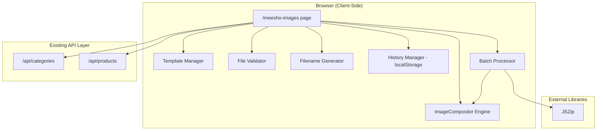
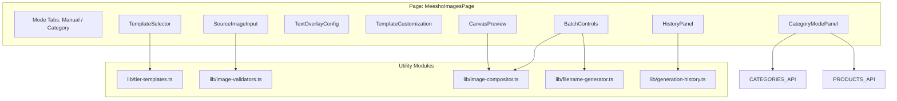

# Design Document: Meesho Image Generator

## Overview

The Meesho Image Generator is a client-side image composition tool that produces 1080×1080 product listing images for the Meesho marketplace. It composites a source product/category image onto tier-specific templates (based on Meesho's 6 shipping weight slabs), overlays product name, pricing, and tier label text, and outputs downloadable PNG files.

The tool supports two workflows:
1. **Manual Mode** — User uploads source images, selects templates, enters text, generates images
2. **Generate by Category Mode** — User picks a category, the tool uses the banner image and fetches products to bulk-generate images

### Key Design Decisions

1. **100% client-side rendering via HTML5 Canvas** — All image composition happens in the browser using Canvas API. No server-side image processing, no new API routes needed. This matches the pattern used by the Flipkart Cropper tool.
2. **JSZip for batch download** — The project already uses `jszip` for the label splitter. Batch downloads package multiple PNGs into a single ZIP file.
3. **LocalStorage for history** — Generation history and configs are persisted in localStorage (scoped by company ID), keeping the feature stateless from the server's perspective.
4. **Existing API reuse** — Categories and products are fetched via the existing `/api/categories` and `/api/products` endpoints. No new backend code required.
5. **Sequential batch processing with memory cleanup** — Images are generated one at a time to avoid memory pressure from multiple simultaneous Canvas operations, with explicit cleanup between renders.

---

## Architecture



### Component Architecture



---

## Components and Interfaces

### 1. Page Component

| File | Purpose |
|------|---------|
| `app/(dashboard)/meesho-images/page.tsx` | Main page with mode tabs, canvas preview, controls |

### 2. Utility Modules (Pure Logic)

| File | Purpose |
|------|---------|
| `lib/image-compositor.ts` | Canvas rendering: composites template + image + text overlays |
| `lib/tier-templates.ts` | Template definitions: layouts, colors, positions for 6 tiers |
| `lib/image-validators.ts` | File validation: size, format, dimensions |
| `lib/filename-generator.ts` | Filename sanitization, deduplication, pattern generation |
| `lib/generation-history.ts` | LocalStorage CRUD for generation records, cleanup logic |

### 3. UI Components

| File | Purpose |
|------|---------|
| `components/image-generator/TemplateSelector.tsx` | Grid of 6 tier template cards with multi-select |
| `components/image-generator/SourceImageInput.tsx` | Upload area + category dropdown for source images |
| `components/image-generator/TextOverlayConfig.tsx` | Product name, price, MRP inputs with live validation |
| `components/image-generator/TemplateCustomization.tsx` | Color pickers, alignment, tier label toggle |
| `components/image-generator/CanvasPreview.tsx` | Live preview canvas showing current composition |
| `components/image-generator/BatchControls.tsx` | Generate button, progress bar, cancel, download |
| `components/image-generator/HistoryPanel.tsx` | Recent generations list with re-render/download |
| `components/image-generator/CategoryModePanel.tsx` | Category list, product selection checkboxes |

### 4. Key Interfaces

```typescript
// lib/tier-templates.ts

export type WeightSlab = '0-500g' | '500g-1kg' | '1-2kg' | '2-5kg' | '5-10kg' | '10-15kg';

export interface TierTemplate {
  id: WeightSlab;
  label: string;
  tierLabelColor: string;        // Default badge background color
  imageArea: {                   // Area where source image is placed
    x: number; y: number;
    width: number; height: number;
  };
  textArea: {                    // Area for product name
    x: number; y: number;
    maxWidth: number; maxHeight: number;
  };
  priceArea: {                   // Area for price display
    x: number; y: number;
  };
  tierLabelArea: {               // Top-right badge position
    x: number; y: number;
    width: number; height: number;
  };
}

export const TIER_TEMPLATES: Record<WeightSlab, TierTemplate>;
export const WEIGHT_SLABS: WeightSlab[];
export const TIER_COLORS: Record<WeightSlab, string>;
```

```typescript
// lib/image-compositor.ts

export interface CompositionConfig {
  sourceImage: HTMLImageElement | ImageBitmap;
  template: TierTemplate;
  productName: string;
  sellingPrice: number;
  mrp: number | null;
  fontSize: number;                    // 12-48px
  backgroundColor: string;            // hex color
  textColor: string;                  // hex color
  tierLabelColor: string;             // hex color
  tierLabelVisible: boolean;
  imageAlignment: 'top' | 'center' | 'bottom';
}

export interface CompositionResult {
  canvas: HTMLCanvasElement;
  blob: Blob;
  width: number;   // always 1080
  height: number;  // always 1080
}

export async function compositeImage(config: CompositionConfig): Promise<CompositionResult>;
export function truncateText(text: string, maxWidth: number, fontSize: number, ctx: CanvasRenderingContext2D): string;
export function calculateCoverDimensions(
  srcWidth: number, srcHeight: number,
  targetWidth: number, targetHeight: number,
  alignment: 'top' | 'center' | 'bottom'
): { sx: number; sy: number; sw: number; sh: number; dx: number; dy: number; dw: number; dh: number };
```

```typescript
// lib/image-validators.ts

export interface FileValidationResult {
  valid: boolean;
  error?: 'file-too-large' | 'unsupported-format' | 'resolution-too-low';
  message?: string;
}

export interface FileMetadata {
  size: number;          // bytes
  type: string;          // MIME type
  width: number;         // pixels
  height: number;        // pixels
}

export const MAX_FILE_SIZE_BYTES = 10 * 1024 * 1024; // 10 MB
export const MIN_RESOLUTION = 200; // pixels
export const SUPPORTED_FORMATS = ['image/png', 'image/jpeg', 'image/webp'];

export function validateImageFile(metadata: FileMetadata): FileValidationResult;
export function validateProductName(name: string): { valid: boolean; error?: string };
export function validatePrice(price: number | null, fieldName: string, required: boolean): { valid: boolean; error?: string };
export function validateGenerationInputs(inputs: GenerationInputs): { valid: boolean; errors: string[] };
```

```typescript
// lib/filename-generator.ts

export interface FilenameInput {
  productName: string;
  weightSlab: WeightSlab;
}

export function sanitizeFilename(productName: string): string;
export function generateFilename(input: FilenameInput): string;
export function deduplicateFilenames(filenames: string[]): string[];
```

```typescript
// lib/generation-history.ts

export interface GenerationRecord {
  id: string;                           // UUID
  timestamp: string;                    // ISO 8601
  productName: string;
  tiers: WeightSlab[];
  thumbnail: string;                    // base64, max 50KB
  config: StoredGenerationConfig;
}

export interface StoredGenerationConfig {
  templateIds: WeightSlab[];
  productName: string;
  sellingPrice: number;
  mrp: number | null;
  fontSize: number;
  backgroundColor: string;
  textColor: string;
  tierLabelColor: string;
  tierLabelVisible: boolean;
  imageAlignment: 'top' | 'center' | 'bottom';
  sourceImage: string;                 // base64, max 200KB
}

export const MAX_HISTORY_RECORDS = 20;
export const MAX_STORAGE_BYTES = 10 * 1024 * 1024; // 10 MB

export function saveGenerationRecord(record: GenerationRecord, companyId: string): void;
export function getGenerationHistory(companyId: string): GenerationRecord[];
export function clearHistory(companyId: string): void;
export function cleanupStorage(companyId: string): void;
export function formatRelativeTime(isoTimestamp: string): string;
```

```typescript
// Batch processing types

export interface BatchItem {
  sourceImage: HTMLImageElement;
  productName: string;
  sellingPrice: number;
  mrp: number | null;
  templateIds: WeightSlab[];
}

export interface BatchProgress {
  current: number;
  total: number;
  status: 'idle' | 'processing' | 'done' | 'cancelled' | 'error';
  failures: Array<{ filename: string; reason: string }>;
}

export interface BatchResult {
  zipBlob: Blob;
  totalGenerated: number;
  failures: Array<{ filename: string; reason: string }>;
}
```

---

## Data Models

This feature does not introduce new database tables. It reads from existing tables via existing APIs.

### Data Read from Existing APIs

**Categories API** (`GET /api/categories`):
```typescript
interface Category {
  id: string;
  name: string;
  slug: string;
  description: string | null;
  bannerImage: string | null;
  isActive: boolean;
  parentId: string | null;
}
```

**Products API** (`GET /api/products?page=N&limit=100`):
```typescript
interface Product {
  id: string;
  name: string;
  categoryId: string;
  isActive: boolean;
  // other fields not used
}
```

### LocalStorage Data Structures

**Generation History** (key: `meesho-images-history-{companyId}`):
```typescript
interface StoredHistory {
  version: 1;
  records: GenerationRecord[]; // max 20 entries
}
```

### Tier Template Configuration (Hardcoded)

| Weight Slab | Label | Default Badge Color | 
|-------------|-------|-------------------|
| 0-500g | "0-500g" | #4CAF50 (green) |
| 500g-1kg | "500g-1kg" | #2196F3 (blue) |
| 1-2kg | "1-2kg" | #FF9800 (orange) |
| 2-5kg | "2-5kg" | #9C27B0 (purple) |
| 5-10kg | "5-10kg" | #F44336 (red) |
| 10-15kg | "10-15kg" | #795548 (brown) |

### Output Image Layout (1080×1080)

```
┌─────────────────────────────────┐
│  Background (user color)        │ ← 1080×1080
│  ┌─────────────────────────┐    │
│  │                         │[TIER]← Tier badge (top-right)
│  │   Source Image Area     │    │
│  │   (object-fit: cover)   │    │
│  │                         │    │
│  └─────────────────────────┘    │
│                                 │
│  Product Name (truncated)       │ ← Text area
│  ₹Price  ₹MRP (strikethrough)  │ ← Price area
│                                 │
└─────────────────────────────────┘
```

---

## Correctness Properties

*A property is a characteristic or behavior that should hold true across all valid executions of a system — essentially, a formal statement about what the system should do. Properties serve as the bridge between human-readable specifications and machine-verifiable correctness guarantees.*

### Property 1: File Validation Correctness

*For any* file metadata with arbitrary size (0 to 100MB), MIME type (any string), and dimensions (0×0 to 10000×10000), the validation function SHALL accept the file if and only if size ≤ 10MB AND type is one of ['image/png', 'image/jpeg', 'image/webp'] AND both width ≥ 200 and height ≥ 200; otherwise it SHALL reject with the specific error reason corresponding to the first failing condition.

**Validates: Requirements 2.1, 2.6**

### Property 2: Category Filtering

*For any* list of categories where each category may or may not have a `bannerImage` value, the filtering function SHALL return exactly those categories where `bannerImage` is a non-null, non-empty string, preserving their original order.

**Validates: Requirements 2.2, 7.1**

### Property 3: Text and Price Input Validation

*For any* product name string and numeric price value, the validation function SHALL accept the product name if and only if its length is between 1 and 80 characters (inclusive), and SHALL accept the selling price if and only if it is a number in the range [1, 999999]. For optional MRP, validation SHALL accept values in [1, 999999] or null.

**Validates: Requirements 3.1, 3.7**

### Property 4: Text Truncation with Ellipsis

*For any* string and maximum pixel width, if the measured text width exceeds the maximum width, the truncation function SHALL return a string that ends with "…" and whose measured width is ≤ the maximum width. If the text fits within the maximum width, it SHALL be returned unchanged.

**Validates: Requirements 3.3**

### Property 5: Output Image Dimensions Invariant

*For any* valid composition config (any source image dimensions, any template, any text values), the compositor SHALL produce an output canvas of exactly 1080×1080 pixels.

**Validates: Requirements 4.2**

### Property 6: Tier Color Uniqueness

*For any* two distinct weight slabs from the set of 6, the tier color mapping SHALL return two different color values, ensuring all 6 tiers have visually distinguishable badge colors.

**Validates: Requirements 4.3**

### Property 7: Filename Sanitization and Deduplication

*For any* product name string: (a) the sanitized filename SHALL be lowercase, (b) spaces SHALL be replaced by hyphens, (c) characters that are not alphanumeric or hyphens SHALL be removed, (d) the result SHALL be truncated to 50 characters. Additionally, *for any* list of filename inputs that produce duplicate filenames, the deduplication function SHALL append numeric suffixes starting at 2 so that all filenames in the output list are unique.

**Validates: Requirements 4.4, 5.4**

### Property 8: Image Cover Scaling Calculation

*For any* source image dimensions (width > 0, height > 0) and target area dimensions (width > 0, height > 0), the cover scaling function SHALL return crop/draw parameters such that: (a) the drawn area completely fills the target (dw = targetWidth, dh = targetHeight), and (b) the source crop maintains the source aspect ratio, and (c) the crop dimensions do not exceed the source dimensions.

**Validates: Requirements 4.6**

### Property 9: Batch Generation Count

*For any* N source images (1 ≤ N ≤ 20) and M selected templates (1 ≤ M ≤ 6), the batch processor SHALL produce exactly N × M output image tasks (assuming no render failures), and this count SHALL not exceed 120.

**Validates: Requirements 5.1, 5.5, 7.4**

### Property 10: Reset Restores Defaults

*For any* customization state (arbitrary valid color values, alignment, visibility, font size), invoking the reset function SHALL produce a state where backgroundColor is '#FFFFFF', textColor is '#000000', tierLabelVisible is true, imageAlignment is 'center', and fontSize is 24.

**Validates: Requirements 6.8**

### Property 11: Generation History LocalStorage Round-Trip

*For any* valid GenerationRecord (with valid ISO timestamp, product name, tiers, config), saving the record to localStorage and then retrieving history SHALL return a list containing a record with identical field values.

**Validates: Requirements 9.1**

### Property 12: Relative Time Formatting

*For any* ISO 8601 timestamp representing a past moment, the relative time formatting function SHALL return a human-readable string (e.g., "2 hours ago", "3 days ago") that correctly reflects the time difference from the current moment, and SHALL never return a negative or future-indicating string.

**Validates: Requirements 9.2**

### Property 13: Storage Cleanup Maintains Size Limit

*For any* set of generation records stored in localStorage whose total serialized size exceeds 10 MB, the cleanup function SHALL remove records oldest-first until the total size is under 10 MB, and the remaining records SHALL be ordered newest-first with no data corruption.

**Validates: Requirements 9.6**

---

## Error Handling

| Scenario | Behavior |
|----------|----------|
| File exceeds 10 MB | Inline error: "File too large. Maximum size is 10 MB." File rejected. |
| Unsupported file format | Inline error: "Unsupported format. Use PNG, JPEG, or WebP." File rejected. |
| Image resolution below 200×200 | Inline error: "Resolution too low. Minimum 200×200 pixels required." File rejected. |
| Category banner image fails to load | Error message with prompt to upload manually instead. |
| No template selected on generate | Validation: "Select at least one shipping tier template." Generation blocked. |
| Required text fields empty on generate | Validation: "Product name and selling price are required." Generation blocked. |
| Selling price > MRP | Warning (non-blocking): "Selling price exceeds MRP." |
| Output PNG exceeds 2 MB | Iteratively reduce quality (0.9 → 0.7 → 0.5). If still over at 0.5, export as-is with warning. |
| Canvas rendering failure | Error: "Image rendering failed: {reason}". Inputs preserved for retry. |
| Single image fails in batch | Skip failed image, continue processing, show failure summary at end. |
| Batch exceeds 120 images | Generate button disabled. Message: "Maximum 120 images per batch (currently {count})." |
| Category has no active products | Message: "No active products in this category." |
| LocalStorage full or corrupt | Try/catch JSON.parse; on failure remove oldest records until valid. On quota exceeded, show warning. |
| History record source image missing | Message: "Source image unavailable. Upload a replacement to re-render." |
| Network error fetching categories/products | Error toast via existing apiClient pattern. Retry option shown. |

### Error Handling Strategy

1. **File validation errors** — Computed synchronously when file is selected/dropped. Uses the `validateImageFile()` pure function. Errors shown inline below the upload area.
2. **Form validation errors** — Computed on generate attempt. Uses `validateGenerationInputs()`. Errors shown next to respective fields.
3. **Rendering errors** — Caught via try/catch around canvas operations. User input preserved so they can retry without re-entering data.
4. **API errors** — Handled by existing `apiClient` wrapper which returns `{ success: false, message }`. Shown as toast notifications.
5. **Storage errors** — try/catch around localStorage operations. On failure, graceful degradation (history feature disabled, not blocking generation).

---

## Testing Strategy

### Property-Based Testing (fast-check)

The project uses `fast-check` v4.9.0 and `vitest`. Property-based tests validate the 13 correctness properties defined above, targeting **pure utility functions** that don't require DOM or Canvas APIs.

**Configuration:**
- Minimum 100 iterations per property test (`fc.assert(property, { numRuns: 100 })`)
- Each test tagged with: `// Feature: meesho-image-generator, Property N: <title>`

**Test Files:**
- `__tests__/properties/image-validators.property.test.ts` — Properties 1, 3
- `__tests__/properties/filename-generator.property.test.ts` — Property 7
- `__tests__/properties/image-compositor.property.test.ts` — Properties 4, 5, 6, 8
- `__tests__/properties/batch-processor.property.test.ts` — Property 9
- `__tests__/properties/template-customization.property.test.ts` — Property 10
- `__tests__/properties/generation-history.property.test.ts` — Properties 2, 11, 12, 13

**Generator Strategy:**
- File metadata: `fc.record({ size: fc.integer({min: 0, max: 100_000_000}), type: fc.oneof(fc.constantFrom(...SUPPORTED_FORMATS), fc.string()), width: fc.integer({min: 0, max: 10000}), height: fc.integer({min: 0, max: 10000}) })`
- Product names: `fc.string({ minLength: 0, maxLength: 200 })` (tests both valid and invalid lengths)
- Prices: `fc.oneof(fc.double({min: -1000, max: 1_500_000, noNaN: true}), fc.constant(null))`
- Weight slabs: `fc.constantFrom('0-500g', '500g-1kg', '1-2kg', '2-5kg', '5-10kg', '10-15kg')`
- Colors: `fc.hexaString().map(s => '#' + s.slice(0, 6))`
- Timestamps: `fc.date({min: new Date('2020-01-01'), max: new Date()}).map(d => d.toISOString())`
- Image dimensions: `fc.record({ width: fc.integer({min: 1, max: 5000}), height: fc.integer({min: 1, max: 5000}) })`

### Unit Tests (vitest)

Unit tests cover specific examples, UI integration points, and edge cases:

**Test Files:**
- `__tests__/unit/tier-templates.test.ts` — All 6 templates have valid layout definitions, non-overlapping areas
- `__tests__/unit/image-validators.test.ts` — Boundary values: exactly 10MB, exactly 200×200, format edge cases
- `__tests__/unit/filename-generator.test.ts` — Known-answer tests for specific product names
- `__tests__/unit/generation-history.test.ts` — Max 20 records limit, clear history, corrupt data recovery

### Integration Tests

- Category dropdown fetches from `/api/categories` and filters to those with `bannerImage`
- Product list fetches from `/api/products` filtered by category
- Full flow: upload image → select template → enter text → generate → download PNG
- Batch flow: multiple images × multiple templates → ZIP download

### Accessibility Requirements

- All form inputs have associated `<label>` elements
- Template selector uses `role="listbox"` with `aria-multiselectable="true"`
- Color pickers have text labels and hex value display (not color-only)
- Progress indicator uses `role="progressbar"` with `aria-valuenow`
- Validation errors announced via `aria-live="polite"` region
- Cancel button is keyboard-focusable during batch processing
- Image previews have meaningful `alt` text
