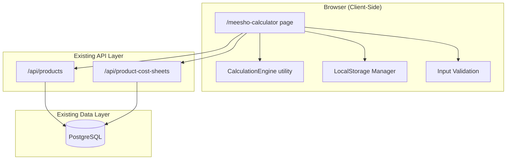
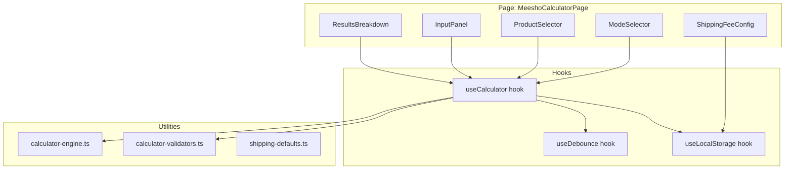

# Design Document: Meesho Profit Calculator

## Overview

The Meesho Profit Calculator is a client-side tool integrated into the existing dashboard that helps suppliers determine optimal listing prices and verify profit margins for products sold on Meesho. It operates in two modes:

1. **Profit Mode** — Given a selling price, computes net profit after all deductions (commission, GST, shipping, returns, product loss)
2. **Listing Price Mode** — Given a target profit (as percentage or absolute rupees), computes the minimum selling price to achieve that target

The calculator integrates with the existing product cost sheet API to auto-populate manufacturing costs and uses localStorage for shipping fee table persistence and calculator state persistence. No new database tables or server-side APIs are required beyond the existing product and cost sheet endpoints.

### Key Design Decisions

1. **Client-side calculation engine** — All profit/price computations run in the browser. This gives instant feedback (no network latency) and avoids backend complexity for what is purely a decision-support tool.
2. **localStorage for configuration** — Shipping fee lookup table, last-used calculator state, and mode preferences persist in localStorage scoped by company ID. This keeps the feature stateless from the server perspective.
3. **Debounced recalculation** — Input changes trigger recalculation after 300ms of inactivity, preventing excessive re-renders during typing while keeping results feeling "live."
4. **Existing API reuse** — Product listing and cost sheet fetching use the existing `/api/products` and `/api/product-cost-sheets` endpoints. No new API routes needed.

---

## Architecture



### Component Architecture



---

## Components and Interfaces

### 1. Page Component

| File | Purpose |
|------|---------|
| `app/(dashboard)/meesho-calculator/page.tsx` | Main calculator page using client-side rendering |

### 2. Custom Hooks

| File | Purpose |
|------|---------|
| `hooks/useCalculator.ts` | Manages calculator state, mode switching, computation orchestration |
| `hooks/useDebounce.ts` | Generic debounce hook (300ms default) for input-triggered recalculation |
| `hooks/useLocalStorage.ts` | Typed localStorage read/write with JSON parse error handling |

### 3. Utility Modules

| File | Purpose |
|------|---------|
| `lib/calculator-engine.ts` | Pure calculation functions for profit mode and listing price mode |
| `lib/calculator-validators.ts` | Input validation logic (ranges, formats) |
| `lib/shipping-defaults.ts` | Default shipping fee lookup table (18 combinations) |

### 4. UI Components

| File | Purpose |
|------|---------|
| `components/calculator/ModeSelector.tsx` | Toggle between Profit Mode and Listing Price Mode |
| `components/calculator/ProductSelector.tsx` | Product dropdown with pagination, fetches active cost sheet |
| `components/calculator/InputPanel.tsx` | All numeric input fields grouped by section |
| `components/calculator/ShippingFeeConfig.tsx` | Editable grid for 18 weight/zone combinations |
| `components/calculator/ResultsBreakdown.tsx` | Structured cost breakdown display with profit summary |

### 5. Key Interfaces

```typescript
// lib/calculator-engine.ts

export type CalculatorMode = 'profit' | 'listing-price';

export type WeightSlab = '0-500g' | '500g-1kg' | '1-2kg' | '2-5kg' | '5-10kg' | '10-15kg';
export type DeliveryZone = 'local' | 'zonal' | 'national';
export type GSTRate = 5 | 12 | 18 | 28;

export interface CalculatorInputs {
  mode: CalculatorMode;
  manufacturingCost: number | null;
  meeshoCommission: number;       // percentage 0-50
  gstRate: GSTRate;
  weightSlab: WeightSlab;
  deliveryZone: DeliveryZone;
  shippingFee: number;            // resolved from lookup or override
  shippingFeeOverride: number | null;
  returnRate: number;             // percentage 0-100
  productLossRate: number;        // percentage 0-100
  // Mode-specific
  sellingPrice: number | null;           // Profit Mode
  targetMargin: number | null;           // Listing Price Mode (percentage)
  targetNetProfit: number | null;        // Listing Price Mode (rupees)
}

export interface CostBreakdown {
  sellingPrice: number;
  effectiveSellingPrice: number;
  manufacturingCost: number;
  meeshoCommissionAmount: number;
  gstOnSellingPrice: number;
  inputTaxCredit: number;
  netGSTLiability: number;
  shippingFee: number;
  returnShippingCost: number;
  productLossCost: number;
  netProfit: number;
  netProfitPercentage: number;
}

export interface ProfitModeResult {
  success: true;
  breakdown: CostBreakdown;
}

export interface ListingPriceModeResult {
  success: true;
  recommendedSellingPrice: number;
  breakdown: CostBreakdown;
}

export interface CalculationError {
  success: false;
  error: 'missing-inputs' | 'target-not-achievable';
  missingFields?: string[];
  message: string;
}

export type CalculationResult = ProfitModeResult | ListingPriceModeResult | CalculationError;

// Calculation functions (pure, no side effects)
export function calculateProfitMode(inputs: CalculatorInputs): ProfitModeResult | CalculationError;
export function calculateListingPriceMode(inputs: CalculatorInputs): ListingPriceModeResult | CalculationError;

// Individual component calculations (exported for testing)
export function computeEffectiveSellingPrice(sellingPrice: number, gstRate: GSTRate): number;
export function computeMeeshoCommission(effectiveSellingPrice: number, commissionRate: number): number;
export function computeGSTOnSellingPrice(sellingPrice: number, gstRate: GSTRate): number;
export function computeInputTaxCredit(manufacturingCost: number, gstRate: GSTRate): number;
export function computeNetGSTLiability(gstOnSelling: number, inputTaxCredit: number): number;
export function computeReturnShippingCost(returnRate: number, shippingFee: number): number;
export function computeProductLossCost(returnRate: number, productLossRate: number, manufacturingCost: number): number;

// Shipping fee lookup
export type ShippingFeeTable = Record<WeightSlab, Record<DeliveryZone, number>>;
export function lookupShippingFee(table: ShippingFeeTable, weightSlab: WeightSlab, zone: DeliveryZone): number;
```

```typescript
// hooks/useCalculator.ts

export interface UseCalculatorReturn {
  inputs: CalculatorInputs;
  result: CalculationResult | null;
  validationErrors: Record<string, string>;
  setMode: (mode: CalculatorMode) => void;
  setInput: (field: keyof CalculatorInputs, value: unknown) => void;
  setProduct: (productId: string | null) => void;
  reset: () => void;
  isLoading: boolean; // true while fetching cost sheet
}

export function useCalculator(): UseCalculatorReturn;
```

```typescript
// lib/calculator-validators.ts

export interface ValidationRule {
  field: string;
  min?: number;
  max?: number;
  decimals?: number;
  required?: boolean;
}

export function validateInput(value: number | null, rule: ValidationRule): string | null;
export function validateAllInputs(inputs: CalculatorInputs): Record<string, string>;
```

---

## Data Models

This feature does not introduce new database tables. It reads from existing tables via API.

### Data Read from Existing APIs

**Products API** (`GET /api/products?page=N&limit=50`):
```typescript
interface Product {
  id: string;
  name: string;
  // other fields not used by calculator
}
```

**Cost Sheet API** (`GET /api/product-cost-sheets?productId=X&status=ACTIVE`):
```typescript
interface ProductCostSheet {
  id: string;
  productId: string;
  totalManufacturingCostPerUnit: string; // numeric as string
  status: 'DRAFT' | 'ACTIVE' | 'ARCHIVED';
  // other fields not used by calculator
}
```

### LocalStorage Data Structures

**Shipping Fee Table** (key: `meesho-calc-shipping-fees-{companyId}`):
```typescript
interface StoredShippingFees {
  version: 1;
  fees: ShippingFeeTable; // Record<WeightSlab, Record<DeliveryZone, number>>
}
```

**Calculator State** (key: `meesho-calc-state-{companyId}`):
```typescript
interface StoredCalculatorState {
  version: 1;
  mode: CalculatorMode;
  selectedProductId: string | null;
  manufacturingCost: number | null;
  meeshoCommission: number;
  gstRate: GSTRate;
  weightSlab: WeightSlab;
  deliveryZone: DeliveryZone;
  shippingFeeOverride: number | null;
  returnRate: number;
  productLossRate: number;
  sellingPrice: number | null;
  targetMargin: number | null;
  targetNetProfit: number | null;
}
```

### Default Shipping Fee Table

The default values represent approximate Meesho logistics rates (the user can update these):

| Weight Slab | Local (₹) | Zonal (₹) | National (₹) |
|-------------|-----------|-----------|--------------|
| 0-500g      | 33        | 45        | 61           |
| 500g-1kg    | 42        | 55        | 75           |
| 1-2kg       | 55        | 75        | 100          |
| 2-5kg       | 80        | 110       | 150          |
| 5-10kg      | 130       | 180       | 250          |
| 10-15kg     | 180       | 250       | 350          |

### Calculation Formulas

**Common computations:**
- `Effective_Selling_Price = Selling_Price × 100 / (100 + GST_Rate)`
- `Meesho_Commission_Amount = (Meesho_Commission / 100) × Effective_Selling_Price` (rounded to 2 dp)
- `GST_On_Selling_Price = Selling_Price × GST_Rate / (100 + GST_Rate)` (rounded to 2 dp)
- `Input_Tax_Credit = Manufacturing_Cost × GST_Rate / (100 + GST_Rate)` (rounded to 2 dp)
- `Net_GST_Liability = max(0, GST_On_Selling_Price - Input_Tax_Credit)` (rounded to 2 dp)
- `Return_Shipping_Cost = (Return_Rate / 100) × Shipping_Fee` (rounded to 2 dp)
- `Product_Loss_Cost = (Return_Rate / 100) × (Product_Loss_Rate / 100) × Manufacturing_Cost` (rounded to 2 dp)

**Profit Mode:**
- `Net_Profit = Selling_Price - Manufacturing_Cost - Meesho_Commission_Amount - Net_GST_Liability - Shipping_Fee - Return_Shipping_Cost - Product_Loss_Cost`
- `Net_Profit_Percentage = (Net_Profit / Selling_Price) × 100`

**Listing Price Mode (by margin):**
- `Deduction_Rate = (Meesho_Commission / 100) × (100 / (100 + GST_Rate)) + GST_Rate / (100 + GST_Rate) + Target_Margin / 100`
- If `Deduction_Rate >= 1`: target not achievable
- `Selling_Price = (Manufacturing_Cost + Shipping_Fee + Return_Shipping_Cost + Product_Loss_Cost) / (1 - Deduction_Rate)`

**Listing Price Mode (by absolute profit):**
- `Selling_Price = (Manufacturing_Cost + Target_Net_Profit + Shipping_Fee + Return_Shipping_Cost + Product_Loss_Cost) / (1 - Commission_Rate_Effective - GST_Rate_Effective)`
  where `Commission_Rate_Effective = (Meesho_Commission / 100) × (100 / (100 + GST_Rate))` and `GST_Rate_Effective = GST_Rate / (100 + GST_Rate)`


---

## Correctness Properties

*A property is a characteristic or behavior that should hold true across all valid executions of a system — essentially, a formal statement about what the system should do. Properties serve as the bridge between human-readable specifications and machine-verifiable correctness guarantees.*

### Property 1: Input Validation Rejects Out-of-Range Values

*For any* numeric input field and *for any* value outside that field's accepted range (e.g., commission > 50%, return rate > 100%, selling price ≤ 0, or negative manufacturing cost), the validation function SHALL return an error string describing the acceptable range, and the calculator SHALL not produce a calculation result.

**Validates: Requirements 1.5, 3.2, 3.4, 5.6, 6.5, 6.6, 6.7**

### Property 2: Mode Switch Preserves All Input Values

*For any* set of calculator inputs entered in one mode, switching to the other mode and then switching back SHALL restore all previously entered values for that mode exactly as they were, without any data loss or mutation.

**Validates: Requirements 1.4**

### Property 3: Commission Computation Formula

*For any* valid selling price (> 0), *for any* GST rate in {5, 12, 18, 28}, and *for any* commission rate in [0, 50], the computed Meesho commission amount SHALL equal `(commissionRate / 100) × (sellingPrice × 100 / (100 + gstRate))`, rounded to 2 decimal places.

**Validates: Requirements 3.3**

### Property 4: GST Computation Chain

*For any* valid selling price (> 0) and manufacturing cost (≥ 0), and *for any* GST rate in {5, 12, 18, 28}:
- GST on selling price SHALL equal `sellingPrice × gstRate / (100 + gstRate)` rounded to 2dp
- Input tax credit SHALL equal `manufacturingCost × gstRate / (100 + gstRate)` rounded to 2dp
- Net GST liability SHALL equal `max(0, gstOnSelling - inputTaxCredit)` rounded to 2dp

**Validates: Requirements 4.2, 4.3, 4.4, 4.5**

### Property 5: Shipping Fee Lookup Correctness

*For any* valid (weightSlab, deliveryZone) pair from the 18 possible combinations and *for any* shipping fee table with non-negative values, the lookup function SHALL return the exact value stored at that position in the table.

**Validates: Requirements 5.4**

### Property 6: Return and Loss Cost Formulas

*For any* return rate in [0, 100], product loss rate in [0, 100], shipping fee ≥ 0, and manufacturing cost ≥ 0:
- Return shipping cost SHALL equal `(returnRate / 100) × shippingFee` rounded to 2dp
- Product loss cost SHALL equal `(returnRate / 100) × (productLossRate / 100) × manufacturingCost` rounded to 2dp

**Validates: Requirements 6.3, 6.4, 6.8, 6.9**

### Property 7: Profit Mode Net Profit Formula

*For any* complete set of valid calculator inputs in Profit Mode, the computed net profit SHALL equal `sellingPrice - manufacturingCost - meeshoCommissionAmount - netGSTLiability - shippingFee - returnShippingCost - productLossCost`, where each component is computed per its respective formula.

**Validates: Requirements 7.1, 7.7**

### Property 8: All Monetary Outputs Rounded to 2 Decimal Places

*For any* valid set of calculator inputs that produces a calculation result, every monetary value in the cost breakdown (commission amount, GST values, shipping costs, return costs, net profit) SHALL be a number with at most 2 decimal places.

**Validates: Requirements 4.6, 7.2, 7.4, 8.3**

### Property 9: Component Percentage of Selling Price

*For any* valid calculation result with selling price > 0, and *for any* cost component in the breakdown, the displayed percentage SHALL equal `(componentValue / sellingPrice) × 100` rounded to 2 decimal places.

**Validates: Requirements 7.3, 9.2**

### Property 10: Missing Inputs Produces Error with Field Names

*For any* non-empty subset of required input fields that are null or empty, the calculator SHALL return a `missing-inputs` error that lists exactly the names of the missing fields without producing any breakdown values.

**Validates: Requirements 7.6**

### Property 11: Listing Price Mode Margin Round-Trip

*For any* valid set of inputs with an achievable target margin, computing the recommended selling price and then running the profit mode calculation at that price SHALL yield a net profit percentage equal to the target margin (within ±0.01% tolerance due to rounding).

**Validates: Requirements 8.1**

### Property 12: Listing Price Mode Absolute Profit Round-Trip

*For any* valid set of inputs with an achievable target net profit in rupees, computing the recommended selling price and then running the profit mode calculation at that price SHALL yield a net profit equal to the target amount (within ±₹0.01 tolerance due to rounding).

**Validates: Requirements 8.2**

### Property 13: Unachievable Target Detection

*For any* set of inputs where the effective deduction rate (commission rate effective + GST rate effective + target margin / 100) is ≥ 1.0, the calculator SHALL return a `target-not-achievable` error instead of a selling price.

**Validates: Requirements 8.5**

### Property 14: Shipping Fee Table LocalStorage Round-Trip

*For any* valid shipping fee table (18 non-negative numeric entries with ≤ 2 decimal places), saving the table to localStorage and then loading it back SHALL produce a table with identical values for all 18 entries.

**Validates: Requirements 11.5**

### Property 15: Calculator State LocalStorage Round-Trip

*For any* valid calculator state (mode, inputs, selections), saving the state to localStorage and then loading it back SHALL produce a state with identical values for all fields, and triggering recalculation with the restored state SHALL produce the same result as the original state.

**Validates: Requirements 12.1, 12.2**

---

## Error Handling

Since this is a client-side calculator, error handling is primarily about user input validation and graceful API failure recovery.

| Scenario | Behavior |
|----------|----------|
| Input value outside accepted range | Inline validation error below the field; calculation not triggered |
| Non-numeric input attempted | Input event prevented; last valid value retained |
| Product cost sheet API returns error | Error message displayed; manual cost entry enabled |
| Product cost sheet API timeout (>5s) | Same as above — AbortController with 5s timeout |
| Products API returns empty list | Empty state message in product selector |
| Corrupt localStorage data (invalid JSON) | Discard data, remove key, initialize to defaults |
| localStorage data with missing fields | Merge with defaults (missing fields get default values) |
| Listing price target not achievable | Display "Target not achievable with current cost and fee configuration" |
| Required fields missing for calculation | No results displayed; required fields highlighted |
| Shipping fee table entry invalid | Per-cell validation error; save button disabled until corrected |

### Error Handling Strategy

1. **Validation errors** are computed client-side using `calculator-validators.ts`. Each field has a validation rule with min/max/decimals constraints. Errors are displayed inline.
2. **API errors** are caught via the existing `apiClient` wrapper which returns `{ success: false, message: string }` on failure. The calculator shows a retry option or falls back to manual entry.
3. **localStorage corruption** is handled with a try/catch around `JSON.parse()`. On failure, the stored key is removed and defaults are used.
4. **Calculation impossibility** (unachievable target) is detected before attempting division by checking if the denominator would be ≤ 0.

---

## Testing Strategy

### Property-Based Testing (fast-check)

The project already has `fast-check` v4.9.0 and `vitest` configured. Property-based tests will validate the 15 correctness properties defined above.

**Configuration:**
- Minimum 100 iterations per property test (`fc.assert(property, { numRuns: 100 })`)
- Each test tagged with: `// Feature: meesho-profit-calculator, Property N: <title>`
- Tests target the **pure utility functions** in `lib/calculator-engine.ts` and `lib/calculator-validators.ts` (no DOM, no React)

**Test Files:**
- `__tests__/properties/calculator-engine.property.test.ts` — Properties 3, 4, 5, 6, 7, 8, 9, 10, 11, 12, 13
- `__tests__/properties/calculator-validators.property.test.ts` — Property 1
- `__tests__/properties/calculator-storage.property.test.ts` — Properties 14, 15
- `__tests__/properties/calculator-state.property.test.ts` — Property 2

**Generator Strategy:**
- Custom arbitraries for valid selling prices (0.01–99999999.99, 2dp)
- GST rate sampled from `fc.constantFrom(5, 12, 18, 28)`
- Commission rate: `fc.double({ min: 0, max: 50, noNaN: true })` constrained to 2dp
- Return/loss rates: `fc.double({ min: 0, max: 100, noNaN: true })` constrained to 2dp
- Manufacturing cost: `fc.double({ min: 0.01, max: 9999999999.9999, noNaN: true })`
- Weight slab: `fc.constantFrom('0-500g', '500g-1kg', '1-2kg', '2-5kg', '5-10kg', '10-15kg')`
- Delivery zone: `fc.constantFrom('local', 'zonal', 'national')`
- Shipping fee table: record of 18 non-negative entries

### Unit Tests (vitest)

Unit tests cover specific examples, UI integration, and edge cases not covered by PBT:

**Test Files:**
- `__tests__/unit/calculator-engine.test.ts` — Specific known-answer tests for each formula
- `__tests__/unit/calculator-validators.test.ts` — Boundary value tests (min, max, just inside/outside)
- `__tests__/unit/shipping-defaults.test.ts` — Default table has all 18 entries with valid values

**Coverage:**
- Default GST rate is 18%
- Default shipping fee override is null (uses lookup)
- Commission default is 0%
- Return rate and product loss rate defaults are 0%
- Mode selector default is listing-price
- Reset button clears all fields to documented defaults
- Negative profit displays correctly (no special formatting beyond red color)
- Zero manufacturing cost produces zero ITC and zero product loss cost

### Integration Tests

- Product selector fetches from `/api/products` and handles pagination
- Cost sheet fetch for selected product returns active sheet or graceful fallback
- Full end-to-end flow: select product → auto-populate cost → set inputs → verify results match manual calculation

### Accessibility Tests

- All form inputs have associated labels
- Mode selector is keyboard navigable
- Validation errors are announced to screen readers (aria-live)
- Color is not the sole indicator of profit/loss (text also indicates)
