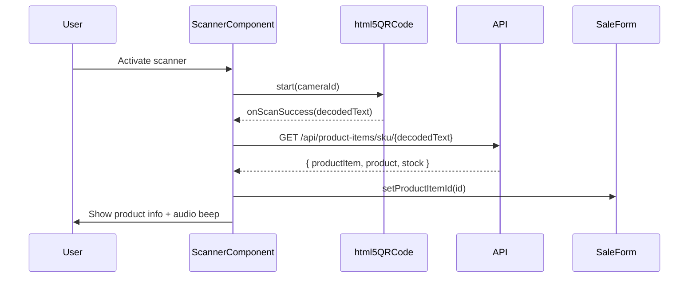

# Design Document: Multi-Channel Listing & Barcode Management

## Overview

This design describes the architecture for adding multi-channel listing management, barcode label generation/scanning, and returns processing to the existing stock management application. The feature set enables sellers to:

1. Create and manage marketplace listings (Meesho, Flipkart, Amazon, Offline) linked to physical product items
2. Generate Code-128 barcode labels for SKUs and scan them via phone camera for warehouse operations
3. Process product returns with barcode verification and stock reconciliation

The implementation follows the existing project patterns: Drizzle ORM schemas, service-layer business logic, Zod validators, and Next.js API routes. Client-side barcode operations use JsBarcode (generation) and html5-qrcode (scanning).

## Architecture

```mermaid
graph TB
    subgraph "Client (Browser)"
        UI[UI Pages]
        BC[Barcode Components]
        JS[JsBarcode - Generation]
        H5[html5-qrcode - Scanning]
        PDF[pdf-lib - Label PDF]
    end

    subgraph "Next.js API Layer"
        LR[/api/listings]
        LRI[/api/listings/id]
        LP[/api/listings/id/performance]
        SR[/api/sales - extended]
        RR[/api/returns/saleId]
        PIR[/api/product-items/sku/SKU]
    end

    subgraph "Service Layer"
        LS[listing.service.ts]
        RS[return.service.ts]
        SS[sale.service.ts - modified]
        SLS[stock-ledger.service.ts - modified]
    end

    subgraph "Database (PostgreSQL/Neon)"
        LT[(listings)]
        ST[(sales - extended)]
        SL[(stock_ledger - RETURN enum)]
        PI[(product_items)]
    end

    UI --> LR
    UI --> SR
    UI --> RR
    BC --> JS
    BC --> H5
    BC --> PIR
    BC --> PDF

    LR --> LS
    LRI --> LS
    LP --> LS
    SR --> SS
    RR --> RS
    PIR --> SS

    LS --> LT
    LS --> PI
    SS --> ST
    SS --> SL
    RS --> ST
    RS --> SL
    SLS --> SL
```

### Key Design Decisions

1. **Barcode generation is client-side only**: JsBarcode renders SVG/Canvas in the browser. No server round-trips for barcode image creation. This keeps the backend stateless and avoids image storage costs.

2. **Barcode scanning uses html5-qrcode**: Browser-based camera access via the html5-qrcode library. Scanning resolves SKUs by calling the existing product-items API. No native app required.

3. **Listings are a separate table**: Rather than adding channel columns to product_items, a dedicated `listings` table allows multiple listings per product item with independent prices, titles, and platform SKUs.

4. **Returns are stored on the sales record**: Return fields (return_status, return_reason, return_condition, returned_at) are added directly to the `sales` table rather than creating a separate returns table. This simplifies queries and keeps the sale as the single source of truth for order lifecycle.

5. **Stock ledger extended with RETURN movement type**: The existing `movement_type` enum gains a `RETURN` value so returns are distinguishable from adjustments in the ledger.

6. **Label PDF generation uses pdf-lib**: Already a project dependency. Labels are assembled client-side into a printable PDF with thermal printer dimensions (50mm × 25mm per label).

## Components and Interfaces

### Database Schema: `listings` table

```typescript
// db/schema/listing.ts
import {
  pgTable,
  pgEnum,
  uuid,
  varchar,
  numeric,
  boolean,
  timestamp,
} from "drizzle-orm/pg-core";
import { companies } from "./company";
import { productItems } from "./product-item";

export const channelEnum = pgEnum("channel", [
  "Meesho",
  "Flipkart",
  "Amazon",
  "Offline",
]);

export const listings = pgTable("listings", {
  id: uuid("id").defaultRandom().primaryKey(),

  companyId: uuid("company_id")
    .references(() => companies.id, { onDelete: "cascade" })
    .notNull(),

  productItemId: uuid("product_item_id")
    .references(() => productItems.id, { onDelete: "cascade" })
    .notNull(),

  channel: channelEnum("channel").notNull(),

  title: varchar("title", { length: 300 }).notNull(),

  listingPrice: numeric("listing_price", { precision: 12, scale: 2 }).notNull(),

  platformSku: varchar("platform_sku", { length: 150 }),

  listingUrl: varchar("listing_url", { length: 500 }),

  isActive: boolean("is_active").default(true).notNull(),

  createdAt: timestamp("created_at").defaultNow().notNull(),

  updatedAt: timestamp("updated_at").defaultNow().notNull(),
});
```

### Database Schema: `sales` table extensions

```typescript
// Added columns to db/schema/sale.ts
channel: varchar("channel", { length: 50 }),

listingId: uuid("listing_id").references(() => listings.id, {
  onDelete: "set null",
}),

returnStatus: varchar("return_status", { length: 20 }),

returnReason: varchar("return_reason", { length: 50 }),

returnCondition: varchar("return_condition", { length: 50 }),

returnedAt: timestamp("returned_at"),
```

### Database Schema: `stock_ledger` enum extension

```typescript
// Modified movement_type enum
export const movementTypeEnum = pgEnum("movement_type", [
  "PURCHASE",
  "SALE",
  "ADJUSTMENT",
  "RETURN",
]);
```

### Service: `listing.service.ts`

```typescript
// services/listing.service.ts
interface ListingFilters {
  channel?: "Meesho" | "Flipkart" | "Amazon" | "Offline";
  productItemId?: string;
  isActive?: boolean;
}

export async function createListing(companyId: string, data: CreateListingInput): Promise<Listing>;
export async function getListings(companyId: string, params: PaginationParams, filters?: ListingFilters): Promise<{ data: Listing[]; total: number }>;
export async function getListingById(companyId: string, id: string): Promise<Listing>;
export async function updateListing(companyId: string, id: string, data: UpdateListingInput): Promise<Listing>;
export async function deactivateListing(companyId: string, id: string): Promise<Listing>;
export async function getListingPerformance(companyId: string, id: string): Promise<ListingPerformance>;
```

### Service: `return.service.ts`

```typescript
// services/return.service.ts
interface ProcessReturnInput {
  returnReason: "Size_Issue" | "Damaged_In_Transit" | "Changed_Mind" | "Wrong_Product_Shipped";
  returnCondition: "Good" | "Damaged" | "Wrong_Product";
  scannedSku?: string;
}

export async function processReturn(companyId: string, saleId: string, data: ProcessReturnInput): Promise<Sale>;
export async function getReturnReport(companyId: string, filters?: ReturnReportFilters): Promise<ReturnReport[]>;
```

### Validator: `listing.validator.ts`

```typescript
// validators/listing.validator.ts
export const createListingSchema = z.object({
  productItemId: z.string().uuid(),
  channel: z.enum(["Meesho", "Flipkart", "Amazon", "Offline"]),
  title: z.string().min(1).max(300),
  listingPrice: z.coerce.number().min(0),
  platformSku: z.string().max(150).optional(),
  listingUrl: z.string().url().max(500).optional(),
});

export const updateListingSchema = z.object({
  title: z.string().min(1).max(300).optional(),
  listingPrice: z.coerce.number().min(0).optional(),
  platformSku: z.string().max(150).optional(),
  listingUrl: z.string().url().max(500).optional(),
  isActive: z.boolean().optional(),
});
```

### Validator: `return.validator.ts`

```typescript
// validators/return.validator.ts
export const processReturnSchema = z.object({
  returnReason: z.enum(["Size_Issue", "Damaged_In_Transit", "Changed_Mind", "Wrong_Product_Shipped"]),
  returnCondition: z.enum(["Good", "Damaged", "Wrong_Product"]),
  scannedSku: z.string().optional(),
});
```

### Client Library: `lib/barcode.ts`

```typescript
// lib/barcode.ts (client-side utility)
export interface LabelData {
  sku: string;
  productName: string;
  variantInfo: string; // e.g., "Size 7" or "Red / XL"
}

export function generateBarcodeDataUrl(sku: string): string;
export function generateLabelHtml(data: LabelData): string;
export function generateBatchLabelsHtml(items: LabelData[]): string;
export function triggerPrint(html: string): void;
```

### API Routes

| Method | Path | Description |
|--------|------|-------------|
| GET | `/api/listings` | List listings (paginated, filterable) |
| POST | `/api/listings` | Create a listing |
| GET | `/api/listings/[id]` | Get listing by ID |
| PUT | `/api/listings/[id]` | Update a listing |
| DELETE | `/api/listings/[id]` | Deactivate a listing (soft-delete) |
| GET | `/api/listings/[id]/performance` | Get listing performance metrics |
| POST | `/api/returns/[saleId]` | Process a return for a sale |
| GET | `/api/returns/report` | Get return rate report by listing |
| GET | `/api/product-items/sku/[sku]` | Look up product item by SKU (for scanner) |

### UI Pages

| Route | Purpose |
|-------|---------|
| `/listings` | List all listings with CRUD modal, channel/product filters |
| `/barcode-labels` | Select product items, preview labels, generate & print |
| `/sales` (enhanced) | Packing mode toggle, barcode scanner integration |
| `/stock-count` | Stock counting mode with barcode scanning |

### Scanner Component Architecture



## Data Models

### Listing Entity

| Field | Type | Constraints |
|-------|------|-------------|
| id | uuid | PK, auto-generated |
| company_id | uuid | FK → companies, NOT NULL |
| product_item_id | uuid | FK → product_items, NOT NULL |
| channel | enum | Meesho, Flipkart, Amazon, Offline |
| title | varchar(300) | NOT NULL |
| listing_price | numeric(12,2) | NOT NULL |
| platform_sku | varchar(150) | Nullable |
| listing_url | varchar(500) | Nullable |
| is_active | boolean | Default true |
| created_at | timestamp | Default now |
| updated_at | timestamp | Default now |

### Sale Entity (extended fields)

| Field | Type | Constraints |
|-------|------|-------------|
| channel | varchar(50) | Nullable |
| listing_id | uuid | FK → listings, Nullable, ON DELETE SET NULL |
| return_status | varchar(20) | Nullable ("RETURNED") |
| return_reason | varchar(50) | Nullable |
| return_condition | varchar(50) | Nullable |
| returned_at | timestamp | Nullable |

### Listing Performance (computed, not stored)

| Field | Type | Source |
|-------|------|--------|
| listing_id | uuid | listings.id |
| total_orders | integer | COUNT(sales where listing_id matches) |
| total_returns | integer | COUNT(sales where return_status IS NOT NULL) |
| return_rate | decimal | total_returns / total_orders |
| total_revenue | decimal | SUM(sales.total_amount) |
| profit | decimal | SUM(total_amount) - SUM(product cost × quantity) |

### Stock Count Session (client-side state)

```typescript
interface StockCountSession {
  startedAt: Date;
  counts: Map<string, { sku: string; productName: string; counted: number; systemStock: number }>;
  isComplete: boolean;
}
```

### Packing Verification Session (client-side state)

```typescript
interface PackingSession {
  saleId: string;
  expectedItems: Array<{ productItemId: string; sku: string; quantity: number; verified: boolean }>;
  allVerified: boolean;
}
```

## Correctness Properties

*A property is a characteristic or behavior that should hold true across all valid executions of a system — essentially, a formal statement about what the system should do. Properties serve as the bridge between human-readable specifications and machine-verifiable correctness guarantees.*

### Property 1: Channel validation rejects invalid values

*For any* string that is not one of "Meesho", "Flipkart", "Amazon", or "Offline", the listing creation validator SHALL reject it, and for any string that IS one of those four values, it SHALL accept it.

**Validates: Requirements 1.2, 13.5**

### Property 2: Listing creation populates all fields with is_active defaulting to true

*For any* valid listing creation input (without explicit is_active), the created listing SHALL contain all specified fields (id, company_id, product_item_id, channel, title, listing_price, platform_sku, listing_url) and is_active SHALL be true.

**Validates: Requirements 1.1, 1.6**

### Property 3: Multiple listings per product coexist

*For any* product item, creating N listings referencing it with varying titles, prices, and channels SHALL result in N distinct listing records all referencing the same product_item_id.

**Validates: Requirements 1.3**

### Property 4: Company ownership validation for listings

*For any* listing creation where the referenced product_item_id does not belong to the requesting company, the system SHALL reject the request with an error.

**Validates: Requirements 1.4, 1.5**

### Property 5: Channel filter returns only matching listings

*For any* set of listings across multiple channels, filtering by a specific channel SHALL return only listings where the channel field matches the filter value.

**Validates: Requirements 2.2**

### Property 6: Product filter returns only matching listings

*For any* set of listings across multiple products, filtering by product_item_id SHALL return only listings belonging to that product item.

**Validates: Requirements 2.5**

### Property 7: Listing update persists correctly

*For any* listing and any valid update payload (title, listing_price, platform_sku, listing_url, is_active), applying the update SHALL result in the listing reflecting exactly the updated values while preserving unchanged fields.

**Validates: Requirements 2.3, 2.4**

### Property 8: Sale-listing validation

*For any* sale creation with a listing_id that does not belong to the same company, the system SHALL reject it. For any sale creation with a valid listing_id belonging to the same company, it SHALL succeed.

**Validates: Requirements 3.2**

### Property 9: Listing performance metrics accuracy

*For any* listing with N associated sales and M of those having non-null return_status, the computed total_orders SHALL equal N, total_returns SHALL equal M, and return_rate SHALL equal M/N.

**Validates: Requirements 4.1, 4.2, 4.4**

### Property 10: Barcode label contains required info and excludes price

*For any* product item with a SKU, product name, variant info, and selling price, the generated label SHALL contain the SKU text, product name, and variant info, but SHALL NOT contain the price value.

**Validates: Requirements 5.3, 5.4, 5.5, 5.6**

### Property 11: Batch label generation produces correct count

*For any* list of N product items, batch label generation SHALL produce exactly N label elements in the output.

**Validates: Requirements 5.7**

### Property 12: SKU lookup round-trip

*For any* product item with a known SKU, looking up by that SKU SHALL return the same product_item_id.

**Validates: Requirements 7.3, 7.4**

### Property 13: Packing verification match/mismatch

*For any* sale with a set of expected item SKUs, scanning a SKU that is in the expected set SHALL mark that item as verified, and scanning a SKU NOT in the expected set SHALL trigger a mismatch warning.

**Validates: Requirements 9.2, 9.3, 9.4**

### Property 14: Stock counting increment

*For any* sequence of N scans of the same SKU during a stock counting session, the running count for that SKU SHALL equal N.

**Validates: Requirements 10.1, 10.2**

### Property 15: Discrepancy detection

*For any* stock count session where counted quantity differs from system stock for a SKU, that SKU SHALL be highlighted as a discrepancy.

**Validates: Requirements 10.4**

### Property 16: Good-condition return restores stock

*For any* completed sale with a product item, processing a return with condition "Good" SHALL create a stock_ledger entry with movement_type "RETURN", reference the sale_id, and increase the product item's stock by the returned quantity.

**Validates: Requirements 13.2, 16.1, 16.2**

### Property 17: Damaged/Wrong_Product returns do not add stock

*For any* return with condition "Damaged" or "Wrong_Product", no stock_ledger entry for stock addition SHALL be created for the original product item.

**Validates: Requirements 13.3, 13.4, 16.4**

### Property 18: Return processing updates sale record completely

*For any* processed return, the sale record SHALL have return_status set to "RETURNED", returned_at set to a non-null timestamp, and the selected return_reason and return_condition stored.

**Validates: Requirements 14.1, 14.2, 14.3**

### Property 19: Return reason validation

*For any* string that is not one of "Size_Issue", "Damaged_In_Transit", "Changed_Mind", or "Wrong_Product_Shipped", the return processor SHALL reject it.

**Validates: Requirements 13.5**

### Property 20: Return report sorting

*For any* set of listings with computed return rates, the return rate report SHALL sort them in descending order by return rate.

**Validates: Requirements 15.4**

### Property 21: Consecutive barcode scans add multiple line items

*For any* sequence of N distinct SKU scans during sale creation, the sale form SHALL contain N line items.

**Validates: Requirements 8.3**

## Error Handling

### API Error Responses

All API routes follow the existing `handleError` pattern:

| Scenario | Status | Response |
|----------|--------|----------|
| Validation error (Zod) | 400 | `{ success: false, message: "Validation failed", errors: [...] }` |
| Resource not found | 404 | `{ success: false, message: "Listing not found" }` |
| Ownership mismatch | 403 | `{ success: false, message: "Product does not belong to your company" }` |
| Invalid state transition | 409 | `{ success: false, message: "Can only return completed sales" }` |
| Insufficient stock (edge case) | 422 | `{ success: false, message: "..." }` |
| Auth missing/invalid | 401 | `{ success: false, message: "..." }` |
| Server error | 500 | `{ success: false, message: "Unable to ..." }` |

### Barcode Scanner Error Handling

| Scenario | UI Behavior |
|----------|-------------|
| Camera permission denied | Display message asking user to enable camera access |
| No barcode detected (timeout) | Show "No barcode detected" after 10s with retry option |
| SKU not found in database | Red error toast: "SKU {value} not found" |
| SKU mismatch during packing | Yellow warning: "Scanned item does not match expected order" |
| SKU mismatch during returns | Error with options: "Re-scan" or "Mark as Wrong Product" |
| Camera not available (desktop) | Hide scanner button, show manual SKU input field |

### Return Processing Guards

- Return only allowed on sales with status = "COMPLETED"
- Cannot process return twice (return_status already "RETURNED" → 409)
- Stock ledger write is atomic within a transaction (no partial return states)

## Testing Strategy

### Property-Based Testing (fast-check)

The project already uses `fast-check` with `vitest`. Property-based tests will validate the correctness properties defined above.

**Configuration:**
- Minimum 100 iterations per property test
- Each test tagged with: `Feature: multi-channel-listing-barcode, Property {N}: {description}`
- Test file: `__tests__/properties/listing-barcode.property.test.ts`

**PBT targets (pure logic / validators):**
- Channel enum validation (Property 1)
- Return reason/condition validation (Property 19)
- Label content generation (Property 10, 11)
- Packing session match/mismatch logic (Property 13)
- Stock counting increment logic (Property 14)
- Discrepancy detection logic (Property 15)
- Performance metric calculations (Property 9)
- Return rate sorting (Property 20)

### Unit Tests (example-based)

- `listing.service.ts` — CRUD operations with mocked DB
- `return.service.ts` — Return processing with stock ledger interaction
- `barcode.ts` — Label HTML generation for specific SKUs
- Validators — Specific valid/invalid inputs

### Integration Tests

- API route handlers with real database transactions (test database)
- Sale → Return → Stock Ledger flow end-to-end
- Listing creation with product ownership verification

### UI Component Tests

- Scanner component mock (html5-qrcode mocked)
- Packing mode state transitions
- Print dialog trigger verification
- Label rendering at correct dimensions
