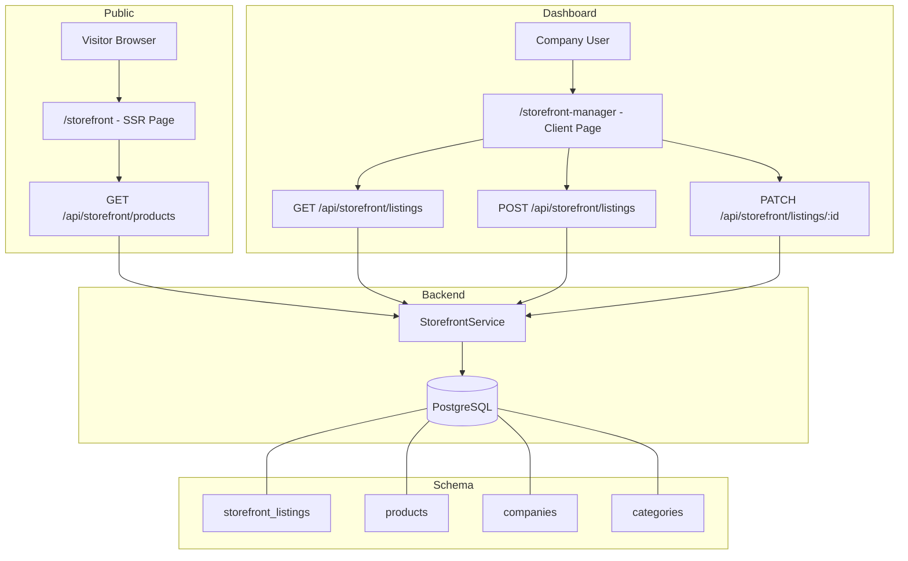
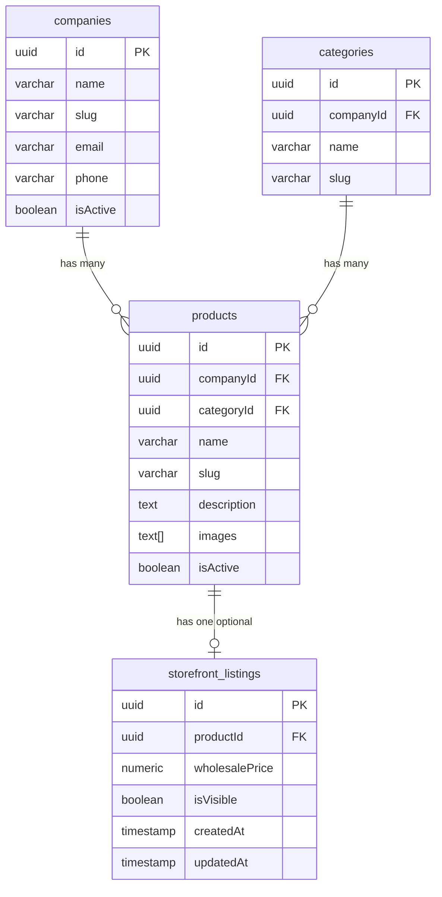

# Design Document: Product Storefront

## Overview

The Product Storefront feature adds two primary capabilities to the existing stock management application:

1. **Public Storefront Page** — A server-side rendered page at `/storefront` accessible without authentication. It displays a paginated, filterable grid of product cards from all companies that have opted in via storefront listings. Each card shows product details, wholesale pricing, and contact CTAs (Call / Send Query).

2. **Dashboard Storefront Manager** — An authenticated page at `/storefront-manager` within the existing `(dashboard)` route group. Company managers/owners can toggle product visibility on the storefront and set wholesale per-piece prices.

The feature introduces a new `storefront_listings` database table, a public API endpoint for fetching storefront products, and authenticated API endpoints for managing listings.

### Key Design Decisions

- **New route group `(storefront)`** for the public page, keeping it separate from `(auth)` and `(dashboard)` route groups. This avoids the dashboard layout's auth guard wrapping the public page.
- **Server-side rendering** for the storefront page using Next.js App Router server components to meet SEO requirements.
- **Separate `storefront_listings` table** rather than adding columns to `products` — keeps storefront concerns decoupled from core product data.
- **`fast-check`** for property-based testing (already in devDependencies).

---

## Architecture



### Route Structure

| Route | Type | Auth | Description |
|-------|------|------|-------------|
| `app/(storefront)/storefront/page.tsx` | Server Component | None | Public storefront page |
| `app/(storefront)/layout.tsx` | Layout | None | Minimal layout without sidebar |
| `app/(dashboard)/storefront-manager/page.tsx` | Client Component | Required | Dashboard management page |
| `app/api/storefront/products/route.ts` | API Route | None | Public product listing |
| `app/api/storefront/listings/route.ts` | API Route | JWT | GET (list) + POST (create) |
| `app/api/storefront/listings/[id]/route.ts` | API Route | JWT | PATCH (update) |

---

## Components and Interfaces

### Frontend Components

#### Public Storefront

| Component | Props | Responsibility |
|-----------|-------|----------------|
| `StorefrontPage` | Server component (no props) | SSR page shell, data fetch, SEO meta |
| `ProductGrid` | `products: StorefrontProduct[]`, `loading: boolean` | Responsive grid layout |
| `ProductCard` | `product: StorefrontProduct` | Individual product display + CTAs |
| `CallCTA` | `phone: string \| null`, `companyName: string` | `tel:` link with disabled state |
| `QueryCTA` | `email: string`, `productName: string`, `companyName: string` | `mailto:` link |
| `StorefrontSearch` | `value: string`, `onChange: (v: string) => void` | Debounced search input |
| `CategoryFilter` | `categories: Category[]`, `selected: string \| null`, `onChange: (id: string \| null) => void` | Category dropdown |
| `StorefrontPagination` | `page: number`, `totalPages: number`, `total: number`, `onChange: (p: number) => void` | Pagination controls |
| `EmptyState` | `message: string` | No-products messaging |

#### Dashboard Storefront Manager

| Component | Props | Responsibility |
|-----------|-------|----------------|
| `StorefrontManagerPage` | Client component | Main management page |
| `ProductListingRow` | `product: ProductWithListing`, `role: string`, `onUpdate: fn` | Individual product row with toggle + price input |
| `VisibilityToggle` | `checked: boolean`, `disabled: boolean`, `onChange: fn` | On/off switch |
| `WholesalePriceInput` | `value: string`, `disabled: boolean`, `onChange: fn`, `error: string \| null` | Price field with validation |

### API Interfaces

#### Public Storefront API Response

```typescript
interface StorefrontProduct {
  id: string;
  name: string;
  slug: string;
  description: string | null;
  images: string[];
  categoryName: string | null;
  wholesalePrice: string; // numeric string "150.00"
  companyName: string;
  companyPhone: string | null;
  companyEmail: string;
}

interface StorefrontListResponse {
  success: true;
  data: StorefrontProduct[];
  pagination: {
    page: number;
    limit: number;
    total: number;
    totalPages: number;
  };
}
```

#### Dashboard Listings API

```typescript
interface StorefrontListing {
  id: string;
  productId: string;
  wholesalePrice: string;
  isVisible: boolean;
  createdAt: string;
  updatedAt: string;
}

interface CreateListingInput {
  productId: string;
  wholesalePrice: number;
  isVisible: boolean;
}

interface UpdateListingInput {
  wholesalePrice?: number;
  isVisible?: boolean;
}
```

### Service Layer

```typescript
// services/storefront.service.ts

export async function getStorefrontProducts(params: {
  page: number;
  limit: number;
  categoryId?: string;
  search?: string;
}): Promise<{ data: StorefrontProduct[]; total: number }>;

export async function getCompanyListings(
  companyId: string
): Promise<StorefrontListing[]>;

export async function createListing(
  companyId: string,
  data: CreateListingInput
): Promise<StorefrontListing>;

export async function updateListing(
  companyId: string,
  listingId: string,
  data: UpdateListingInput
): Promise<StorefrontListing>;
```

---

## Data Models

### New Table: `storefront_listings`

```typescript
// db/schema/storefront-listing.ts
import { pgTable, uuid, numeric, boolean, timestamp, unique } from "drizzle-orm/pg-core";
import { products } from "./product";

export const storefrontListings = pgTable(
  "storefront_listings",
  {
    id: uuid("id").defaultRandom().primaryKey(),

    productId: uuid("product_id")
      .references(() => products.id, { onDelete: "cascade" })
      .notNull(),

    wholesalePrice: numeric("wholesale_price", {
      precision: 12,
      scale: 2,
    }).notNull(),

    isVisible: boolean("is_visible").default(false).notNull(),

    createdAt: timestamp("created_at").defaultNow().notNull(),
    updatedAt: timestamp("updated_at").defaultNow().notNull(),
  },
  (table) => ({
    uniqueProduct: unique().on(table.productId),
  })
);
```

### SQL Migration

```sql
CREATE TABLE "storefront_listings" (
  "id" UUID DEFAULT gen_random_uuid() PRIMARY KEY,
  "product_id" UUID NOT NULL REFERENCES "products"("id") ON DELETE CASCADE,
  "wholesale_price" NUMERIC(12, 2) NOT NULL,
  "is_visible" BOOLEAN NOT NULL DEFAULT FALSE,
  "created_at" TIMESTAMP NOT NULL DEFAULT NOW(),
  "updated_at" TIMESTAMP NOT NULL DEFAULT NOW(),
  CONSTRAINT "storefront_listings_product_id_unique" UNIQUE ("product_id")
);
```

### Relationships



### Query Pattern for Public Storefront

The core query joins `storefront_listings` → `products` → `companies` → `categories`, filtering by:
- `storefront_listings.isVisible = true`
- `products.isActive = true`
- `companies.isActive = true`

Ordered by `storefront_listings.createdAt DESC` with LIMIT/OFFSET pagination.

### Validators

```typescript
// validators/storefront.validator.ts
import { z } from "zod";

export const createStorefrontListingSchema = z.object({
  productId: z.string().uuid("Invalid product ID"),
  wholesalePrice: z
    .number()
    .min(0.01, "Wholesale price must be at least ₹0.01")
    .max(9999999999.99, "Wholesale price must not exceed ₹9,999,999,999.99"),
  isVisible: z.boolean().default(false),
});

export const updateStorefrontListingSchema = z.object({
  wholesalePrice: z
    .number()
    .min(0.01, "Wholesale price must be at least ₹0.01")
    .max(9999999999.99, "Wholesale price must not exceed ₹9,999,999,999.99")
    .optional(),
  isVisible: z.boolean().optional(),
});

export const storefrontQuerySchema = z.object({
  page: z.coerce.number().int().min(1).default(1),
  limit: z.coerce.number().int().min(1).max(50).default(20),
  categoryId: z.string().uuid().optional(),
  search: z.string().max(100).optional(),
});

export type CreateStorefrontListingInput = z.infer<typeof createStorefrontListingSchema>;
export type UpdateStorefrontListingInput = z.infer<typeof updateStorefrontListingSchema>;
export type StorefrontQueryInput = z.infer<typeof storefrontQuerySchema>;
```

---

## Correctness Properties

*A property is a characteristic or behavior that should hold true across all valid executions of a system — essentially, a formal statement about what the system should do. Properties serve as the bridge between human-readable specifications and machine-verifiable correctness guarantees.*

### Property 1: Visibility Filtering

*For any* set of products with associated storefront listings, companies, and active/inactive states, the storefront query result SHALL contain only products where ALL three conditions hold: `storefront_listing.isVisible === true`, `product.isActive === true`, and `company.isActive === true`. Any product missing any one of these conditions SHALL be excluded.

**Validates: Requirements 1.3, 1.4, 6.3**

### Property 2: Text Truncation

*For any* string input, the truncation function SHALL return the original string unchanged when its length is ≤ the limit, and SHALL return exactly `limit` characters followed by "…" when the original string length exceeds the limit. This applies to product name (limit 60) and description (limit 120).

**Validates: Requirements 2.1, 2.3**

### Property 3: Price Formatting

*For any* positive numeric value, the price formatting function SHALL produce a string matching the pattern `₹{value formatted to exactly 2 decimal places} per piece` — e.g., for input `150`, output is `"₹150.00 per piece"`.

**Validates: Requirements 2.6**

### Property 4: CTA Link Generation

*For any* company phone string and product name / company email combination:
- The Call CTA href SHALL equal `tel:{phone}` for the given phone string
- The Query CTA href SHALL equal `mailto:{email}?subject=Wholesale%20Inquiry%3A%20{url-encoded product name}`

**Validates: Requirements 3.2, 3.3**

### Property 5: Wholesale Price Validation

*For any* numeric value, the wholesale price validator SHALL accept the value if and only if it falls within the range [0.01, 9999999999.99]. Values ≤ 0 or > 9999999999.99 SHALL be rejected.

**Validates: Requirements 4.3, 5.3, 7.5**

### Property 6: Result Ordering

*For any* set of visible storefront listings returned by the public API, the results SHALL be ordered by `createdAt` descending — i.e., for any adjacent pair of results at positions `i` and `i+1`, `results[i].createdAt >= results[i+1].createdAt`.

**Validates: Requirements 6.1**

### Property 7: Pagination Parameter Clamping

*For any* `page` and `limit` input values, the pagination logic SHALL clamp `limit` to the range [1, 50] and `page` to a minimum of 1. The resulting page of data SHALL contain at most `limit` items (at most 20 by default). For non-numeric inputs, the system SHALL reject with a 400 error.

**Validates: Requirements 6.5, 9.1, 9.6**

### Property 8: Combined Search and Category Filter

*For any* search term and optional category ID applied to the storefront product list, every product in the result set SHALL satisfy BOTH: (a) the product name contains the search term (case-insensitive) when a search term is provided, AND (b) the product belongs to the specified category when a category ID is provided. When no products match, the result SHALL be an empty array with total 0.

**Validates: Requirements 8.1, 8.5, 6.7**

### Property 9: Page Range Display Formatting

*For any* valid combination of `page`, `limit`, and `total` values where `total >= 0` and `page >= 1`, the page range formatter SHALL produce a string in the format `"Showing {start}–{end} of {total} products"` where `start = (page - 1) * limit + 1`, `end = min(page * limit, total)`. When `total` is 0, no range text is shown.

**Validates: Requirements 9.4**

---

## Error Handling

| Scenario | HTTP Code | Response | User-Facing Behavior |
|----------|-----------|----------|---------------------|
| Public API fetch success | 200 | `{ success: true, data: [...], pagination: {...} }` | Products displayed |
| Public API - invalid pagination params | 400 | `{ success: false, message: "Invalid pagination parameters" }` | Error toast / fallback to page 1 |
| Public API - no products match | 200 | `{ success: true, data: [], pagination: { total: 0 } }` | Empty state message |
| Public API - server error | 500 | `{ success: false, message: "Failed to load products" }` | Error message (no internal details) |
| Dashboard - create listing, product not owned | 403 | `{ success: false, message: "Forbidden" }` | Error toast |
| Dashboard - invalid wholesale price | 422 | `{ success: false, message: "Wholesale price must be..." }` | Inline validation / error toast |
| Dashboard - duplicate listing | 409 | `{ success: false, message: "Listing already exists..." }` | Error toast |
| Dashboard - unauthorized role | 403 | `{ success: false, message: "Insufficient permissions" }` | Controls hidden / error toast |
| Dashboard - network failure | — | `{ success: false, message: "Network error..." }` | Revert UI state + error toast |

### Error Handling Patterns

- **Public storefront**: Graceful degradation — show error message if API fails, never expose stack traces or internal paths.
- **Dashboard management**: Optimistic UI with revert — disable control during API call, revert on failure with descriptive toast.
- **Validation**: Zod schemas at API boundary catch malformed input before reaching the service layer. Client-side validation provides immediate feedback.
- **Auth errors**: Dashboard layout auth guard handles 401 redirects. The storefront has no auth requirements.

---

## Testing Strategy

### Unit Tests (Example-Based)

Unit tests cover specific scenarios, edge cases, and integration points:

- Product card rendering with various data combinations (empty images, null description, long names)
- CTA disabled state when phone is null
- Role-based rendering (MANAGER sees toggle, STAFF sees read-only)
- Empty state rendering
- URL parameter persistence for filters
- Meta tag generation for SEO
- Debounce behavior timing

### Property-Based Tests (fast-check)

Property tests verify universal correctness properties using the `fast-check` library (already in devDependencies). Each property test runs a minimum of 100 iterations.

| Property | Test File | Tag |
|----------|-----------|-----|
| Visibility Filtering | `__tests__/properties/storefront-filter.property.test.ts` | Feature: product-storefront, Property 1: Visibility filtering |
| Text Truncation | `__tests__/properties/storefront-format.property.test.ts` | Feature: product-storefront, Property 2: Text truncation |
| Price Formatting | `__tests__/properties/storefront-format.property.test.ts` | Feature: product-storefront, Property 3: Price formatting |
| CTA Link Generation | `__tests__/properties/storefront-format.property.test.ts` | Feature: product-storefront, Property 4: CTA link generation |
| Wholesale Price Validation | `__tests__/properties/storefront-validation.property.test.ts` | Feature: product-storefront, Property 5: Wholesale price validation |
| Result Ordering | `__tests__/properties/storefront-filter.property.test.ts` | Feature: product-storefront, Property 6: Result ordering |
| Pagination Clamping | `__tests__/properties/storefront-pagination.property.test.ts` | Feature: product-storefront, Property 7: Pagination clamping |
| Combined Filters | `__tests__/properties/storefront-filter.property.test.ts` | Feature: product-storefront, Property 8: Combined search and category filter |
| Page Range Formatting | `__tests__/properties/storefront-pagination.property.test.ts` | Feature: product-storefront, Property 9: Page range display formatting |

### Integration Tests

Integration tests verify database operations and API endpoint behavior:

- Storefront listing CRUD operations with database
- Cascade delete behavior when product is deleted
- Unique constraint enforcement on `product_id`
- Cross-company authorization enforcement (403)
- Role-based access control for write operations
- Full API response shape validation

### Test Configuration

- **Framework**: Vitest (existing)
- **PBT Library**: fast-check (existing in devDependencies)
- **Minimum iterations**: 100 per property test
- **Tag format**: `Feature: product-storefront, Property {number}: {property_text}`

