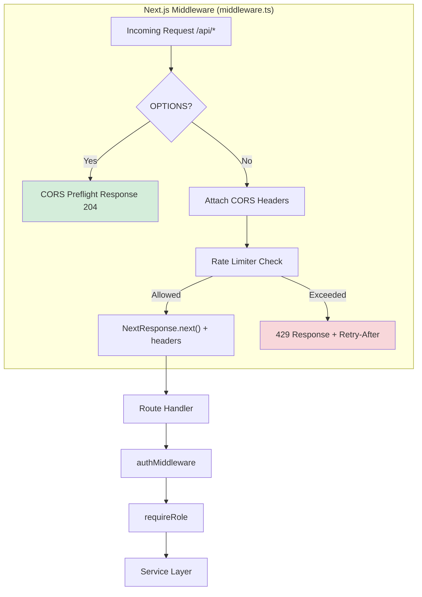

# Design Document: Rate Limiting & CORS

## Overview

This feature introduces a Next.js edge middleware (`middleware.ts`) that applies two security layers to all `/api/*` routes before they reach route handlers:

1. **CORS Handler** — validates cross-origin requests against a configurable allowed-origins list and attaches appropriate headers.
2. **Rate Limiter** — enforces IP-based sliding window rate limits with separate tiers for auth and general endpoints.

Both components are pure utility modules (`lib/cors.ts`, `lib/rate-limiter.ts`) consumed by the root `middleware.ts`. The existing per-email rate limiter in `lib/rate-limit.ts` remains untouched and continues to operate at the route-handler level for login requests.

### Design Decisions

| Decision | Rationale |
|----------|-----------|
| In-memory `Map` for rate limit store | Simple, zero-dependency. Acceptable for single-instance deployment. Redis can replace later. |
| Separate module from existing `lib/rate-limit.ts` | Keeps the two stores (IP-based middleware vs. per-email route-level) decoupled per Requirement 8. |
| CORS before rate limiting in middleware | Preflight (OPTIONS) should return immediately without consuming rate limit quota (Req 7.4). |
| Fail-open on middleware errors | Availability over strictness for an internal stock management tool (Req 7.7). |
| `NextResponse.next()` with header rewriting | Next.js 16 pattern for modifying response headers inside middleware without blocking. |

---

## Architecture



### Request Flow

1. Browser/client sends request to `/api/*`
2. Next.js middleware intercepts (via `matcher` config)
3. If OPTIONS → return CORS preflight immediately (no rate limit consumed)
4. Extract origin, attach CORS headers if origin is allowed
5. Extract client IP, determine endpoint tier (auth vs. general)
6. Check rate limit counter in sliding window store
7. If under limit → `NextResponse.next()` with CORS + rate limit headers
8. If over limit → return `429` JSON with `Retry-After`
9. On any middleware error → fail open, pass to route handler

---

## Components and Interfaces

### 1. `lib/rate-limiter.ts` — Sliding Window Rate Limiter

```typescript
export interface RateLimiterConfig {
  maxRequests: number;       // Max requests per window
  windowMs: number;          // Window duration in milliseconds
  maxStoreSize: number;      // Max entries before LRU eviction
  cleanupIntervalMs: number; // Periodic cleanup interval
}

export interface RateLimitEntry {
  count: number;
  windowStart: number;       // Unix ms timestamp of window start
}

export interface RateLimitResult {
  allowed: boolean;
  limit: number;
  remaining: number;
  resetAt: number;           // Unix epoch seconds when window resets
  retryAfterSeconds: number; // Seconds until reset (for Retry-After header)
}

export class SlidingWindowRateLimiter {
  private store: Map<string, RateLimitEntry>;
  private config: RateLimiterConfig;
  private cleanupTimer: ReturnType<typeof setInterval> | null;

  constructor(config: RateLimiterConfig);
  
  /** Check and increment counter for a given key */
  check(key: string): RateLimitResult;
  
  /** Remove all expired entries */
  cleanup(): void;
  
  /** Stop the cleanup interval (for testing) */
  destroy(): void;
  
  /** Current number of tracked entries (for monitoring) */
  get size(): number;
}
```

**Key behaviors:**
- Composite key: `${tier}:${clientIp}` (e.g., `auth:192.168.1.1`)
- On `check()`: if entry exists and window not expired → increment; if expired → reset window; if no entry → create
- Eviction: when `store.size >= maxStoreSize`, evict entry with earliest `windowStart`
- Cleanup timer iterates all entries every `cleanupIntervalMs`

### 2. `lib/cors.ts` — CORS Handler

```typescript
export interface CorsConfig {
  allowedOrigins: string[];  // Parsed from env var
  allowAllOrigins: boolean;  // True when CORS_ALLOWED_ORIGINS="*"
}

export interface CorsHeaders {
  headers: Record<string, string>;
  isAllowed: boolean;
}

/** Parse CORS_ALLOWED_ORIGINS env var into config */
export function parseCorsConfig(envValue: string | undefined): CorsConfig;

/** Generate CORS headers for a preflight response */
export function getPreflightHeaders(origin: string | null, config: CorsConfig): CorsHeaders;

/** Generate CORS headers for a standard response */
export function getResponseHeaders(origin: string | null, config: CorsConfig): CorsHeaders;

/** Check if an origin is allowed */
export function isOriginAllowed(origin: string | null, config: CorsConfig): boolean;
```

**Key behaviors:**
- `parseCorsConfig`: splits on comma, trims whitespace, filters empty strings, detects `*`
- `isOriginAllowed`: case-sensitive exact match against list (or `true` if `allowAllOrigins`)
- Preflight headers include: `Access-Control-Allow-Methods`, `Access-Control-Allow-Headers`, `Access-Control-Max-Age`
- Standard response headers include: `Access-Control-Allow-Credentials`, `Access-Control-Expose-Headers`
- Omit `Access-Control-Allow-Origin` when origin is not allowed or absent

### 3. `middleware.ts` — Root Next.js Middleware

```typescript
import { NextRequest, NextResponse } from "next/server";

export function middleware(request: NextRequest): NextResponse;

export const config = {
  matcher: ["/api/:path*"],
};
```

**Key behaviors:**
- Wraps everything in try/catch → fail-open on error
- Detects preflight by `request.method === "OPTIONS"`
- Determines tier by checking if path starts with `/api/auth`
- Extracts IP from headers: `x-forwarded-for` (first entry) → `x-real-ip` → `"unknown"`
- Constructs composite key and calls rate limiter
- Attaches all headers (CORS + rate limit) to the response

### 4. Environment Configuration

| Variable | Default | Description |
|----------|---------|-------------|
| `CORS_ALLOWED_ORIGINS` | `""` (same-origin only) | Comma-separated list of allowed origins, or `*` for all |
| `RATE_LIMIT_AUTH_MAX` | `20` | Max requests per window for auth endpoints |
| `RATE_LIMIT_AUTH_WINDOW_MS` | `900000` (15 min) | Window duration for auth tier |
| `RATE_LIMIT_GENERAL_MAX` | `100` | Max requests per window for general endpoints |
| `RATE_LIMIT_GENERAL_WINDOW_MS` | `900000` (15 min) | Window duration for general tier |

> Note: `RATE_LIMIT_*` env vars are optional extensions for configurability. The defaults match the requirements exactly.

---

## Data Models

### Rate Limiter Store (In-Memory)

```typescript
// Internal Map structure
Map<string, RateLimitEntry>

// Key format: "{tier}:{clientIdentifier}"
// Examples:
//   "auth:192.168.1.1"
//   "general:10.0.0.5"
//   "auth:unknown"

interface RateLimitEntry {
  count: number;        // Requests made in current window
  windowStart: number;  // Unix timestamp (ms) when window opened
}
```

### CORS Config (Parsed from env)

```typescript
interface CorsConfig {
  allowedOrigins: string[];  // e.g., ["http://localhost:3000", "https://app.example.com"]
  allowAllOrigins: boolean;  // true when env = "*"
}
```

### Response Schemas

**429 Response Body:**
```json
{
  "success": false,
  "message": "Too many requests. Please try again later."
}
```

**Rate Limit Response Headers (all responses):**
```
X-RateLimit-Limit: 100
X-RateLimit-Remaining: 42
X-RateLimit-Reset: 1700000000
```

**Additional 429 Header:**
```
Retry-After: 523
```

---


## Correctness Properties

*A property is a characteristic or behavior that should hold true across all valid executions of a system — essentially, a formal statement about what the system should do. Properties serve as the bridge between human-readable specifications and machine-verifiable correctness guarantees.*

### Property 1: IP Extraction Priority Order

*For any* combination of request headers (`x-forwarded-for`, `x-real-ip`, connection remote address), the extracted Client_Identifier SHALL be the first IP from `x-forwarded-for` (leftmost value before any comma) when present, otherwise `x-real-ip` when present, otherwise the connection remote address, otherwise `"unknown"`.

**Validates: Requirements 1.1, 2.1**

### Property 2: Threshold Enforcement

*For any* rate limiter configuration with `maxRequests = N` and `windowMs = W`, and *for any* client identifier making sequential requests within a single window: requests 1 through N SHALL return `allowed: true`, and request N+1 SHALL return `allowed: false`.

**Validates: Requirements 1.2, 1.3, 2.3, 2.4**

### Property 3: Rate Limit Header Correctness

*For any* rate limiter result after `k` requests (where `1 ≤ k ≤ maxRequests`) within a window, `X-RateLimit-Remaining` SHALL equal `maxRequests - k`, `X-RateLimit-Limit` SHALL equal `maxRequests`, and `X-RateLimit-Reset` SHALL be a Unix timestamp (seconds) equal to `ceil((windowStart + windowMs) / 1000)`.

**Validates: Requirements 1.6, 2.7**

### Property 4: Retry-After Correctness

*For any* rate limiter result where `allowed: false`, the `retryAfterSeconds` SHALL be a positive integer representing the number of whole seconds remaining until `windowStart + windowMs`, computed as `ceil((windowStart + windowMs - now) / 1000)`.

**Validates: Requirements 1.4, 2.5**

### Property 5: Tier Independence

*For any* client identifier, making requests to the auth tier SHALL NOT affect the remaining count of the general tier, and vice versa. Specifically, after `a` auth requests and `g` general requests, `authRemaining = authMax - a` and `generalRemaining = generalMax - g` independently.

**Validates: Requirements 3.4**

### Property 6: Store Eviction Preserves Newest Entries

*For any* set of rate limit entries that fills the store to `maxStoreSize`, when a new entry is inserted, the evicted entry SHALL be the one with the smallest (earliest) `windowStart` value, and the new entry SHALL be present in the store.

**Validates: Requirements 3.5**

### Property 7: Allowed Origin Echo

*For any* origin that appears in the `allowedOrigins` list (or when `allowAllOrigins` is true), the CORS handler SHALL set `Access-Control-Allow-Origin` to exactly that origin string in both preflight and standard responses.

**Validates: Requirements 4.2, 5.1, 6.4**

### Property 8: Disallowed Origin Omission

*For any* origin that does NOT appear in the `allowedOrigins` list (when `allowAllOrigins` is false), and for any origin that is `null` (no Origin header), the CORS handler SHALL NOT include `Access-Control-Allow-Origin`, `Access-Control-Allow-Credentials`, or `Access-Control-Expose-Headers` in the response headers.

**Validates: Requirements 4.6, 5.4, 5.5**

### Property 9: CORS Config Parsing Round-Trip Consistency

*For any* comma-separated string of valid origin URLs (with arbitrary surrounding whitespace and consecutive commas), `parseCorsConfig` SHALL produce an `allowedOrigins` array containing exactly the non-empty trimmed entries, in order, with no empty strings.

**Validates: Requirements 6.2, 6.6**

### Property 10: Case-Sensitive Origin Matching

*For any* origin string and allowed-origins list where the origin differs from every list entry in at least one character's case, `isOriginAllowed` SHALL return `false`.

**Validates: Requirements 6.5**

---

## Error Handling

| Scenario | Behavior | Rationale |
|----------|----------|-----------|
| Middleware throws unexpected error | Fail-open: `NextResponse.next()` without CORS/rate-limit headers | Availability-first for internal app (Req 7.7) |
| No Client_Identifier found | Use shared `"unknown"` key for rate limiting | Prevents bypass while degrading gracefully (Req 1.7, 2.2) |
| `CORS_ALLOWED_ORIGINS` not set | No cross-origin allowed (same-origin only) | Secure default (Req 6.3) |
| Rate limit store hits 10K entries | Evict oldest entry before inserting new | Bounded memory (Req 3.5) |
| Cleanup timer fails | No impact on correctness; entries naturally expire on next access | Cleanup is an optimization, not correctness-critical |
| IP spoofing via `x-forwarded-for` | Accepted — rate limiting is defense-in-depth, not sole protection | Matches industry standard for reverse-proxy setups |

---

## Testing Strategy

### Unit Tests (Vitest)

| Module | Test Focus |
|--------|------------|
| `lib/rate-limiter.ts` | Window creation, increment, expiry, eviction, cleanup |
| `lib/cors.ts` | Config parsing, origin matching, header generation |
| `middleware.ts` | Integration: preflight handling, header attachment, fail-open |

### Property-Based Tests (fast-check + Vitest)

The project already includes `fast-check` (v4.9.0) and Vitest. All 10 correctness properties will be implemented as property-based tests.

**Configuration:**
- Minimum 100 iterations per property (`numRuns: 100`)
- Each test tagged with: `Feature: rate-limiting-cors, Property {N}: {title}`
- Generators for: IP addresses (v4/v6), origin URLs, header combinations, request sequences

**Test file structure:**
```
__tests__/
  rate-limiter.property.test.ts   — Properties 1-6
  cors.property.test.ts           — Properties 7-10
  middleware.test.ts              — Integration/example tests
```

**Generator examples:**
- `arbIpAddress`: generates valid IPv4 strings (`a.b.c.d`)
- `arbOriginUrl`: generates `http(s)://hostname(:port)` strings
- `arbHeaderSet`: generates combinations of `x-forwarded-for`, `x-real-ip` with random IPs
- `arbRequestSequence(n)`: generates a sequence of n requests with random IPs and tiers

### Integration Tests

- Verify middleware integrates correctly with the Next.js request/response lifecycle
- Verify coexistence with existing per-email rate limiter on login route
- Test fail-open behavior when rate limiter or CORS handler throws

### What Is NOT Tested

- Timer interval exact timing (flaky, implementation detail)
- Actual Next.js edge runtime behavior (requires E2E)
- Browser CORS enforcement (browser responsibility)
