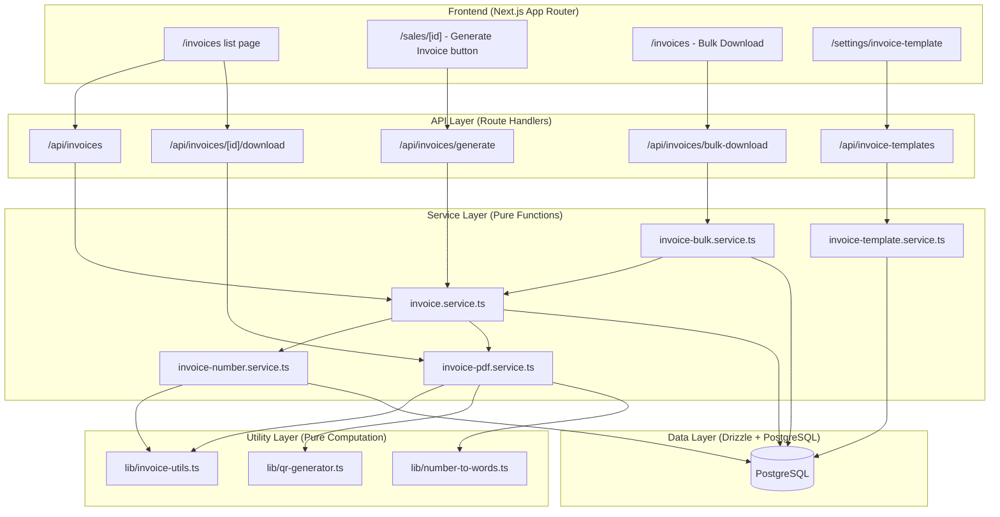
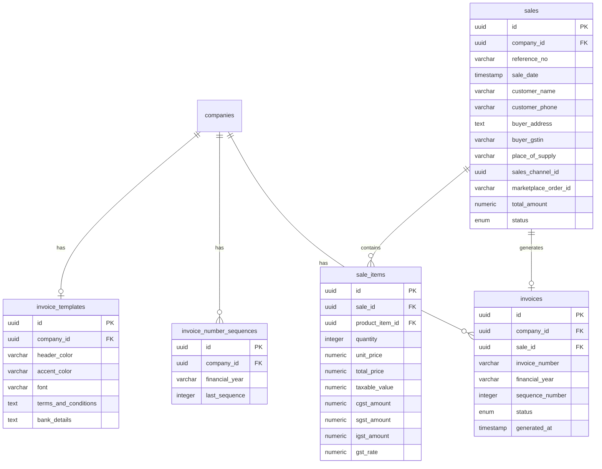

# Design Document: Sales Invoice Generation

## Overview

This feature adds GST-compliant tax invoice PDF generation to the stock management system. It builds on existing sales records and integrates with the planned GST Filing Assistant (which adds tax columns to `sale_items` and GST fields to `sales`).

### Key Design Decisions

1. **Pure function core** — Invoice number formatting, financial year calculation, tax split logic, number-to-words conversion, and address formatting live in pure utility functions (`lib/invoice-utils.ts`). This enables property-based testing without DB dependencies.
2. **pdf-lib for PDF generation** — Already in `package.json`. Used for programmatic A4 PDF creation with embedded fonts, images, and QR codes.
3. **qrcode (npm) for QR generation** — Lightweight pure-JS QR code generator that outputs PNG buffers suitable for embedding in pdf-lib documents.
4. **jszip for bulk download** — Already in `package.json`. Streams multiple PDFs into a single ZIP archive.
5. **Database-level sequence locking** — Uses PostgreSQL `FOR UPDATE` row lock on `invoice_number_sequences` table for concurrency-safe sequential numbering.
6. **Re-render, not store** — Invoice PDFs are regenerated on demand from sale data + stored invoice number. No binary PDF storage needed, reducing DB/storage costs.
7. **Company-scoped everything** — All queries, sequences, and templates are scoped by `companyId` following existing patterns.
8. **Snapshot seller details** — Seller details are read at generation time but not stored separately. Since PDFs are re-rendered, current company data is always used (acceptable for this use case where company details rarely change).

---

## Architecture



---

## Components and Interfaces

### 1. Pure Utility Libraries

| File | Purpose |
|------|---------|
| `lib/invoice-utils.ts` | Financial year calculation, invoice number formatting, filename generation, address formatting, logo scaling, tax column visibility logic |
| `lib/number-to-words.ts` | Convert numeric amount to Indian numbering words (lakhs, crores) |
| `lib/qr-generator.ts` | Thin wrapper around `qrcode` npm package for PNG buffer generation |

### 2. Service Layer

| File | Purpose |
|------|---------|
| `services/invoice-number.service.ts` | Concurrency-safe sequence allocation, idempotent number assignment |
| `services/invoice.service.ts` | Invoice generation orchestration, metadata CRUD, list/search/filter |
| `services/invoice-pdf.service.ts` | PDF document assembly using pdf-lib (layout, embedding, rendering) |
| `services/invoice-bulk.service.ts` | Bulk generation with ZIP packaging, partial failure handling |
| `services/invoice-template.service.ts` | Template config CRUD per company |

### 3. API Routes

| Route | Methods | Purpose |
|-------|---------|---------|
| `/api/invoices/generate` | POST | Generate invoice for a single sale |
| `/api/invoices/bulk-download` | POST | Generate ZIP of multiple invoices |
| `/api/invoices` | GET | List invoices with filters (FY, date, channel, status, search) |
| `/api/invoices/[id]/download` | GET | Download/re-render a specific invoice PDF |
| `/api/invoice-templates` | GET, PATCH | Get/update company invoice template settings |

### 4. Key Interfaces

```typescript
// lib/invoice-utils.ts

/**
 * Determine the Indian financial year for a given date.
 * April-March cycle: dates in Jan-Mar belong to previous year's FY.
 * Returns format "YY-YY" (e.g., "24-25")
 */
export function getFinancialYear(date: Date): string;

/**
 * Format an invoice number from components.
 * Returns "INV/{financialYear}/{zeroPaddedSequence}"
 * Sequence is zero-padded to 4 digits.
 */
export function formatInvoiceNumber(
  financialYear: string,
  sequence: number
): string;

/**
 * Generate PDF filename from invoice number.
 * Replaces "/" with "-" and appends ".pdf"
 */
export function invoiceNumberToFilename(invoiceNumber: string): string;

/**
 * Format buyer address into multiple lines.
 * Splits on commas and explicit newline characters.
 */
export function formatAddress(address: string): string[];

/**
 * Calculate scaled dimensions for logo to fit within maxWidth x maxHeight
 * while maintaining aspect ratio.
 */
export function scaleLogo(
  originalWidth: number,
  originalHeight: number,
  maxWidth: number,
  maxHeight: number
): { width: number; height: number };

/**
 * Determine which tax columns to show based on supply type.
 * Intra-state: show CGST + SGST, hide IGST
 * Inter-state: show IGST, hide CGST + SGST
 */
export type SupplyType = "intra-state" | "inter-state";

export function getTaxColumnVisibility(supplyType: SupplyType): {
  showCgstSgst: boolean;
  showIgst: boolean;
};

/**
 * Generate ZIP filename from date range.
 * Format: "invoices_YYYYMMDD_YYYYMMDD.zip"
 */
export function formatBulkZipFilename(startDate: Date, endDate: Date): string;
```

```typescript
// lib/number-to-words.ts

/**
 * Convert a number to Indian numbering words.
 * Supports up to 99,99,99,999.99 (99 crores).
 * Returns format: "Rupees [amount in words] and [paise] Paise Only"
 * If paise is 0, omits the paise part.
 */
export function numberToIndianWords(amount: number): string;
```

```typescript
// lib/qr-generator.ts

/**
 * Generate a QR code PNG buffer encoding the given string.
 * Uses error correction level M (15% recovery).
 * Output is a square image suitable for embedding in PDF.
 */
export function generateQrCodeBuffer(data: string): Promise<Buffer>;
```

```typescript
// services/invoice-number.service.ts

/**
 * Get or assign an invoice number for a sale.
 * - If the sale already has an invoice record, return existing number (idempotent).
 * - Otherwise, atomically increment the sequence for the company+FY and create invoice record.
 * Uses SELECT ... FOR UPDATE on invoice_number_sequences for concurrency safety.
 */
export async function assignInvoiceNumber(
  companyId: string,
  saleId: string,
  saleDate: Date
): Promise<{ invoiceNumber: string; isNew: boolean }>;
```

```typescript
// services/invoice.service.ts

export interface GenerateInvoiceInput {
  saleId: string;
}

export interface GenerateInvoiceResult {
  invoiceId: string;
  invoiceNumber: string;
  pdfBuffer: Buffer;
  filename: string;
  warnings: string[];
}

/**
 * Generate a single invoice for a completed sale.
 * Validates sale status, assigns number, assembles data, renders PDF.
 */
export async function generateInvoice(
  companyId: string,
  input: GenerateInvoiceInput
): Promise<GenerateInvoiceResult>;

/**
 * List invoices for a company with pagination and filters.
 */
export async function listInvoices(
  companyId: string,
  params: PaginationParams,
  filters?: InvoiceListFilters
): Promise<{ data: InvoiceRecord[]; total: number }>;

/**
 * Search invoices by invoice number, customer name, or buyer GSTIN.
 */
export async function searchInvoices(
  companyId: string,
  query: string,
  params: PaginationParams
): Promise<{ data: InvoiceRecord[]; total: number }>;
```

```typescript
// services/invoice-bulk.service.ts

export interface BulkDownloadInput {
  saleIds: string[];
}

export interface BulkDownloadResult {
  zipBuffer: Buffer;
  filename: string;
  generated: number;
  skipped: { saleId: string; reason: string }[];
  failed: { saleId: string; error: string }[];
}

/**
 * Generate multiple invoice PDFs and package into ZIP.
 * - Validates count <= 100
 * - Skips non-COMPLETED sales
 * - Continues on individual failures
 * - Assigns invoice numbers in sale date order
 */
export async function bulkDownloadInvoices(
  companyId: string,
  input: BulkDownloadInput
): Promise<BulkDownloadResult>;
```

```typescript
// services/invoice-template.service.ts

export interface InvoiceTemplateConfig {
  headerColor: string;       // hex, e.g. "#FFFFFF"
  accentColor: string;       // hex, e.g. "#1a237e"
  font: "Roboto" | "Open Sans" | "Lato";
  termsAndConditions: string; // max 500 chars
  bankDetails: string;        // max 300 chars
}

/**
 * Get template config for a company. Returns defaults if not configured.
 */
export async function getTemplateConfig(
  companyId: string
): Promise<InvoiceTemplateConfig>;

/**
 * Update template config for a company. Creates if not exists.
 */
export async function updateTemplateConfig(
  companyId: string,
  config: Partial<InvoiceTemplateConfig>
): Promise<InvoiceTemplateConfig>;
```

### 5. Validator Schemas

```typescript
// validators/invoice.validator.ts

import { z } from "zod";

export const generateInvoiceSchema = z.object({
  saleId: z.string().uuid("Invalid sale ID"),
});

export const bulkDownloadSchema = z.object({
  saleIds: z
    .array(z.string().uuid("Invalid sale ID"))
    .min(1, "At least one sale must be selected")
    .max(100, "Maximum 100 invoices per bulk download"),
});

export const invoiceTemplateSchema = z.object({
  headerColor: z
    .string()
    .regex(/^#[0-9A-Fa-f]{6}$/, "Invalid hex color")
    .optional(),
  accentColor: z
    .string()
    .regex(/^#[0-9A-Fa-f]{6}$/, "Invalid hex color")
    .optional(),
  font: z.enum(["Roboto", "Open Sans", "Lato"]).optional(),
  termsAndConditions: z
    .string()
    .max(500, "Terms & Conditions must be at most 500 characters")
    .optional(),
  bankDetails: z
    .string()
    .max(300, "Bank details must be at most 300 characters")
    .optional(),
});

export const invoiceListFiltersSchema = z.object({
  financialYear: z.string().regex(/^\d{2}-\d{2}$/).optional(),
  startDate: z.coerce.date().optional(),
  endDate: z.coerce.date().optional(),
  salesChannelId: z.string().uuid().optional(),
  status: z.enum(["ACTIVE", "CANCELLED"]).optional(),
  search: z.string().max(100).optional(),
});

export type GenerateInvoiceInput = z.infer<typeof generateInvoiceSchema>;
export type BulkDownloadInput = z.infer<typeof bulkDownloadSchema>;
export type InvoiceTemplateInput = z.infer<typeof invoiceTemplateSchema>;
export type InvoiceListFilters = z.infer<typeof invoiceListFiltersSchema>;
```

---

## Data Models

### Schema Extensions (Existing Tables)

#### sales table — new column

```typescript
// Add to db/schema/sale.ts
buyerAddress: text("buyer_address"), // nullable, up to 500 chars
```

#### companies table — new column

```typescript
// Add to db/schema/company.ts
registeredAddress: text("registered_address"), // nullable, seller address for invoices
```

Note: The following columns will be added by the GST Filing Assistant spec (same implementation wave) and are assumed present for invoice generation:
- `sales`: `buyerGstin`, `placeOfSupply`, `salesChannelId`, `marketplaceOrderId`
- `sale_items`: `taxableValue`, `cgstAmount`, `sgstAmount`, `igstAmount`, `totalTax`, `gstRate`

### New Tables

#### invoices

```typescript
// db/schema/invoice.ts
import { pgTable, pgEnum, uuid, varchar, integer, timestamp } from "drizzle-orm/pg-core";
import { companies } from "./company";
import { sales } from "./sale";

export const invoiceStatusEnum = pgEnum("invoice_status", [
  "ACTIVE",
  "CANCELLED",
]);

export const invoices = pgTable("invoices", {
  id: uuid("id").defaultRandom().primaryKey(),

  companyId: uuid("company_id")
    .references(() => companies.id, { onDelete: "cascade" })
    .notNull(),

  saleId: uuid("sale_id")
    .references(() => sales.id, { onDelete: "restrict" })
    .notNull()
    .unique(), // one invoice per sale

  invoiceNumber: varchar("invoice_number", { length: 30 }).notNull(),
  // e.g. "INV/24-25/0001"

  financialYear: varchar("financial_year", { length: 5 }).notNull(),
  // e.g. "24-25"

  sequenceNumber: integer("sequence_number").notNull(),
  // e.g. 1, 2, 3...

  status: invoiceStatusEnum("status").default("ACTIVE").notNull(),

  generatedAt: timestamp("generated_at").defaultNow().notNull(),

  createdAt: timestamp("created_at").defaultNow().notNull(),

  updatedAt: timestamp("updated_at").defaultNow().notNull(),
});
// Unique constraint: (companyId, invoiceNumber)
```

#### invoice_number_sequences

```typescript
// db/schema/invoice-number-sequence.ts
import { pgTable, uuid, varchar, integer, timestamp, unique } from "drizzle-orm/pg-core";
import { companies } from "./company";

export const invoiceNumberSequences = pgTable(
  "invoice_number_sequences",
  {
    id: uuid("id").defaultRandom().primaryKey(),

    companyId: uuid("company_id")
      .references(() => companies.id, { onDelete: "cascade" })
      .notNull(),

    financialYear: varchar("financial_year", { length: 5 }).notNull(),
    // e.g. "24-25"

    lastSequence: integer("last_sequence").default(0).notNull(),
    // current counter value; next invoice gets lastSequence + 1

    createdAt: timestamp("created_at").defaultNow().notNull(),

    updatedAt: timestamp("updated_at").defaultNow().notNull(),
  },
  (table) => ({
    uniqueCompanyFy: unique().on(table.companyId, table.financialYear),
  })
);
```

#### invoice_templates

```typescript
// db/schema/invoice-template.ts
import { pgTable, uuid, varchar, text, timestamp } from "drizzle-orm/pg-core";
import { companies } from "./company";

export const invoiceTemplates = pgTable("invoice_templates", {
  id: uuid("id").defaultRandom().primaryKey(),

  companyId: uuid("company_id")
    .references(() => companies.id, { onDelete: "cascade" })
    .notNull()
    .unique(), // one template per company

  headerColor: varchar("header_color", { length: 7 }).default("#FFFFFF").notNull(),

  accentColor: varchar("accent_color", { length: 7 }).default("#1a237e").notNull(),

  font: varchar("font", { length: 20 }).default("Roboto").notNull(),

  termsAndConditions: text("terms_and_conditions").default("").notNull(),

  bankDetails: text("bank_details").default("").notNull(),

  createdAt: timestamp("created_at").defaultNow().notNull(),

  updatedAt: timestamp("updated_at").defaultNow().notNull(),
});
```

### Entity Relationship Diagram



---

## Correctness Properties

*A property is a characteristic or behavior that should hold true across all valid executions of a system — essentially, a formal statement about what the system should do. Properties serve as the bridge between human-readable specifications and machine-verifiable correctness guarantees.*

### Property 1: Financial Year Calculation

*For any* date, `getFinancialYear(date)` SHALL return the financial year such that dates in January–March map to the previous calendar year's FY (e.g., March 2025 → "24-25") and dates in April–December map to the current calendar year's FY (e.g., April 2024 → "24-25"). The returned string SHALL always match the format `\d{2}-\d{2}` where the second number equals the first number + 1.

**Validates: Requirements 1.2**

### Property 2: Invoice Number Format

*For any* valid financial year string and *for any* positive integer sequence (1–9999), `formatInvoiceNumber(fy, sequence)` SHALL produce a string matching the pattern `INV/\d{2}-\d{2}/\d{4}` where the sequence portion is zero-padded to exactly 4 digits.

**Validates: Requirements 1.1**

### Property 3: Invoice Number Idempotency

*For any* sale that already has an invoice record in the database, calling `assignInvoiceNumber` SHALL return the existing invoice number without creating a new record or incrementing the sequence counter.

**Validates: Requirements 1.6, 7.5**

### Property 4: Invoice Number Uniqueness Within Sequence

*For any* sequence of N consecutive calls to the sequence allocation function for the same company and financial year, all N returned sequence numbers SHALL be distinct and monotonically increasing.

**Validates: Requirements 1.4**

### Property 5: Invoice Filename Generation

*For any* invoice number string (which may contain forward slashes), `invoiceNumberToFilename(invoiceNumber)` SHALL produce a string where all "/" characters are replaced with "-" and the suffix ".pdf" is appended. The round-trip property holds: the filename contains the same information as the original number (reversible by replacing the first three "-" back to "/" and removing ".pdf").

**Validates: Requirements 7.3**

### Property 6: Tax Column Mutual Exclusivity

*For any* invoice line item, the tax columns SHALL be mutually exclusive: either (CGST > 0 AND SGST > 0 AND IGST === 0) for intra-state supply, or (IGST > 0 AND CGST === 0 AND SGST === 0) for inter-state supply. For intra-state, CGST SHALL equal SGST.

**Validates: Requirements 4.2, 4.3**

### Property 7: Line Item Totals Aggregation

*For any* list of invoice line items, the totals row SHALL satisfy: totalTaxableValue = Σ(item.taxableValue), totalCgst = Σ(item.cgstAmount), totalSgst = Σ(item.sgstAmount), totalIgst = Σ(item.igstAmount), and grandTotal = totalTaxableValue + totalCgst + totalSgst + totalIgst. All sums SHALL be rounded to 2 decimal places.

**Validates: Requirements 4.6, 4.7**

### Property 8: Monetary Values 2 Decimal Places

*For any* valid invoice data, every monetary field in the computed invoice (taxable values, tax amounts, totals, grand total) SHALL have at most 2 decimal places.

**Validates: Requirements 4.7**

### Property 9: Number to Words Round-Trip Consistency

*For any* positive number with at most 2 decimal places (representing INR amount), `numberToIndianWords(amount)` SHALL produce a non-empty string containing "Rupees". For amounts with non-zero paise, the output SHALL also contain "Paise".

**Validates: Requirements 4.8**

### Property 10: QR Code Round-Trip

*For any* valid invoice number string (containing alphanumeric characters and forward slashes), encoding as QR then decoding SHALL produce the original string unchanged.

**Validates: Requirements 5.1, 5.4**

### Property 11: Bulk Download Status Filtering

*For any* list of sales with mixed statuses (COMPLETED, PENDING, CANCELLED), the bulk download service SHALL produce PDFs only for COMPLETED sales. The count of generated PDFs plus the count of skipped sales SHALL equal the total input count.

**Validates: Requirements 8.1, 8.2**

### Property 12: Bulk Download Limit Enforcement

*For any* list of sale IDs with length > 100, the bulk download service SHALL reject the request with an error. For any list with length ≤ 100, the request SHALL proceed to generation.

**Validates: Requirements 8.4, 8.5**

### Property 13: Bulk Invoice Number Ordering

*For any* set of sales without existing invoice numbers, when bulk-processed, the assigned sequence numbers SHALL be monotonically increasing when the sales are ordered by sale date.

**Validates: Requirements 8.7**

### Property 14: Logo Scaling Aspect Ratio Preservation

*For any* image with dimensions (width > 0, height > 0), `scaleLogo(width, height, 150, 60)` SHALL return dimensions that: (a) fit within 150×60 (scaledWidth ≤ 150 AND scaledHeight ≤ 60), (b) maintain the original aspect ratio (scaledWidth/scaledHeight ≈ width/height within floating-point tolerance), and (c) maximize size (at least one dimension touches the boundary).

**Validates: Requirements 9.2**

### Property 15: Address Formatting Line Breaks

*For any* address string containing commas or newline characters, `formatAddress(address)` SHALL return an array with more than one element, splitting at commas and/or newlines. Each resulting line SHALL be trimmed of leading/trailing whitespace.

**Validates: Requirements 10.5**

### Property 16: Bulk ZIP Filename Format

*For any* two valid dates (start ≤ end), `formatBulkZipFilename(start, end)` SHALL produce a string matching the pattern `invoices_\d{8}_\d{8}\.zip` where the digits represent YYYYMMDD format.

**Validates: Requirements 8.3**

### Property 17: Sale Status Validation for Generation

*For any* sale with status "PENDING" or "CANCELLED", invoice generation SHALL fail with an error. *For any* sale with status "COMPLETED", invoice generation SHALL proceed (assuming valid data).

**Validates: Requirements 7.4**

---

## Error Handling

Following the existing `ServiceError` pattern:

| Error Case | Status Code | Message |
|------------|-------------|---------|
| Sale not found or not in company | 404 | "Sale not found" |
| Sale status not COMPLETED | 400 | "Invoices can only be generated for completed sales" |
| Bulk download exceeds 100 limit | 400 | "Maximum 100 invoices per bulk download" |
| Template validation failed (color/length) | 400 | Zod validation errors |
| Company GSTIN not configured | 200 (with warning) | Warning: "Seller GSTIN not configured" |
| Buyer address missing | 200 (with warning) | Warning: "Buyer Address Missing" |
| Seller address missing | 200 (with warning) | Warning: "Seller Address Missing" |
| Sequence lock timeout | 500 | "Unable to generate invoice number, please retry" |
| PDF generation failure | 500 | "Failed to generate invoice PDF" |
| QR code generation failure | 500 | "Failed to generate QR code" |

### Warning System

The invoice generation response includes a `warnings: string[]` field. Warnings do not prevent PDF generation but inform the caller about missing non-critical data:

```typescript
interface GenerateInvoiceResult {
  invoiceId: string;
  invoiceNumber: string;
  pdfBuffer: Buffer;
  filename: string;
  warnings: string[]; // e.g. ["Seller Address Missing", "Buyer Address Missing"]
}
```

### Bulk Download Error Recovery

For bulk operations, individual failures don't abort the batch:

```typescript
interface BulkDownloadResult {
  zipBuffer: Buffer;
  filename: string;
  generated: number;         // count of successful PDFs in ZIP
  skipped: { saleId: string; reason: string }[];  // non-COMPLETED sales
  failed: { saleId: string; error: string }[];    // generation errors
}
```

---

## Testing Strategy

### Property-Based Tests (fast-check)

Property-based tests are appropriate for this feature because the core logic involves pure functions with well-defined input/output behavior:
- Financial year calculation (date → string mapping)
- Invoice number formatting (components → formatted string)
- Filename generation (string transformation)
- Tax column visibility (supply type → column flags)
- Number to words conversion (number → string)
- Logo scaling (dimensions → scaled dimensions)
- Address formatting (string → string array)
- Totals aggregation (line items → sums)
- Bulk validation (array length → accept/reject)

**Configuration**: Minimum 100 iterations per property test.
**Library**: `fast-check` (already in devDependencies).
**Tag format**: `Feature: sales-invoice-generation, Property {N}: {title}`

Each correctness property (1–17) maps to one property-based test in `__tests__/properties/invoice-utils.property.test.ts`.

### Unit Tests (Vitest)

Unit tests cover specific examples and edge cases:
- Company without GSTIN → "GSTIN: Not Registered" fallback
- Company without registered address → warning generated
- Sale without buyer address → warning generated
- Product without HSN code → "N/A" in line item
- Sale without sales channel → "Offline" default
- Template defaults when no config exists
- Invoice cancellation status transition
- Sequence counter boundary (9999 → 10000 overflow handling)
- Empty line items list handling
- Zero-amount invoice edge case

### Integration Tests

- Concurrent invoice number generation (no duplicates under parallel requests)
- Full invoice generation flow (sale → number → PDF → response)
- Bulk download with mixed sale statuses
- Invoice list with filters and pagination
- Template CRUD operations
- Sale cancellation → invoice status update

### New Dependency

Add `qrcode` for QR code generation:
```bash
npm install qrcode
npm install -D @types/qrcode
```

This is a well-maintained, pure-JS package with no native dependencies — suitable for serverless/Vercel deployment.
